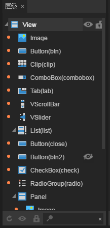

# Design Mode Interface Overview

> This article is based on LayaAirIDE 1.7.3 screenshot, if there are difference, please download the latest LayaAirIDE version.

​         LayaAirIDE is divided into module such as design, coding and others. In this section, the common layout and function area of design patterns are introduced, and provides a quick overview of the names and roles of the various panels.

​	  
​	(Picture 1)

### 1. Navigation bar module :

​        Mode conversion button function can be switched easily between the interface and the code edit mode.

​	  
​	(Picture 2）

### 2. menu bar :

​        The menu bar includes a set of program operations, interface operations, control operation commands, and tool sets. For more  details, please refer to the section about the menu bar.

​	 
​	(Picture 3）

 

### 3. Toolbar :

​        The toolbar includes file operations, control actions, and scene manipulation buttons. For more   details, read  please refer to the section about the toolbar.
​	 
​	(Picture 4）

### 4. Project manager :

​        The project manager shows all pages in the project (Page), which are displayed in a tree structure. You can double-click to open the page you want to edit in the Project Manager. For more   details, read  please refer to the section about Project Manager.

​	 
​	 (Picture 5）

 

### 5. Resource manager :

​        The resource manager displays all the assets in the project resource folder. Here, The contents folder are displayed in a tree  structure. You can use the right-click button to open the folder to add resources.  For more   details, read  please refer to the section about resource manager.

​	 
​	(Picture 6）

 

### 6. Template library :

​         The template library displays all the templates in the IDE template folder. Folders and the thumbnail of the template UI will be displayed in the tree structure, and it automatically synchronizes with resource folder changes. You can add the external template directly to the template folder, or you can make the template yourself through the View. For more   details, read  please refer to the section about template manager.

​	 
​	(Picture 7）

 

### 7. Scene editor:

​        The scene editor is a work area for displaying and editing visual content in UI or animated scenes. Both of the acquired scenes are constructed by the display of the scene editor.  For more   details, read  please refer to the section about  scene editor.

​	 
​	(Picture 8）

  

### 8. Property setter:

​        The property setter is the work area that we view and edit the current selected node and component properties. This panel will display and edit the attribute data of the selected control in the most appropriate form. For details, read the property settings section.

​	 
​	(Picture 9）

### 9. Hierarchic manager :

​        The hierarchy manager displays all nodes in the scene and their hierarchical relationships in the form of a tree list. All the content seen in the scene editor can find the corresponding node entry in the level manager. When editing the scene, the two The contents of the panel will be synchronized display. In general, we will also use the two panels to build the scene. For more information, please read the hierarchy manager section.

​	 
​	(Picture 10）

### 10. Timeline animation editor :

 Timeline Animation Editor is used to create animation in the page. The Frame Properties panel is used to display the frame details on the set timeline.  For details, please read the section of  Animation Editor.

​	 
​	(Picture 11）

### 11. Particle editor :

Particle editor is used to create particle animation in the page. The particle property panel is used to display details of the properties of the set particles. For details, please read the particle editor section.

​	 
​	(Picture  12）
