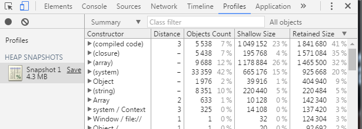

# Using Chrome's performance analyzer

>  The performance analyzer (Profiles) is part of the chrome developer tool. You can choose the review elements on the right side of the page or open the chrome developer tool by F12 on Google browser page. Then click Profiles to switch to the performance analyzer (Profiles) panel.
>

 

###  1. CPU usage cost

#### 1.1 Start the CPU Performance Analyzer

​         Select `Record JavaScript CPU Profile` and click the Start button or the solid dot in the upper left corner. This time Chrome will start recording the execution of the current web page method. As shown in Figure 1-1.

 （Picture 1-1）

#### 1.2 End the monitoring of the CPU performance analyzer

Clicking the Stop button (or the red solid circle on the left) will end the monitoring record for this profiler. As shown in Figure 1-2.

 （Picture 1-2）

### 1.3 Check the CPU Performance Analyzer's record

After the monitoring is completed, a monitoring result file will be listed under the left profile. Monitoring result file can be opened by one click. As shown in Figure 1-3

 （Picture1-3）

The results of the monitoring are displayed in the form of data tables. We can find the function name provided in Function based on the consumption rankings, and optimize where the performance is larger.

### 2. Memory footprint analysis

#### 2.1 Start memory analysis

Select the `Take Heap Snapshot`, click the `Take Snapshot` button (and click the black solid circle on the left), as shown in Figure 2-1

 （Picture 2-1）

The generated memory snapshot file is recorded in the form of a data table, the number of the current web page objects, the size of the memory occupied, and so on.

#### 2.2 Memory snapshot record

After the memory analysis is started, a memory snapshot file of the current web page will soon be generated under the Profiles column on the left. Click to see the related data, as shown in Figure 2-2.

 （Picture 2-2）

#### 2.3 Memory snapshot analysis

After the first memory snapshot, click the dot in the upper left corner to record a new memory snapshot. Click the second memory snapshot to select the Comparison mode change between the second snapshots and the first snapshot. Through the analysis, the web page is optimized.

​     
​    （Picture 2-3）

​     
​    （Picture 6）
