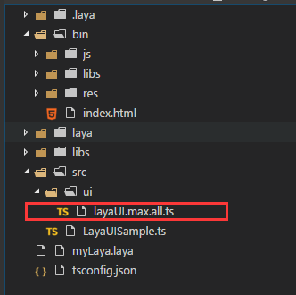

# 设置遮罩

> LayaAir的遮罩，可以设置一个对象(支持位图和矢量图)，然后根据对象形状进行遮罩显示。 
>


## 一、遮罩API介绍

　　遮罩属性位于[laya.display.Sprite](http://layaair.ldc.layabox.com/api/index.html?category=Core&class=laya.display.Sprite#mask) API内，该属性的说明如图1所示：

<br />（图1）


## 二、简单的遮罩示例

### 2.1 我们先用LayaAir引擎显示一张位图

创建一个`MaskDemo.ts`入口类，编写代码如下：

```typescript
// 程序入口
class MaskDemo{
    private Res:string;
    private img:Laya.Sprite;
    constructor()
    {
        Laya.init(1336,640);
        //设置舞台背景色
        Laya.stage.bgColor = "#ffffff";
        //资源路径
        this.Res = "res/img/monkey1.png";
        //先加载图片资源，在图片资源加载成功后，通过回调方法绘制图片并添加到舞台
        Laya.loader.load(this.Res,Laya.Handler.create(this,this.graphicsImg));
    }
    private graphicsImg():void{
        this.img = new Laya.Sprite();
        //获取图片资源，绘制到画布
        this.img.graphics.drawTexture(Laya.loader.getRes(this.Res),150,50);
        //添加到舞台
        Laya.stage.addChild(this.img);
    }
}
new MaskDemo();
```

运行效果如图2所示：

<br />（图2）

### 2.2 创建一个圆形的遮罩区域

用代码创建一个圆形的遮罩区域。通过mask属性，即可实现遮罩效果。继续看代码和注释，我们将2.1示例代码修改为如下代码：

```java
// 程序入口
class MaskDemo{
    private Res:string;
    private img:Laya.Sprite;
    private cMask:Laya.Sprite;
    constructor()
    {
        Laya.init(1336,640);
        //设置舞台背景色
        Laya.stage.bgColor = "#ffffff";
        //资源路径
        this.Res = "res/img/monkey1.png";
        //先加载图片资源，在图片资源加载成功后，通过回调方法绘制图片并添加到舞台
        Laya.loader.load(this.Res,Laya.Handler.create(this,this.graphicsImg));
    }
    private graphicsImg():void{
        this.img = new Laya.Sprite();
        //获取图片资源，绘制到画布
        this.img.graphics.drawTexture(Laya.loader.getRes(this.Res),150,50);
        //添加到舞台
        Laya.stage.addChild(this.img);

        //创建遮罩对象
        this.cMask = new Laya.Sprite();
        //画一个圆形的遮罩区域
        this.cMask.graphics.drawCircle(80,80,50,"#ff0000");
        //圆形所在的位置坐标
        this.cMask.pos(120,50);
        
        //实现img显示对象的遮罩效果
        this.img.mask = this.cMask;
    }
}
new MaskDemo();
```

运行效果如图3所示：

 <br />（图3）

通过对比代码我们发现，实现遮罩很简单，把创建的显示对象cMask作为遮罩对象赋值给img对象的mask属性，即实现了img显示对象的遮罩效果。


## 三、在LayaAirIDE中设置遮罩

> 除了直接在代码中设置遮罩，也可以通过LayaAirIDE方便的给对象设置遮罩。下面我们跟着引导按步骤操作。

步骤一：创建一个UI页面`maskDemo.ui`，导入资源。*(本步骤不了解的请去IDE章节查看UI创建及资源导入相关文档)*


步骤二：在资源面板拖入一个`Image`组件到场景编辑区，如图4所示

 <br /> （图4）


步骤三：双击进入`Image`组件内部，然后再到组件面板拖入一个`Sprite`组件，如图5所示。

 <br /> （图5）


步骤四：选中`Sprite`组件，在右侧属性面板中，将公用属性`renderType`设置为`mask`，如图6所示。

 <br /> （图6）


步骤五：双击进入`Sprite`组件内部，然后再到组件面板拖入一个`Graphics`圆形组件，调整好位置和大小。层级关系如图7所示。

 <br /> （图7）


步骤六：连续双击编辑区的空白区域退出`Image`组件内部，即可看到遮罩的效果，如图8所示。

 <br /> (图8)


## 四、在项目中应用LayaAirIDE设置的遮罩

### 4.1 发布UI

　　在IDE界面按`F12`发布制作遮罩效果的UI页面，会在`src/ui`目录下生成UI类，以及`bin/h5/res/atlas`目录下的图集文件，如图9所示。

 <br />（图9）


### 4.2 使用IDE生成的类与图集，实现遮罩效果

　　创建一个入口类`MaskDemo.ts`，编码如下：

```java
module laya
{
	import Loader = laya.Loader;
	import Handler= laya.Handler;	
	import maskDemoUI = ui.maskDemoUI;
	
	export class MaskDemo
	{
      private cMask:maskDemoUI;
		
     constructor()
		{
			//初始化舞台
			Laya.init(1136,640);
			//设置舞台背景色
			Laya.stage.bgColor = "#ffffff"    
				
			//加载图集资源，加载成功后添加到舞台
			Laya.loader.load("res/atlas/ui.atlas",Handler.create(this,this.onLoaded));
			
		}
		
		private onLoaded():void
		{
			this.cMask = new maskDemoUI();
			Laya.stage.addChild(this.cMask);
		}
	}
}new laya.MaskDemo();
```

运行效果如图10所示，我们很快捷的实现了遮罩的效果。

 <br /> (图10)

