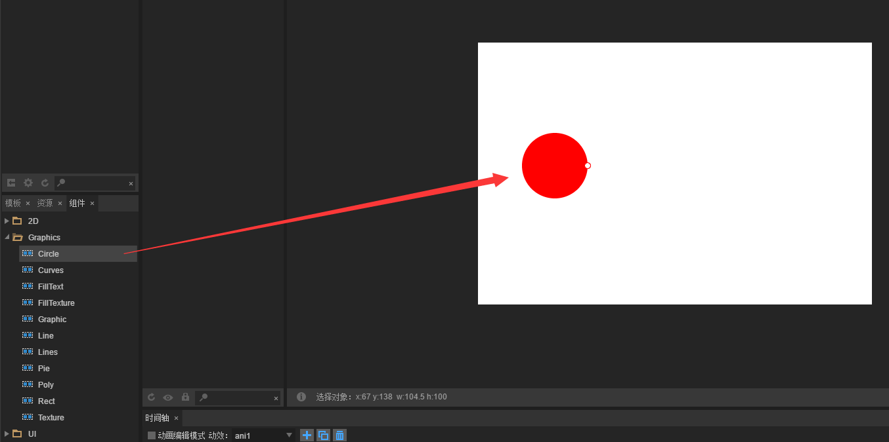

# Draw circles and fan-shaped


### A. draw circles

The circular drawing is easy to understand, and it can be conveniently implemented by the LayaAir laya.display.Graphics Method API (drawCircle). Give data such as center coordinates and radius of the circle, detailed description of the method is shown below:

​	<br/>
​	(Picture 1)

Below we use the LayaAir engine to draw a circle, the sample code is as follows:

```javascript
module laya {
    import Sprite = Laya.Sprite;
    import Stage = Laya.Stage;
    import WebGL = Laya.WebGL;
  
    export class Sprite_DrawShapes {
        private sp: Sprite;
  
        constructor()
        {
            Laya.init(500, 300, WebGL);
            this.drawSomething();
        }
  
        private drawSomething(): void {
            this.sp = new Sprite();
            Laya.stage.addChild(this.sp);
            //画圆
            this.sp.graphics.drawCircle(80,80,50,"#ff0000");
  
        }
    }
}
new laya.Sprite_DrawShapes();
```

The code runs as shown below:

​	<br/>
​	(Picture 2)

​        Circular drawing is relatively simple, "80, 80" is the central coordinates of the circle. 50 is the radius, and "#ff0000" is the fill color value.


### B. draw fan-shaped

​        To go further, let introduce a fan-shape drawing method that is slightly more complicated than the circle; "drawPie ()"; the method is detailed as shown in the following figure:

​	<br/>
​	(Picture 3)

Here we use the LayaAir engine to draw a fan-shape, the sample code is as follows:

```typescript
module laya {
    import Sprite = Laya.Sprite;
    import Stage = Laya.Stage;
    import WebGL = Laya.WebGL;
  
    export class Sprite_DrawShapes {
        private sp: Sprite;
  
        constructor()
        {
            Laya.init(500, 300, WebGL);
            this.drawSomething();
        }
  
        private drawSomething(): void {
            this.sp = new Sprite();
            Laya.stage.addChild(this.sp);
            //画圆
            this.sp.graphics.drawPie(80,80,50,90,180,"#ff0000");
  
        }
    }
}
new laya.Sprite_DrawShapes();
```

The code runs as shown below:

​	<br/>
​	(Picture 4)
Fan is similar to the circle code example,  the first three arguments are the same,  except increased parameters before the fill color value. It is set for two angle parameters (90 and 180). we adjust the parameters to further understanding.


### C. Drawing circle graphics with LayaAirIDE through control tools

**1**. Open LayaAirIDE and click design mode to create a new View page

​	<br/>
​   	(Picture 5)  

**2**. Drag the curve component into the View page to automatically generate the default circle

​	<br/>
​   	(Picture 6) 

**3**. Modify (add / subtract) the values in the Circle component properties, change the size of the circle, the color, the outer frame, and so on.

​   	<br/>
​   	(Picture 7)  

​   	<br/>
​   	(Picture 8)


### D. Drawing fan-shaped graphics with LayaAirIDE through control tools

**1**. Open LayaAirIDE and click design mode to create a new View page

​	<br/>
​   	(Picture 9)  

**2**. Drag the curve component in the component onto the View page to automatically generate the default fan

​	<br/>
​   	(Picture 10)  

**3**. Modify (add / subtract) the values in the Pie component properties, change the fan's angle, size, color, and so on.

​   	<br/>
​   	(Picture 11)

​   	<br/>
​   	(Picture 12)  

Here we draw the circle and fan-shaped through the LayaAirIDE component.
