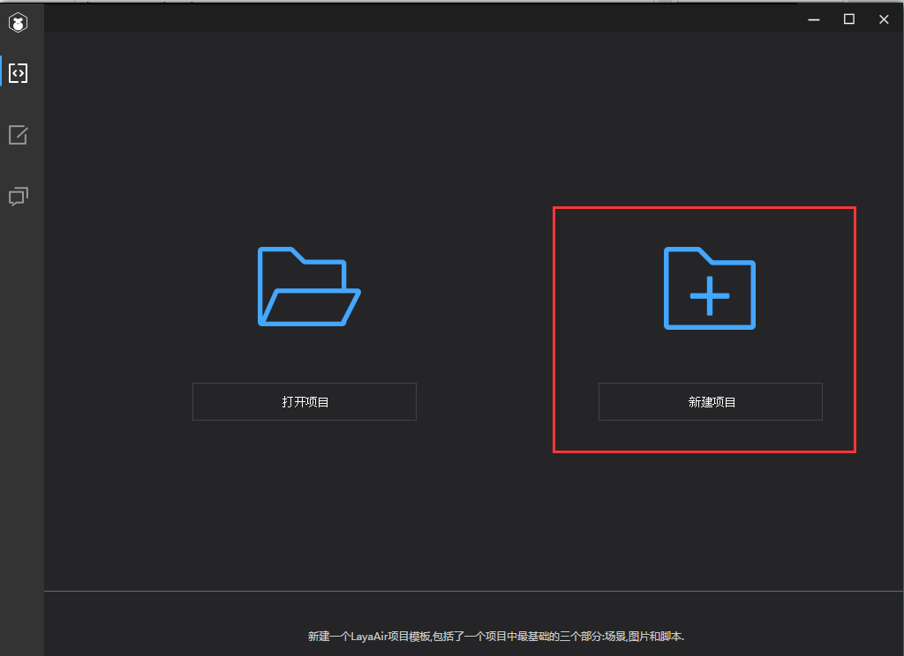
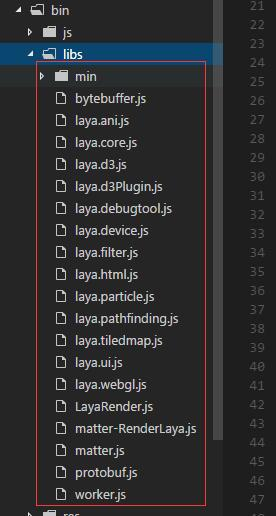

# Create TS project with LayaAirIDE and directory structure explained

​       Open LayaAir IDE for the first time, or use the New Project feature in the IDE's File menu. Building a project through LayaAirIDE will create a clear directory structure by default. Now let’s start with the LayaAirIDE tool to create the AS3 empty project, leading you to introduce the structure of the project.


## A. create a TS project with LayaAirIDE

Step 1: open the LayaAirIDE, and if it is first opened, click "new project" to start a new project. As shown in Figure 1

<br />（Picture 1）


Step 2: Select “LayaAir empty project”. After setting the project name, path, type, and select the engine version, click create to generate a new empty project. As shown in figure 2.

 <br />（Picture 2）

​    Step 3: after you click create, you can see the structure of the project. The folder structure of the project is shown in figure 3:

 <br /> （Picture 3）


## 2. Introduction of directory structure

### 2.1 Project configuration file (.Laya folder)

​    `.laya` The folder under the folder is some configuration information for the project in the development run.

#### 2.1.1`.laya/launch.json` Document file description

　　 `launch.json` file saves the configuration information necessary about project debugging. Respectively, the debug is handle with LayaAirIDE and configuration with Chrome. After settings is done, Manually change may not easy since the project will affect the debugging error.

　　**`launch.json` important attributes are as follows:**

　　`"name": "layaAir"` Indicates the built-in debugging mode with LayaAirIDE.

　　`"name": "chrome browser"` Indicates debugging with local Chrome browser.

　　`"file": "${workspaceRoot}/bin/index.html"` Define the path directory where project’s run start

　　`"runtimeExecutable": "C:/Program Files (x86)/Google/Chrome/Application/chrome.exe"`, The path directory of Chrome browser, developers set this path according to their own needs.

　　`"userDataDir": "${tmpdir}"` represent the temporary directory the chrome debug cache, default is the user’s temporary directory, developers can change settings. For example, cache settings directory under the current project root path: “userDataDir”:  `"userDataDir": "${workspaceRoot}/cache"`。

#### 2.1.2  `.laya/tasks.json` file introduction

　　`tasks.json` is the task configuration file. After opening, the contents are shown below:


### 2.2 output directory of the project（bin）

​    `bin` directory is stored under the current project output file.

​    `bin/index.html` is the project's entry file, all of the LayaAir engine library or a third-party class library JS need to be introduced here.

​    *Tips: The script comments in index.html indicate the relevant functions of each class library, developers can delete the reference of the class library according to the project needs, click on the project release button will js file in index.html Compression, to reduce network transmission. If you reference a third-party library, you must reference the LayaAir engine library before.*

​    `bin/js` The folder is stored in the JS file compiled by the TypeScript file in the project.

​    `bin/libs` The folder stores the JS files of each module of the LayaAir engine. As shown in Figure 4, which module is needed to use in the project, it is necessary to introduce the corresponding module package JS file in index.html.

 <br /> （Picture 4）

**Here, let's give a brief introduction to the main parts of the LayaAir engine module:**

　　`laya.core.js ` It is the core package, which includes display object rendering, event, time management, timeline animation, slow motion, message interaction, socket, local storage, mouse touch, voice, loading, color filter, bitmap font, etc.

　　 `laya.webgl.js` The webgl rendering pipeline is encapsulated, and if webgl rendering is used, it can be invoked at initialization `Laya.init(1136,640,laya.webgl.WebGL);` 

　　`laya.ani.js` Animation module, including SWF animation, bone animation, and so on.

　　`laya.filter.js` It contains more webgl filters, such as external luminescence, shadow, blur, and more.

　　 `laya.html.js` The HTML dynamic typesetting function is encapsulated.

　　 `laya.ui.js` The various component implementations of the UI are provided.

　　`laya.tilemap.js` Provide tileMap parsing support.


### 2.3 UI project directory（laya）

​    “`laya`”  directory is used to store the current UI project for LayaAirIDE.

 <br />（Picture 5）

​    “`laya/assets`” directory is used to store the image assets resources required for components suomponents, particles, and so on.

​    “`laya/pages`” directory is used to store files generated by LayaAirIDE to create page layouts.

​    “`laya/.laya`”  file is the LayaAirIDE UI project configuration file.


### 2.4 `.d.ts` Code provides a file directory（libs）

 `libs`  directory is the layaAir engine LayaAir.d.ts file. For code hints, if the developer has three party libraries, the related.D.ts files are put in this directory.


### 2.5 Project code directory（src）

​    The project code file will be stored in the src directory by default

 

### 2.6 Project configuration file

​    `Project name .laya` Is the project configuration file that records the project name of the current project, the version number of the library, and the type of the project.

```json
{"proName":"studyTS","version":"1.5.4","proType":1}
```
​    `tsconfig.json` The file is a configuration file for the TS project. Do not delete it.