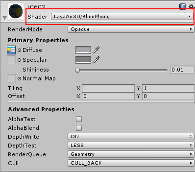
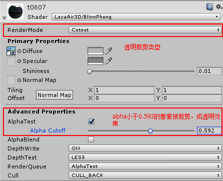

## LayaAir3D BlinnPhong material

### BlinnPhong Material Overview

In the previous version of the LayaAir 3D engine (before the 1.7.12 version), the model material only supports the traditional StandardMaterial standard material. In Unity, whatever type of Shader is used in the model material, the plug-in export is standard material (except for the particle material).

Because the Unity standard and LayaAir standard materials and other materials are different, so developers use the derived 3D resources, we will find the art effect and Unity have different needs in the code, modify the various material properties parameters or adjust the light to achieve the desired effect, for developers to bring inconvenience.

In order to make the operation art effect and the adjusting effect of Unity in the LayaAir engine, the official LayaAir increase of BlinnPhongMaterial material in Unity plug and engine, allows developers to WYSIWYG, modify the art effect to reduce code time, improve work efficiency. Therefore, it is recommended to use this material as much as possible in future development.


### Create BlinnPhong material

Code creation BlinnPhong material and standard material consistent, can directly create its instance, or through the BlinnPhongMaterial.load () method to load related material resources creation, and assigned to the model use. Its color light property modification and assignment method is also the same as the standard material, but the material type is different.

```java
//创建盒子模型
var box:Laya.MeshSprite3D=new Laya.MeshSprite3D(new Laya.BoxMesh());
scene.addChild(box);

//创建BlinnPhong材质
var mat:Laya.BlinnPhongMaterial=new Laya.BlinnPhongMaterial();
mat.diffuseColor=new Laya.Vector4(0.5,0.3,0.3,1);
mat.diffuseTexture=Laya.Texture2D.load("res/layabox.png");

//加载材质资源方法创建
//var mat:Laya.BlinnPhongMaterial=Laya.BlinnPhongMaterial.load("truck/Assets/Materials/t0200.lmat");

//为模型赋材质
box.meshRender.material=mat;
```


### Using BlinnPhong material in Unity

The LayaAir engine supports BlinnPhong material creation from the 1.7.0 version from the 1.7.12 version and Untiy export plug-in, so developers want to experience new functionality and need to download new engines and plug-ins. Installing the 1.7.0 plug-in step in the project is exactly the same as the previous version of installing plug-in methods.

#### Convert the scene key to BlinnPhong material

Install the new plug-in, in the Untiy LayaAir3D menu adds a key scene materials into BlinnPhong material function (Figure 1), click on the menu LayaAir Tool--------> Switch Shader to LayaBlinnPhong option, can be found in the interface model of resources will become purple, a scene change, the material type changed successfully.

<br>（Picture 1）

The mouse selects any model in the scene, and we can see a new material Shader type in the right Inspector panel (Figure 2). The material properties are different from the Standard standard material in Unity, which simplifies a lot and removes some attributes that LayaAir does not support. We can change the display of the model by modifying these properties.

<br>（Picture 2）


#### Manually modify to BlinnPhong material

In general, we recommend the use of a key in the menu into BlinnPhong material, so that all the materials in the scene will be modified, will not occur a material can not be found or ignored, resulting in non modified circumstances.

Of course, when you create a new material, the default is generated standard material, then developers need to manually modify the material type Shader BlinnPhong. When we install the plug-in, the Shader type of the material panel will appear the LayaAir3D option for us to modify and use. (Fig 3)

<br>（Picture 3）


### BlinnPhong material rendering mode

Material rendering mode RenderMode is mainly used for material performance, such as different transparent translucent effect, etc., in StandardMaterial, there are more than 10 types of optional, but more complex, but also need to modify the code, very inconvenient.

Export plug-in provides BlinnPhong material modification interface, can directly modify the rendering mode, and it has been reduced in the BlinnPhong material, summed up several types of commonly used. It allows developers to easily adjust the material effect through its modifications.

Choosing different types, the Advanced Properties options in the BlinnPhong material panel will also be different.

Type descriptions are as follows:

**Opaque  Material**. There is no transparency, and even if the texture is translucent, the model does not have a translucent effect.

**Cutout  Transparent cutting**. The transparent alpha value can be adjusted according to the Utniy value according to the alpha value of the transparent pixels in the map, which is less than a certain alpha value, and the partial model is transparent (Fig. 4).

Tips：此种透明，边缘有像素锯齿，但性能较高，如想去除锯齿效果，请选择Transparent类型，性能稍低。

<br>（图4）

**Transparent  Material** This transparent, edge jagged pixels, but the performance is high, if you want to remove the sawtooth effect, please choose Transparent type, the performance is slightly lower.

**Addtive   color mixing** . Mainly used for some transparent and high brightness color material, it will be based on the brightness of the map pixel color mixing, the model front and back mapping color, overlapping model of the map color will overlay each other, forming a bright translucent effect (Figure 5).

<br>（Picture 5）


**Material custom effect**  The above four rendering patterns basically include most of the effects of game development, if you can not meet the needs of the developers of art, you can also Custom custom rendering mode settings.

In the above four types of patterns, the Advanced Properties options are basically fixed settings that cannot be modified. In the Custom custom, developers can manually modify its parameter values, the effect is more abundant, in repeated settings to achieve the developers need the effect of art.

<br>（Picture 6）


### BlinnPhong Material color light mapping properties

BlinnPhong material shader properties are almost the same as the standard material. In Unity, the material palette can adjust the following attributes:

**Diffuse color and texture**

**Specular highlight color and texture** an adjustable slider with high light range is added, even if the specular map is not used, the high light range can be adjusted.

**Normal map**

After the above color mapping is set up in Untiy, you can directly export the load, or simulate the operation by pressing the LayaAir Run button in the export plug-in. You can see that the browser's artistic effect is consistent with the camera view in Unity.

So does the BlinnPhong material support reflective maps and reflective colors? Of course, they are implemented in accordance with StandardMaterial. They need to be modified by code. The code is as follows:

```java
//创建盒子模型
var box:Laya.MeshSprite3D=new Laya.MeshSprite3D(new Laya.BoxMesh());
scene.addChild(box);
//创建BlinnPhong材质
var mat:Laya.BlinnPhongMaterial=new Laya.BlinnPhongMaterial();
//增加反射贴图（与StandardMaterial一致）
mat.reflectTexture = Laya.TextureCube.load("skyBox/skyCube.ltc");
mat.reflectColor=new Laya.Vector3(1,1,1);
//为模型赋材质
box.meshRender.material=mat;
```
