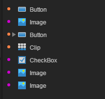

# Hierarchical Manager

The hierarchical manager is one of the core components of the design pattern, and all the components in the `scene editor`will be presented in a tree level structure.

### 1.Hierarchical structure

#### 1.1 Grades

Unless you select Dialog when you create a UI page, either the UI or the animation, the root is View, and the ID is 1. As shown in Figure 1.

  (picture 1)

#### 1.2 Multi-layer nesting

Hierarchy Manager allows multi-level nesting, each parent layer will starts with gray triangular head, click the triangle mark can expand the level, as shown in Figure 2.

 (Picture 2)

#### 1.3 Hierarchical structure optimization

In the hierarchical manager, there are dots of different colors in front of the component icon. The same color represents the nodes of the same atlas. If the color values are different, as shown in Figure 3, the optimization needs to be operated.

  (Picture 3) When the dots of different colors are crossed, need to be optimized

The optimization method is very simple, so that the same level of the same color dot can be arranged together, there is a small skill to note, when the drag component for a straight line,  is the same level to change the order. If the display is a box when the component is dragged, it will drag to the sub level of the target component. In addition, you can change the hierarchy order by shortcut keys, and the，`ctrl + directional keys move upwards` to a level, and the `ctrl+ direction keys move downward` to a level.

   (Picture 4)

Change the level of hierarchy display order,the point is optimized when the color of the dots is the same. As shown in Figure 5.

   （Picture 5）

### 2. The function of the layer manager panel.

#### 2.1 Show and hide components

When you `select a component` in the level manager, click the `eye icon` on the right side of the component to **hide** the  **corresponding component** in the `scene editor` and click again to show it. The effect is shown in Figure 6.

  (picture 6)

#### 2.2 Lock components and unlock

Select a component in the `hierarchy manager`, and click the lock icon on the right side of the component to `lock` the `corresponding components`in the `scene editor`. Clicking again will unlock it. The effect is shown in Figure 7.

  (picture 7)

#### 2.3 Bottom function button

The bottom function button of the hierarchical manager is used for the entire list of hierarchies.

Click the `Refresh` button to update the entire hierarchy manager list;

Clicking on the `eye` button will hide or display all the components of the entire hierarchical manager;

Clicking the `lock` button will lock or unlock all the components of the entire hierarchy manager;

The specific effect is shown in figure 8.

  （Picture 8）

#### 2.4 Component search filter

Components are found in the hierarchical manager, which can be filtered by the keyword of the original name of the component, or filtered by the alias of the component, as shown in figure 9.

   （Picture 9）

**Tips：component alias, set by the name attribute of the attribute setter. Easy to find and locate components after setting aliases.**

### 3. Right-click menu operation of the hierarchical Manager

#### 3.1 Copy, paste, delete components

After selecting the components in the level manager, right-click to copy, delete, and paste. As shown in Figure 10.

  （图10）

**Tips：**You can also use the shortcut `ctrl+c` to copy,`ctrl+v` to paste,`Delete` to remove.

#### 3.2 Convert and Disassemble Containers

After selecting one or more components, the right key button  can be ` converted to a container`, as shown in figure 11.

  （Picture 11）

**Tips：**You can also use the shortcut key `ctrl+B` to convert the `component to a container`.

Select the container component, right-click the broken `container`, you can remove the container hierarchy, as shown in figure 12.

   (Picture 12)

**Tips：**you can also use the shortcut key `ctrl+U` to break up containers.

#### 3.3 All put away and unfolded

The triangle mark in front of the icon can expand or retract the components under the current container. The right keys are all `retracted` and `expanded`to put away the entire root level component. The effect is shown in figure 13.

   (Picture 13)

#### 3.4 Create a component node

After the selected components can be quickly created through the right-click menu commonly used components, right-click menu to `create 2D`can directly create 2D basic components, `create Graphics`can create vector graphics components, `create UI common components`, the creation of these components corresponding to the component library Of the components, as shown in Figure 14.

  (Picture 14)

**Tips**：*right-hand component creation and component library exactly, so you can also create components through the component library.*

### 4、Other operations

#### 4.1 Multi-select operation

Hold down Shift to select multiple adjacent components at the same level;

Holding Ctrl can simultaneously select multiple adjacent or separated components at the same level;

#### 4.2 Add component operations

In addition to the direct create the components in the right-click menu, you can also create components from the `component library` and `resource manager`Explorer in a drag-and-drop manner.When multiple scenes are superimposed in the scene editor, they are created and managed directly through the hierarchy manager Components are more efficient development methods. The component add operation is shown in Figure 15.

   (Picture 15)

