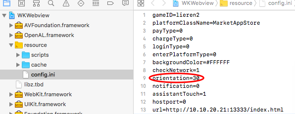
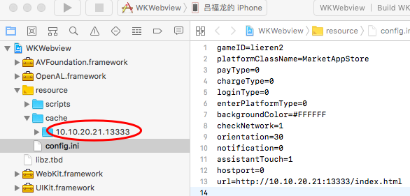

# 3D
Temporarily support LayaAir-1.0 3D project, using the most basic webgl instructions, iOS version can also use WKWebview，But can support the use of LayaDCC to play local resource packs。(LayaNative2.0 and LayaAir2.0 will be released together. The 3D project experience of LayaNative2.0 will be greatly improved. In order to balance the 3D projects that some developers use LayaAir1.0, they temporarily support it.)
### 1.LayaNative
Minimum engine version required LayaAir Native SDK 1.0 LayaAir 1.7.19.1 beta  
As LayaAir has not yet released a new version，Developers are required to manually modify some code in the LayaAir-1.7.19.1-beta version.
See the documentation for details:https://github.com/layabox/layaair-doc/blob/master/Chinese/LayaNative/3d/modify.md
#### 1.Create a 3D project
##### 1.Manual creation
Add the following line in config.js
```javascript
window.ConchRenderType = 6;
```
**TIPS:  
ios version: under the engineering directory resource\scripts\config.js  
android version: under the engineering directory assets\scripts\config.js  **
##### 2.LayaNative command line tool creation
```javascript
$ layanative createapp -f SnowBallH5 -t 1 -n SnowBallNative -u http://10.10.20.102:8899/index.html -v v0.9.5 -d 3D
```
##### 3.IDE creation
#### 2.Channel docking
Reference documents with the 2D version
https://ldc.layabox.com/doc/?nav=zh-as-0-3-0
### 2.webview
The webview solution is also available on the iOS platform.
#### 1.Start address
  
#### 2.Set horizontal and vertical screen
  
The meaning of the parameters is as follows:
```
orientation=2   //Vertical screen: is under IOS home button
orientation=4   //Vertical screen: IOS home button on 
orientation=8   //Horizontal screen: IOS home button on the left
orientation=16  //Horizontal screen: IOS home button is on the right
```
The value of orientation can be set in the way of `Bitwise or` , for example :
```   
orientation=6   //Represents the vertical screen can be rotated at will
orientation=24  //Represents horizontal screen can be rotated freely
```
#### 3.Package local cache resources
```
layadcc C:\Users\lvfulong\Desktop\3d\03_Src-replace\ClientMain\client\bin\h5 -cache -url http://10.10.20.21:13333/index.html
```
Generate the cache and put it in the cache directory
see the DCC  documentation https://ldc.layabox.com/doc/?nav=zh-as-7-2-0  
 

#### 4.Channel docking
Using WebView and native communication mechanism, MarketAppStore interface is realized with accelerator.
See the documentation for details: https://ldc.layabox.com/doc/?nav=zh-as-7-2-3
#### 5. Platform code actively executes js scripts
```
    NSString* js = [NSString stringWithFormat:@"if(!window.conchMarketData){window.conchMarketData=JSON.parse('%@')}",pJsonString];
    [_layaWKWebview.webview evaluateJavaScript:js completionHandler:^(id _Nullable response, NSError * _Nullable error) {
        if (response || error)
        {
            NSLog(@"value: %@ error: %@;", response, error);
        }
    }];
```
#### 6.Webview interacts with native
You can refer to the implementation of MarketAppStore.

script
```
var sData={type:"test"};
window.wkbridge.callNative('nativeFunctionXX',JSON.stringify(sData),function(data){
console.log(data);
// TODO 数据处理.
});
```

registration
```
- (void)viewWillAppear:(BOOL)animated
{
    ...
    [_layaWKWebview.webview.configuration.userContentController addScriptMessageHandler:self name:@"nativeFunctionXX"];
    ...
}
```

delete
```
- (void)viewWillDisppear:(BOOL)animated
{
    ...
    [_layaWKWebview.webview.configuration.userContentController removeScriptMessageHandlerForName:@"nativeFunctionXX"];
    ...
}
```

handle
```
- (void)userContentController:(WKUserContentController *)userContentController didReceiveScriptMessage:(WKScriptMessage *)message
{
    ...
    else if ([message.name isEqualToString:@"nativeFunctionXX"])
    {
        ...
        [self callbackToJS:@"nativeFunctionXX" data:jsonParam];//回调
    }
    ...
}
```
