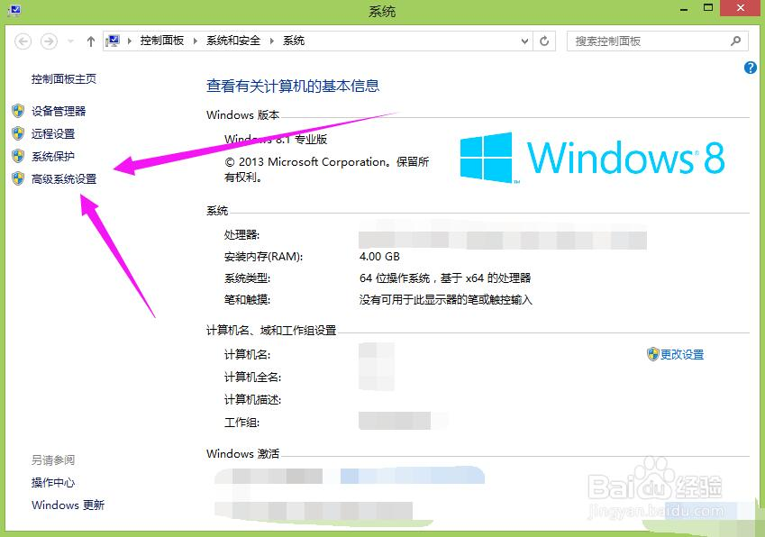
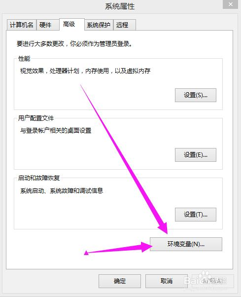
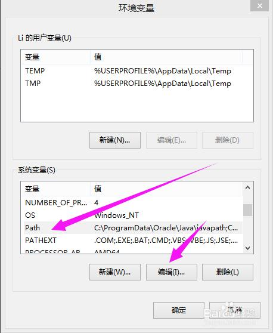
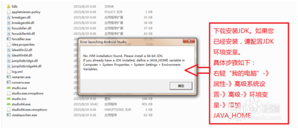
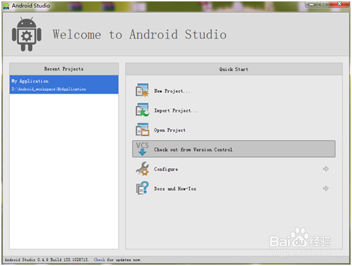
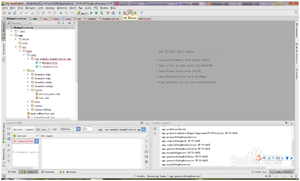
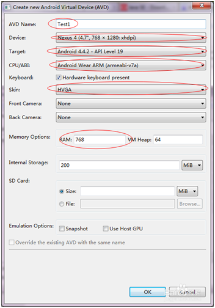
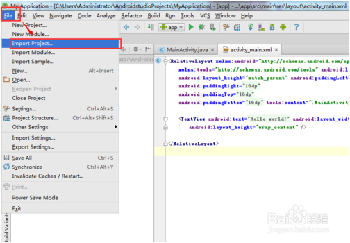
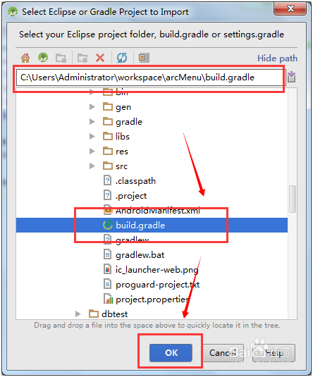
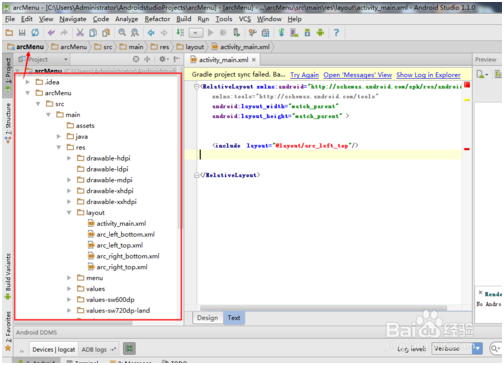

# Android Studio usage and configuration

## 1、 Preparation for installing Android Studio

### 1.1 Download java JDK

　　Download Java JDK to the official website. Specific tutorials can be referred to:[http://jingyan.baidu.com/article/9989c746064d46f648ecfe9a.html](http://jingyan.baidu.com/article/9989c746064d46f648ecfe9a.html)

### 1.2 Install JDK and configure environment variable.

　　In the process of learning Java or android, set up a JDK environment is a must. This article takes jdk-8u45-windows-x64, as an example to configure the environment on the windows8.1 64-bit system configuration environment.

#### 1.2.1 Install JDK

　　Double-click jdk installation package, enter the installation wizard, and then mindless operation, the reference picture has been the next step;

 

 

 

 

 

#### 1.2.2 Configure environment variables

　　**Step A: right click on my computer, click the attribute (as shown below), and enter the property panel:**

　　**Step B: click on the left advanced system settings to enter the system property settings**

　　**Step C: Click Advanced, click Environment Variables**

　　**Step D: the following system variables, click New,**

　　`变量名：JAVA_HOME`

　　`变量值：JDK的安装路径（如：E:\Program Files\Java\jdk1.8.0_45）`

　　**Step E: the system variable bar, click New again**

　　Variable : `CLASSPATH`

　　Variable :（`.;%JAVA_HOME%\lib;%JAVA_HOME%\lib\tools.jar`）

In front of the brackets can be copied. Be careful not to forget the dot and the semicolon in front of the semicolon remember the English input method.

　　**Step F: find the Path (or path) variable in the system variable**. Double-click Path（Or select - edit）. Since the original value of the variable already exists, it should be added after the existing variable（`;%JAVA_HOME%\bin;%JAVA_HOME%\jre\bin`）Brackets can be copied.

Notice the semicolon in front (separate the old path from the one you added).

　　**Step G : environment variable has been configured**

　　Verification: Win + R Opened the box, enter the cmd command to return.

　　Enter java-version carriage return, display java version information; input javac, the following screen will show the configuration is successful

*Precautions*

`Remember to use the original and new use when configuring the environment variable;Separate, do not appear in Chinese；Number`

### 1.3 Install Android Studio

Since Google announced Android Studio will replace Eclipse, formally become the official integrated development software, suspension of the latter support. This article will introduce Android Studio installation（Take Android Studio 1.4 as an example, the article abbreviated AS） 

1）Due to the domestic network of factors, not through special means is unable to visit Google's official website to download AS. So we can search for other sites download address. This chapter does not make

2）After downloading, extract。 Enter android-studio-ide-141.2178183-windows\android-studio\bin，Click studio64.exe can enter the AS development environment.

3）If you can't run, you need to download and install JDK. And configure the JDK environment variable

4）Android studio first install runtime card will be stuck on the update check interface. There are a variety of processing methods on the Internet, and only one of them is introduced here. Go step 2 to unzip the directory android-studio-ide-141.2178183-windows\android-studio\bin

5）Find the  idea.properties file, open it with Notepad (or use another text editor such as UE).

Append to the end of the file at the end of the file to append disable.android.first.run=true

Save. Reopen the AS. You can skip the AS update check.

**Precautions**

·         This step is based on Win7 64-bit, other operating systems, please refer to Google's official download

·         Before installing AS, please install JDK, and configure the corresponding JAVA environment variables

 

# 2. How to create a new project using Android Studio

1）After installation, we want to create our project. Focus from here

2）Click New Project will appear. When we set the name, we can also operate without brain, clicking next until the end, but we need to wait patiently for this process. (time is a little long).

3）  And then we're going to get into our development interface. Clicking the red circle icon in the picture (SDK manager) will show the following figure

4）This step is to install Android's SDK, recommended, and all Android1.6~Android4.4.2 is installed. (this is a long time, please install it at a good net speed and a lot of leisure time. You can see a movie during the installation process).

5）After the installation, we start to configure our AVD (Android Virtual Device), which is the virtual environment of Android. Clicking, the red circle icon in the picture

6）  Click New (Test is what I configured)

7）  Just set AVD name, it is recommended to set as shown

8）After setting is completed, you can click on the triangle below to compile our program.

# 3. AndroidStudio how to import items:

**3.1 Development environment: **

> 　　win7
>
> 　　AndroidStudio
>

**Method / step**

1）Open your own IDE-AndroidStudio, as shown:

2）Click the "File" button, and then select "Import Project", as shown:

3）Find the program you want to import, the best choice build.gradle file, as shown:

4）Select "Next" as shown:

5）Select "Next" as shown:

6）Waiting for the import process, as shown:

7）The final import success, you can look at shown in figure:

