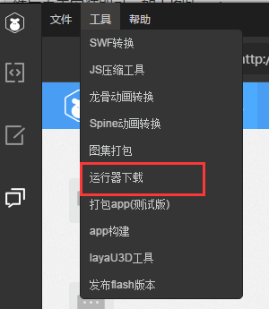
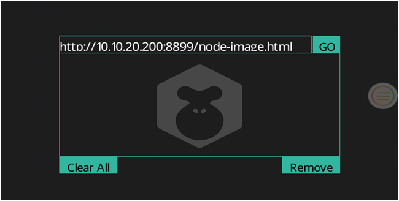

# How to run a project with LayaNative test App

### 1. Download and install

Open LayaAirIDE, in the “Tools” menu, click "Runtime Download",  and pop up display a QR code download address.

​	
​	Picture (1)

​	
​	Picture (2)
**Tips：LayaPlayer is not a browser, enter the address to enter the full path, even if the default boot is index.html, also to enter /index.html. **
* http://testgame.layabox.com/index.html      正确  
* http://192.168.0.100:8899/index.html        正确  
* http://testgame.layabox.com/                错误    
* http://testgame.layabox.com                 错误  
* http://192.168.0.100:8899/                  错误  
* http://192.168.0.100:8899                   错误  

**Tips: input address, if you find any screen is not displayed on the screen, it may be because the project is not properly set screen, please refer to the document: https://github.com/layabox/layaair-doc/tree/master/English/LayaNative/screen_orientation **

#### 1. Android download and install

Scan directly with android phone code, click apk to install.

**Tips：If you use the WeChat scan code, because of the WeChat security settings,  after scanning code need to copy the link address to the mobile browser to download.**    

#### 2.iOS download and install

　　Scan with the WeChat, click "Open with Safari", open the Safari browser, click the Install button, and then click Install, as shown below:

**Step 1: **

​	 
​	Picture (3)

 

**Step 2：**

​	 
​	Picture (4)

 

**STep 3：**

​	  
​	Picture (5)

  **Tips**：

Click the installation, there is no automatic jump function, you need to manually go to the system desktop look at the existence of Layabox application is installed, if you are installing, waiting for the installation after the next step.

　　After the installation is successful, click Run to pop the "untrusted enterprise developer" and this time needs the developer to set it on its own. You need to click "set"-->"General"-->"Device Management"-->" Click LayaBox Network Technology.."-->"Click Trust".  Finally you can open LayaBox application, use it as shown below.

**Step 4：**

​	 
​	Picture (6)

 

**Step 5：**

​	 
​	Picture (7)

 

**Step 6：**

​	 
​	Picture (8)

 

**Step 7：**

​	 
​	Picture (9)

 

**Step 8：**

​	 
​	Picture (10)

 

#### 3. Open the application

　　After opening the application, you will see the interface of Figure 11:

​	 
​	Picture (11)

　　The default address is a performance test instance provided by LayaBox, and click the “GO” button to enter the performance test. Of course, developers can enter their own project addresses for testing, as shown in the following figure:

​	 
​	Picture (12)

 

Click on AssistiveTouch in the project and click Back to return to the home page.

​	 
​	Picture (13)

 

The second time you open the app will automatically record the last entered address.

​	 
​	Picture (14)

 

#### 4. Precautions

　　Text format files (for example: ini, XML, HTML, JSON, JS, etc.) must be utf8 encoding format, because IOS devices do not support non utf8 format encoded files now.

#### 5. Suggestion

　　It is recommended that developers learn the basic knowledge of Android and IOS development. They can connect mobile devices to computers and check log at any time. There are many important information in log, which can help developers locate problems. For example, file names, network errors, downloading errors, and so on, which are encoded in non - utf8 format.
