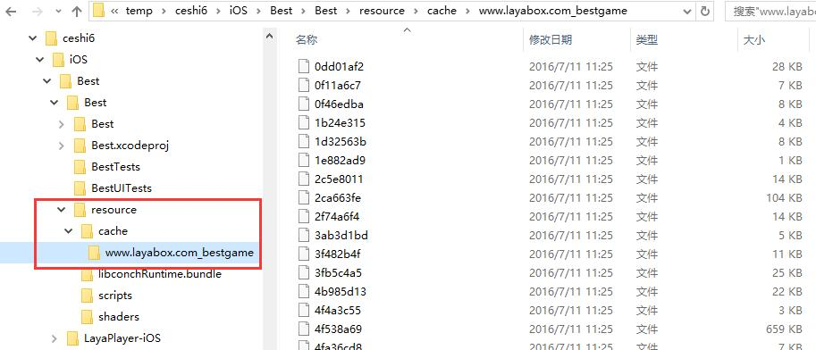
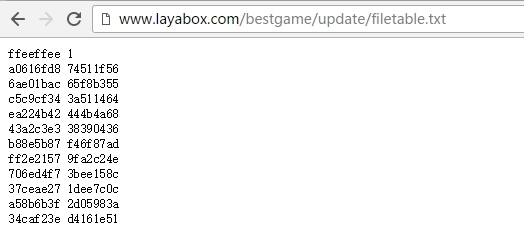

# LayaDCC tool

## Introduction
LayaDCC：Laya-Dynamic Content Check，a hot update solution provided by LayaPlayer. The advantage is that the network traffic can be reduced effectively when the running difference is updated. main data is DCC file, DCC file is used to describe the check value of all files in the project. DCC file is generated by the tool layadcc.

Layadcc will traverse all of the project files, generate a binary file filetable.bin that contains all the file's checksums. layaPlayerAt startup, this file is obtained from the server（If you need it）determine what files need to be updated.

layadcc it can also be used to create a resource package that is used to pack the resources into App.

## type of LayaPlayer resource package
There are three current resource packaging solutions.
1. #### App networking package：  

   App   itself does not have any resources,  and the volume is the smallest.
   LayaPlayer first run time, all the resources used will be downloaded from the server side, And cached in the local。Second and after operation, DCC file will be obtained from the server first, and then when you need to download a file, Check whether local resources need to be updated, Only when it needs to be updated is it really downloaded, Non-updated resources are read directly from the local cache
   Local caches will increase gradually.

2. #### Resource based App networking packages:

   App package itself contains some or all of the game resources, with a larger package.
   data can still be updated, i.e. each run will still take the DCC file from the server to check, if found a file in the package is old, it will download the new file in the local cache, then run again, as long as the cache file has not changed, we still use the cache. 
   After many updates, most of the files of the App package are invalid, and the local cache is always taken. At this time, it is recommended to renew the App package and package it with new resources.

3. #### App offline package (stand-alone package) :  

   All of the resources are packaged in App directly, without the need for network downloads, or even networking. The volume is the largest.
  Because it is a stand-alone version, no url, so can not be dynamically updated resources, you want to update the resource, you can only update the App.

## Install and use layadcc
layadcc based on Node.js, So you need a Node.js environment.
### 1. Install  Node.js 
Reach nodejs[official website](https://nodejs.org/en/) download.
node.js cant support too old version, under 0.xx, you can use the command to view the node version
for example :  
```bash
$ node -v
v4.2.0
```
This version is OK.

### 2. install layadcc
```bash
npm install -g layadcc
```
If you install it smoothly, you can execute layadcc directly on the command line.

### 3.Usage method

```
layadcc 资源目录 [options]
options:
    -cache 生成资源包.
    -lwr 文件路径全部转为小写。（一般不需要）
    -url url 如果要打包资源的话，对应的url.
    -cout outpath 打包资源的输出目录，如果不设置的话，就是在资源目录下。
例如:
   layadcc d:/game/wow -cache -url www.game.com
```
### 4. Actual operationn
#### 4.1 Operating environment
Make sure Node.js, npm, and layadcc are installed properly
Authentication method:  
  
Picture 1  
As long as the implementation of layadcc no error on it.

#### 4.2 html5 project environment
Suppose there is a game project, put contents under F:/work/test/bestgame/ (Start page index.html is in this directory), directory structure is：
  
Picture 2   
After the project is published, the corresponding URL address is： `http://www.layabox.com/bestgame/index.html`  
（If the single version does not need the URL address）

#### 4.3 Packaging resources
Now you have to pack the HTML5 project and put it in the App project.
```
 layadcc F:/work/test/bestgame -cache -url http://www.layabox.com/bestgame/index.html
```
If it is a single package, input:
```
 layadcc F:/work/test/bestgame -cache -url http://stand.alone.version/index.html
```

Following figure :  
  
Picture 3  

加了`-cache`参数后，就会遍历所有的资源文件，输出到`-cout`指定的目录下，如果没有`-cout`参数，就在工作目录下创建一个layadccout目录（如上图），输出目录下的cache目录就是打包App的时候需要使用的资源。  
然后把这个目录拷贝到构建的项目的对应的目录中，就可以编译打包生成App。  
在不同的开发环境下，需要放到不同的目录中（如果使用LayaAirIDE或者layabox命令行工具，可以自动完成这一步）。  

**Android Eclipse:**  
 <br />
（图4） android的资源目录是项目下的assets目录   

**Android Studio:**  
  
（图5）  

**iOS XCode:**  
 <br />
（图6）IOS是resource目录

#### 4.4 更新服务器
这是App发布后最常见的操作。每当更新了html5项目的内容，需要提交到服务器或者本地测试的时候，都要生成新的dcc，以便客户端能更新到最新资源。操作过程如下图：   
  
图7   

可以看到执行完layadcc后，在指定目录（现在是当前路径 . ）下面会生成一个update目录。然后把这个update目录拷贝到本地或者远程服务器的相同目录即可。  
**Tips:**   
为了方便和不出错误，建议直接在服务器所在目录下执行layadcc。

**update目录介绍：**   
  
图8  

allfiles.txt 所有的资源文件的相对路径。  
assetsid.txt 本次dcc统计的整个资源包的校验码。  
filetable.bin dcc主文件，里面是每个文件的校验值。  
filetable.txt 文本格式的dcc文件，除了前三行，每一行代表一个文件和对应的校验值，与allfiles.txt正好对应起来，即第4行对应的文件是allfiles.txt的第一行。  
filetable1.txt 这个文件不再使用。  

**注意:**  
1. 如果web服务器上的目录里面没有update目录，或者update目录里面没有内容，则客户端的dcc更新机制就会关闭，这样所有的资源每次都会重新下载。在开发期间建议用这种方式。
2. 上面的例子是在当前目录下，实际也可以指定其他路径，相对或绝对都可以，例如:  
   `layadcc d:/game/bin/h5` 或者 `layadcc ../bin/h5`


#### 4.5 测试
1. 资源打包成功的测试  
   先说包中没有资源的情况，这种情况下所有的资源都会从网上下载，日志如下:   
     
   图9  可以看到有很多的Download   
   **打印信息说明：**  
    这里面的url后面跟着的 @127.0.0.1是调试用的，表示这个文件对应的服务器地址。s=0表示这个文件没有dcc信息， l=xxx表示下载的文件的长度。

    如果打了资源包，即cache目录下的东西拷贝到上面指定的目录了，这时候最直观的变化是包变大了。然后运行app，会有从资源包读取资源的打印，如下：
        
    图10  
   **打印信息说明**  
   打印 `found the file in the package:` 就表示对应的资源是从包中获取的，没有去网络下载，看到这个日志就表示打包资源成功。如果打的单机版，则所有资源都应该有这个打印，不应该有任何下载。

2. 服务是否有dcc的测试：  
   在浏览器里打开地址： http://www.layabox.com/bestgame/update/filetable.txt  
   注意要改成自己的地址，如果文件存在，表示打过dcc。如下图：  
     
   图11 

3. 更新机制起作用的测试  
   直观的测试就是更新了资源，App产生了对应的改变，例如修改了的图片，能在app上看到。从日志看的话，就是资源获取的时候，凡是没有改变的都是打印 `found the file in the package:`， 而改变了的都是打印  `Downlaod [ ] xxxurl `。   
   **注意**  
     1 Download只执行一次，第二次再进入app，这个资源如果没改，就会直接从缓存取。
     2 DCC的机制是运行时更新，所以只有执行到需要这个资源的时候才会下载，而不是一启动就下载所有更新。


**总结**  
* 凡是有 `Downlaod [ ] url `就表示下载，说明没有dcc或者资源更新了  
* 凡是有`found the file in the package:`，说明打包资源成功，dcc起作用了。


**注意:**  
* layadcc执行的时候会修改所有文件的修改时间，目的是为了防止cdn在回源的时候以为文件没有被修改。 
* 上面的地址是虚构的，不存在一个 http://www.layabox.com/bestgame/index.html 的地址。


## 常见问题
1. 打包资源以后，没感觉速度变快，怀疑所有的资源还是都在下载。
    1. 确定是否真的都是在下载，看日志是不是有上面提到的Download和find，如果既有读缓存，也有下载，则没有问题，只是真的下载慢。
    2. 如果全部都是Download，没有读缓存  
        1. 是不是忘了打dcc了，通过浏览器检查服务器是否有dcc信息。
        2. 检查打包资源路径是否正确。

2. App发布后，修改了部分资源，但是没有被App更新到。  
    1. 是不是忘了打dcc了？
    2. 打了dcc了，但是忘了提交到服务器上（建议在服务器打dcc）？
    3. 打了dcc了，也提交到服务器了，但是由于有cdn，还没有把这个变化分发到你所在的节点。

3. 我确认dcc流程都对了，但是某个资源每次都会重新下载，不走缓存。
    1. 确认这个资源是否在打包资源中，即dcc列表中，可以在 update/allfiles.txt中搜索这个文件。
    2. 如果在。确认请求这个资源的url是否有search部分，即?xxx, 如果加了的话，是无法走dcc流程的。    
    3. 如果也没有search，那有可能是这个文件的实际内容与校验值不匹配，dcc会以为是错误的文件，就不缓存了。可能的原因：
        1. 打完dcc以后，有人把这个文件的内容又给改了，导致dcc校验值与实际文件内容不匹配。解决方法：重新打dcc
        2. 没人改文件内容，但是dcc是在客户端打的，文件在上传到服务器以后，被上传软件修改内容了。这种情况一般发生在文本文件上，例如有的版本管理工具和ftp工具会把windows下的回车换行变成unix的回车。解决方法：用zip的方式传文件，或者在服务器上打dcc。 
        3. 没有上面的问题，而且错误的是图片。可能原因是有的系统会全局截获http请求，在请求图片的时候，通过自己的服务器来缓存一个被压缩过的图片，来达到所谓的节省流量。这个压缩过的图片的校验值肯定与dcc记录的不一样。解决方法：关掉节省流量功能。
        4. 如果没有开流量节省。但是使用了cdn，则还可能是cdn的问题，例如dcc文件被刷新了，但是对应的资源文件没有刷新。确认方法：通过curl命令下载本节点上的资源文件（方法见附录），与源站的资源文件比较，如果不同，即确认。解决方法：强制刷新cdn节点，或者找cdn客服。

4. 开发期间，每次更新都打dcc太麻烦。  
    不要用layadcc来打dcc，如果已经打了，
    把update目录删掉，然后重新安装一下app，以去掉内部的缓存，这样dcc机制就关掉了，每个文件每次请求都会重新下载。  
    如果某次又打了一下dcc，在服务器端生成了update目录，则缓存又会起作用，想关掉的话，再来一遍上面的操作。

## Further more
1. Process of LayaDCC
     
   Picture 12  
   Corresponding code in index.js

2. Download a file on a CDN node.
```sh
curl -H "Host:www.layabox.com" http://182.110.238.110/bestgame/index.html >a.html
```
Representing the 182.110.238.110 node `http://www.layabox.com/bestgame/index.html`,  file is downloaded and saved to a.html
其中的 Host：后面的内容改成自己的域名， `http://`后面的ip地址改成节点服务器的地址，那怎么获得节点服务器地址呢？在LayaPlayer中，节点服务器通常不会改变，所以可以通过任意一个Download的打印来得到地址，例如:  
```
Downloaded http://www.layabox.com/bestgame/bestgame.min.js@182.110.238.110 s=44216b56 l=422
```
It is known that the node address is  182.110.238.110。 
