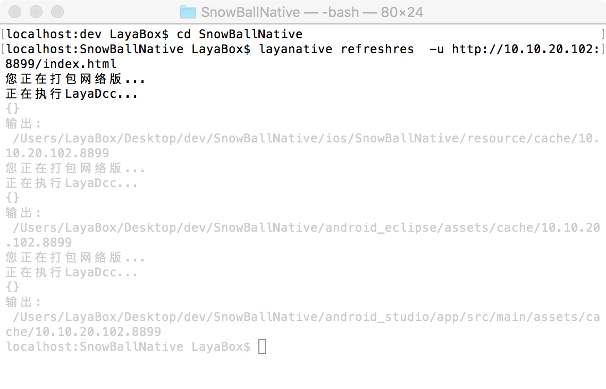

# LayaNative command line tools
The layanative command line tools are used to generate Android and iOS native projects, as well as the resource refresh capabilities of the project to facilitate resource updates during the project iteration.
The function of the generated project corresponds to the  `Tool/app build` in IDE.
## 1. linux
### 1. Install layanative
windows
```   
$ npm install -g layanative  
```
mac
```   
$ sudo npm install -g layanative  
```
### 1. Look at SDK version information
The SDK is a native project template. The listversion command will list all currently available SDK version information. When creating a native project below, you can specify the required version by using the parameter.   
```   
$ layanative listversions  
```
### 2.Create a native project
createapp command is used to create a native project
You can use the following command to view the command createapp help information
```
$ layanative createapp --help
```
#### usage:
    layanative createapp [-f res_path] [--path output_path] [-s sdk_path | -v version] [-p all|ios|android_eclipse|android_studio] [-t 0|1|2] [-u url] [-n project_name] [-a app_name] [--package_name package_name]

#### Parameter description:

| Keyword | describe
| ------------ | ------------ 
| `--folder,-f` |    Resource path: pack the game resources into the client to reduce network downloading and select the local game directory,  for example start index at d:/game/index.html  and the resource path is d:/game. t can not be filled at 0
| `--path` |       native project output directory [Default value: "."]
| `--version，-v` |       SDK Version: using a specific version of the SDK automatically, system downloads the SDK from the server and stores it in a specific location. --version with--sdk Conflicts can not be specified at the same time, the latest version of SDK is not used by default.
| `--platform, -p` |   Project platform [Optional value: all, ios, android_eclipse, android_studio][Default value: all]
| `--type, -t` |       build type [0: Do not hit the resource package 1: Play resource package 2: Stand-alone version] [Default value: 0]
| `--url, -u` |       Game address [When t is 0 or 1, you have to fill it out, and when t is 2, you don't have to fill in it.]
| `--name, -n` |       project name：native APP name of the project [Default: LayaBox]
| `--app_name, -a` |      Application Name：name that appears after the app is installed to the phone [Default: LayaBox]
| `--package_name` |       Package names [Default: com.layabox.game]
| `--sdk,-s` |       SDK local directory: Custom SDK directory, Optional parameters. Optional parameters, under normal circumstances it is recommended to use the parameters--version。
When the type is 1 or 2 will hit the resource package to the native project,Do not play at 0. ottom layer of the package resource is actually a method of calling dcc. Package resource dcc related, reference [LayaDcc Tool](https://github.com/layabox/layaair-doc/tree/master/English/LayaNative/LayaDcc_Tool)。  
Can use --path Parameters specify the output path of a project, default output to the current path

Using the -v  version v0.9.5 of the SDK
```
$ layanative createapp -f SnowBallH5 -t 1 -n SnowBallNative -u http://10.10.20.102:8899/index.html -v v0.9.5
```

Neither specify -v nor  -s is specified, using the latest version of SDK
```
$ layanative createapp -f SnowBallH5 -t 1 -n SnowBallNative -u http://10.10.20.102:8899/index.html
```
Using--version or -v specified version needs a networked environment, Can be used under the network off --sdk or -s Specify the SDK directory [SDK Download address](https://ldc.layabox.com/layadownload/?type=layaairnative-LayaAir%20Native%20SDK%200.9.6)
```
$ layanative createapp -f SnowBallH5 -t 1 -n SnowBallNative -u http://10.10.20.102:8899/index.html -s D:/v0.9.6
```
### 3.Refresh the native project resource package
refreshres command is used to refresh the resource package for the native project
During the project iteration, the H5 project has been modified, you can use refreshres command, re-package refresh resources and code to the native project.
#### usage:
    layanative refreshres [-p all|ios|android_eclipse|android_studio] [--path path] [-u url]

#### Parameter Description:

| Keywords | description
| ------------ | ------------ 
| `--platform, -p` |    Project platform [Optional value: all, ios, android_eclipse, android_studio][默认值: all]
| `--path` |       native project path [Defaults: "."]
| `--url, -u` |       Game address


If the created project is a single machine version, you do not need to enter url for refreshres.  If you enter the network version url,It's a network version of the resource package, Then you need to change the project code, To become a network version of the project. 
If the project created is a network version, You must enter URL when refreshres.If you enter a new address, then change the code to set up URL in the project. If you enter a stand-alone version of the address and call a single version of the resource package, you need to change the project code to become a stand-alone project.
Manually switch between stand-alone and online versions, reference [LayaBox Build tools](https://github.com/layabox/layaair-doc/tree/master/English/LayaNative/build_Tool)。

When createapp is called, resource path is written in the native.json file in the generated native project directory. If the resource was moved somewhere else later, it would not be able to find resource directory. Createapp, if the -t parameter is specified as 0, no resource can be specified, no resource path parameters can be specified, and the resource path written in native.json is empty. When refreshres is used, it will report empty errors in resource path. These two cases can manually modify the native.json file to specify the correct resource path.

### 4. Delete the native project resource package
The removeres command is used to delete the resource package for the native project

#### usage :
    layanative removeres [--path path] 
#### Parameter Description:

| Keywords | description
| ------------ | ------------ 
| `--path` |       native Project path [Default: "."]

## 3.Applications
1. First create the directory structure shown below. SnowBallH5 is the html5 project resource directory

  
2. Check SDK version information
  
3. Create a native project
  
4. Generate the directory structure shown below. 
  
5. Refresh the resource package at any time 
In the dev directory, the directory of the native project is specified by --path  
       
Entering the native project directory, you do not need to specify the --path parameter
   
5. If you do not need a resource package, delete it
In the dev directory, specify the native project's directory via --path
    
Into the native project directory, do not need to specify the - path parameter 
  

   
Note: If you execute the command line on your Mac, the window will be grayed out for unknown reasons (visible in the picture above). However, as long as the command prompt appears, the command execution is complete and the command can continue.
