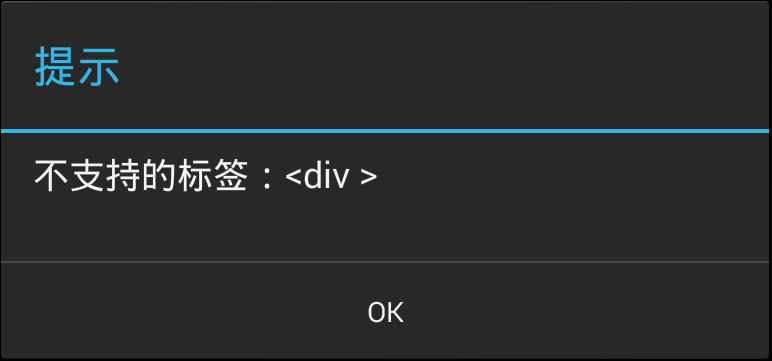

## LayaPlayer Description

LayaPlayer is not a browser ! LayaPlayer is not a browser ! LayaPlayer is not a browser !

Now LayaPlayer is started by an index.html, but in fact, this is just for convenience, in order to unify with the browser. LayaPlayer is not based on the browser, not through the package browser or webkit controls such as the implementation of html content, LayaPlayer internal just use js regular expression to simply parse the contents of the html page, remove the configuration and run inside Script, because html itself is very complicated, and our engine does not need html rendering, so LayaPlayer does not intend to be compatible with html. The resulting problems are :
1. LayaPlayer  only care about html  `<meta>`  tag, `<script>` label. Other tags will be ignored. `<meta>` label now only recognizes inclusion `name='laya'` properties, used to set the horizontal and vertical screen and other configurations, for example:
    ```html
    <meta name='laya' screenorientation='landscape' >
    ```
2. Script tag is best src='xxx' form, because the inline form of the script is more complex, can not be resolved with a regular expression, which may lead to parsing errors.
3. Everything else is not supported. So jQuery, which relies on DOM, is not supported.
4. Similarly, because LayaPlayer is not based on Node, so all the node-based scripts are not supported.
5. Other currently not implemented, and are expected to be implemented in subsequent versions.

    |function | priority |  
    |:--|:---|  
    |wss协议| High |
    |Orientation| High |
    |WebAssembly|High |
    |XMLHttpRequest synchronous call|Low|
    |WebVideo|Low|
    |WebWorker|Low|
    |WebVR|Low|
    

**prompt:**  
When the LayaPlayer is running, if you encounter a label that is not supported, it will directly play the wrong frame. For example, figure 1
  
Picture 1


