# IOS packaged release APP all the detailed processes

Some other good reference: [Click to open link: IOS Developer Certificate Application and xcode5 application online release](https://www.lvtao.net/ios/558.html)

## Part A. Application for Apple Developer account

  First, you need to apply for an apple developer account to publish the application in APP store.

　　The developer account is divided into:（1）Personal developer account   （2）Enterprise developer account 

　　The main difference is：[Click here for details](http://www.zhihu.com/question/20308474)

### 1.Personal developer and Enterprise Development Account Application

　　[**Click on the open link**](http://jingyan.baidu.com/article/676629976d12aa54d51b841f.html)

Which companies need to apply when D-U-N-S Number coding:

#### 1.1     The company's  D-U-N-S Number

 Apple Corp to send an email (or directly call the Apple Developer service hotline: 40067018552). He will provide you with free registration Duns. A direct registration is good.

   [https://developer.apple.com/ios/enroll/dunsLookupForm.action](https://developer.apple.com/ios/enroll/dunsLookupForm.action)

#### 1.2     A copy of the company's business license and the company in English name control certificate

 Proof of your company's English name of the letter (in fact, as long as a sentence just fine, for example, you write this letter to indicate our company's English name is XXXX ok), the company sealed.

   Many domestic companies are unable to fax abroad, this time you can use Internet fax, recommended [http://faxzero.com/](http://faxzero.com/) 

#### 1.3     A credit card that opens VISA or MASTER

 It can be personal, submitting accounts to Apple ($99)

### 2. Account registration

#### 2.1     Application of Duns

　　 First apply for the D-U-N-S Number  code, you will receive the phone the second day of the application, with the mail. That mail is not Dun & Bradstreet code. But your application code. It is best to keep it. Is a ten-digit code, about noon you will receive a call from Huaxia Dun & Bradstreet. Is to check with you about the information. About night, you will receive a new mail. That is the Dun & Bradstreet code. This D & B code is invalid and needs to wait at least 14 days before it can be used.

　　After 14 days, go to the ios develop website and apply for the developer account. If you are prompted with an invalid Dun & Bradstreet code, call Apple Developer Center and tell him that D & B is invalid and she will process (maybe contact with D & B) A few days (specific customer service will tell you a few days) Dun & Bradstreet code is available.

　　Then you may fill in the company information may encounter prompts that the company information and information in the Apple database does not match (in fact, Dun & Bradstreet database and Apple's database is not synchronized), do not worry, then call, she will tell you Company information in the Apple database. Then tell you a D & B's email address (this email is used by Dun & Bradstreet exclusively for Apple developer accounts) and you send the company information in the Apple database to D & B to change it. Wait another 14 days, go to apply, everything ok. This situation is not everyone will encounter. If the information matches, it is the best. Do not wait 14 days.

  

*Tips: wait patiently for 14 days and then register, Duncan code has the number of attempts to limit.*

#### 2.2     Information registration

 　　After applying for the D & B code, it is to register iOS developer account, to  [http://developer.apple.com/programs/ios/](http://developer.apple.com/programs/ios/) This developer account registration entry, start enroll (registration). If you already have an apple personal account, then you can be your personal account as a developer account, or you apply for a new account.

　　When you choose to be registered as a person or company, please choose the company. Registration is to fill in the information must be paid attention to, do not disorderly fill, to really fill, or you will be in trouble when the back of the verification. When you ask you to choose that development platform, you have to choose ios.

　　When you have registered your personal Apple account, you will be transferred to the company information to fill in. The information of the company should be filled in. This will be linked to the business license of your company, and the subsequent audit will be used. Registration information can only be used in English, so for companies and addresses without English names, it is necessary to deal with these things first. After completing the company information, the next step is to fill in the mail, which will be used to contact the Apple Developer Center later, and you can choose the name of yourself or your boss. The next thing is to wait for the other party to review it. It will usually wait for 1-2 days, and if it has been examined, the other party will send you mail.

  

PS：Representatives, and legal entity fields, must be the same as when applying for the D & B code, otherwise can not be passed, this is what the above information does not match the database field. .

#### 2.3     Fax information

　　apple over there if you have passed your company information, it will send you a message to send information in the past（The other party will use this mail [devenroll@apple.com](mailto:devenroll@apple.com)）. You need to send your company's business license, a letter to prove your company's English name. This is just a word to say, for example, you write this letter to indicate that our company's English name is XXXX, OK, and the company seal. And then fax the past. Many domestic companies can't fax it to foreign countries. This time you can use Internet fax. Recommended : [http://faxzero.com/](http://faxzero.com/) 

　　**This step is the most troublesome, to wait for 3-4 days review period**

*Tips：Apple doesn't recommend fax and ask them to turn to the apple developer team.*

#### 2.4     Phone verification

​    If your fax is passed by, the other person will email you and let you call for verification. There is a Chinese area phone, you can choose to call this.

#### 2.5     Payment

　　 When the phone is finished, you will receive an email in a few minutes for you to pay. Apple does not open domestic online payment, so you have to fill in a purchaseform. You need to prepare a transnational credit card (such as visa or Mastercard, etc.), fill in your credit card information, and fax it to purchase form again. After the first 2 days, if the other side passes your payment, you will be officially opened.

#### 2.6     Activation account

　　After payment, the account is basically opened, and then the apple will send an email that activates the account. There is an activation code in the mail, and the activation code is activated directly.

 Here is the end of the application for the developer account.

## B. Apply for APPID

### 1 . Add BundleID

​       
​      Picture (1)

**After clicking Add**

​       
​      Picture (2)

**Select the store to release**

​       
​      Picture (3)

 The final submission is good

### 2. Connect iTunesConnect

​         Just activated account is temporarily unable to log on to iTunesConnect. You need to wait for apple to send you a message about login, then you can log in, otherwise you will not have permission.  
Picture (4)

### 3. Create new applications

**3.1  After logging in to iTunes Connect, click Manage Your Apps to go to the Admin page. **

​      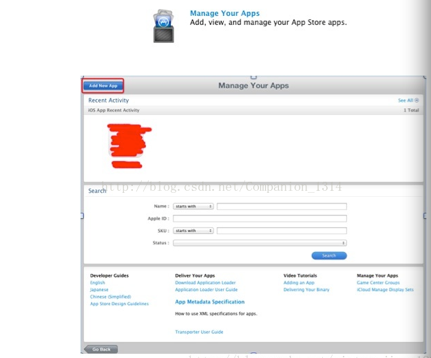 
​      Picture (5)

 **3.2  Click the “Add new application” button**

​      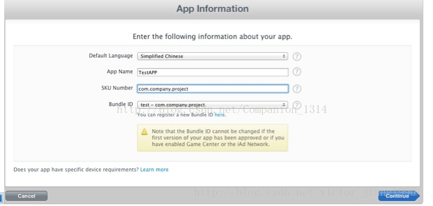 
​      Picture (6)

  

We dont know what SKUNumber mean exactly, we suggest to fill same as BundleID. The fourth BundleID, once selected, can not be changed, so be careful.

**3.3 Set effective time and price**

​       
​      Picture (7)

 The price here is by level, and not exactly how much money, Tier 1 for 1 US dollars, equivalent to 6 yuan in Chinese shops.

Note that there is also a store where your app is published, by default all stores are released.

​       
​      Piture (8)

 **3.4 Set APP information**

​     Including the version number, ownership

​       
​      Picture (9)

​     

　　APP content description, the default is None, according to the actual situation of their own APP

​      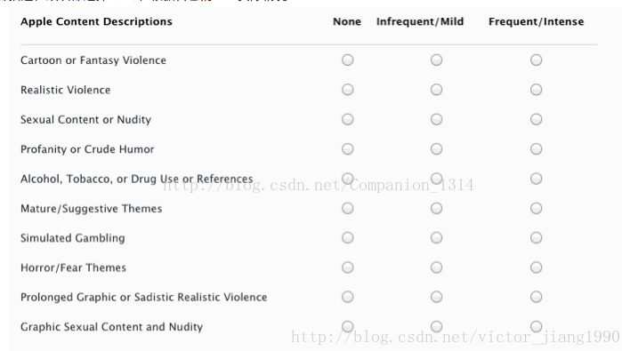 
​      Picture (10)

　　Then there are some metadata, the description of APP, which is used to display in APPStore. The keyword is used by the user to use these keywords to search your APP. SupportURL is the address that the user can contact when your APP has a problem.

​        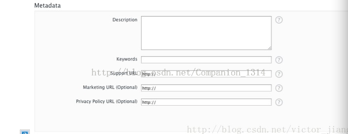 
​      Picture (11)

　　Then the feedback information of the APPStore audit, including the contact information, and the APP test account.

​      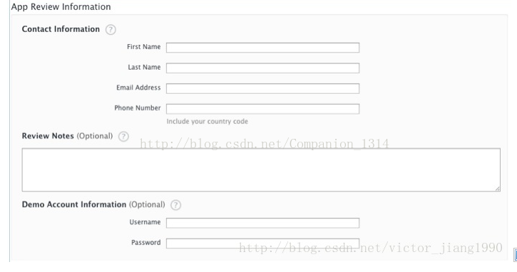 
​      Picture (12)

​        The last is to upload Icon, screen screenshots, screen screenshots not more than 5.

​        
​      Picture (13)

​        Submit, there is an APP ID.

​       
​      Picture (14)

### 

**Tips：**

​            Note that the current status is Preparefor Upload, click ViewDetails, after entering "Readyto Upload Binary"

​       
​      Picture (15)

​            Then you will be asked if you want to use the encryption feature, choose to save it later.

​        
​      Picture (16)

​            The current status is  “Waiting For Upload”。

## Part C. Uploading application

### 1 Create a CSR file

1.1   Open the keychain in your computer and find it in the application

​       
​      Picture (17)

 1.2 Select the following options in the navigation bar

​         
​      Picture (18)

 1.3 Then enter the user's mailbox, name, choose to save to hard disk.

​       
​      Picture (19)

 **Note: The user's Email is the developer's account mailbox, CA mailbox can not fill in, provided that you choose to store to the hard disk**

At this point in time to generate such a document

​       
​      Picture (20)（This file needs to be used when a certificate is generated by the developer center）

### 2 Create a publishing certificate

 2.1 Select App Store

​      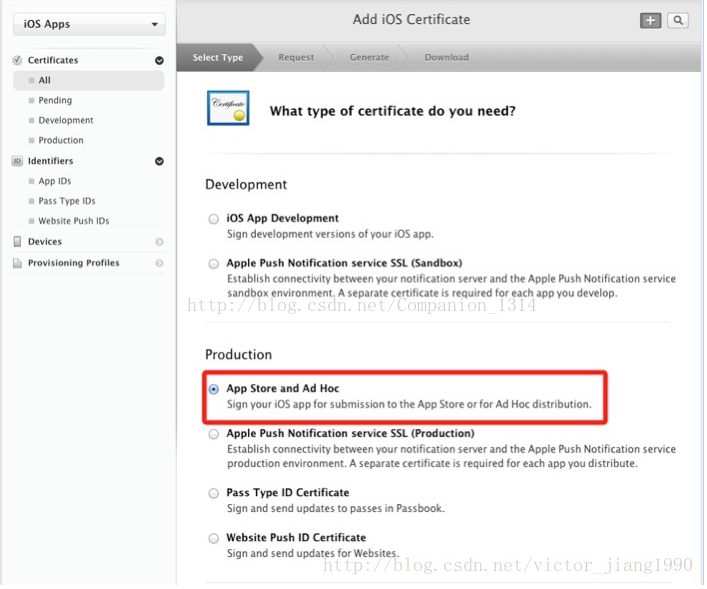 
​      Picture (21)

 2.2 Upload the CSR file you just created

​       
​      Picture (22)

 2.3 After the certificate is successfully created, download to the local.

​       
​      Picture (23)

2.4 Double-click the file to add it to the keychain.

​       
​      Picture (24)

**The purpose of this is to publish a license for your computer installation, and only in this way your computer can release the program.**

### 3 Create  ProvisioningProfiles

####  3.1 Select APP Store                              

​       
​      Picture (25)

####  3.2 Select App ID

​        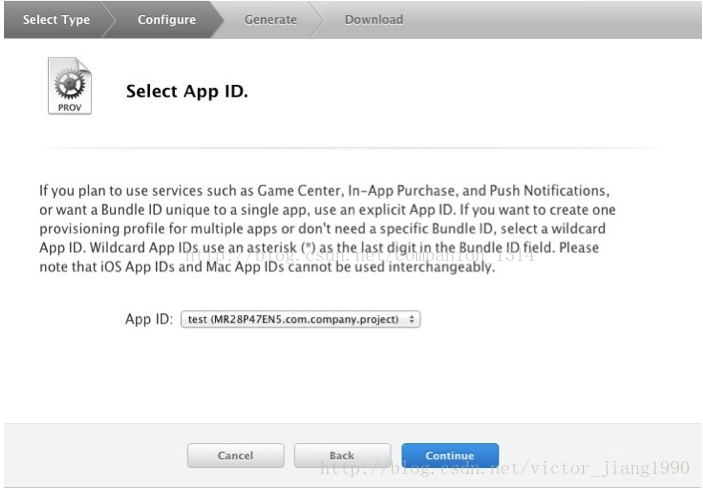 
​       Picture (26)

####  3.3 Select a certificate

​       
​      Picture (27)

　　This certificate is also the certificate that has just been generated. One mistake can be encountered was that there were two certificates. If chose a wrong one, resulting in the problem that the package description file was out of order, which resulted in the failure of publication.

####  3.4 命名

​      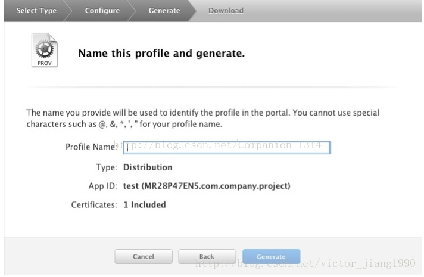 
​      Picture (28)

The name of your choice is visible to you when installing to Xcode.

 3.5 After the final submission, download the ProvisioningProfiles file to the local, double click open to add to the Xcode.

### 4. Xcode settings

####  4.1 Setting up target

​                    The BundleIdentifier here must be consistent with the BundleID previously applied; the version number must also be consistent with the version number of the previous application for AppID.

​      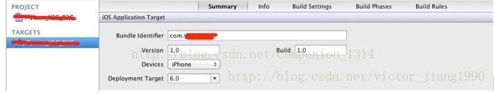 
​      Picture (29)
​       
​      Picture (30)

####  4.2 Modify the signature file

　　You must select the ProvisioningProfiles file you created earlier

 
​      picture (31)

  

####  4.3 Add distribution configuration

 If you did not add one

​       
​      picture (32)

Next is the packing process

There is a packaged button in our xcode

​       
​      picture (33)

After the package is completed, it will pop up automatically, or you can view it in "origanizer"

​       
​      picture (34)

​      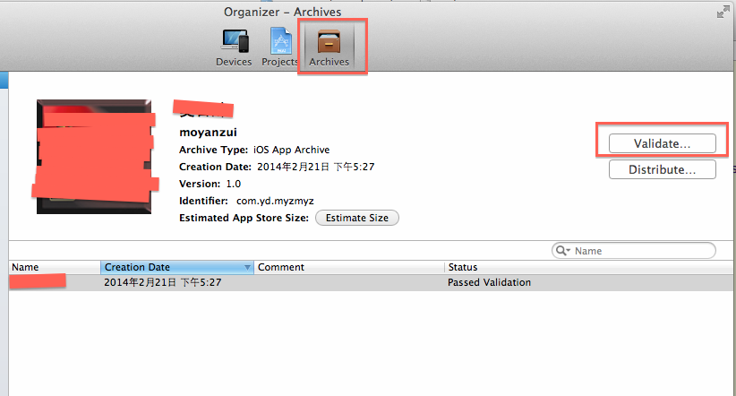 
​      picture (35)

After that, verify the information, click the "Validate" above to verify it, and make sure that it is no problem in submission. No verification can also be submitted, but if you do not verify the problem will be very troublesome, it is better to form a good habit of checking and submitting.

Click on the verification, there will be a frame, here enter the developer's account and password, click next

​      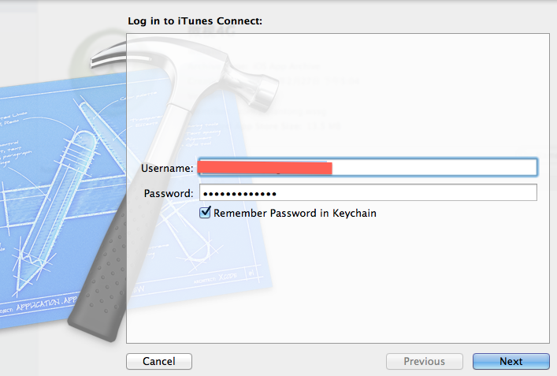 
​      picture (36)

Select a description file (with the description of the certificate issued)

​       
​      picture (37)

This interface indicates that your app is OK. If there is a problem, it will prompt errors or warnings. If you have questions, you need to revise your app again. There are some warnings, which can be directly submitted without modification, which is purely based on your perfectionism.

​       
​      picture (38)

## Part D.  Submit the application to app store

Apple recommends the use of Application Loader with Xcode to submit our application, but in addition to this, we can also use the other, the following.

### 1. the application directly to the app store

*（This method is not recommended）*

Click distribute

​       
​      picture (39)

select

​      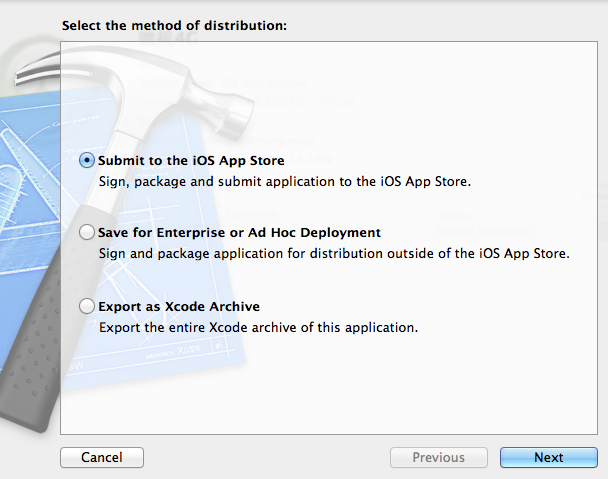 
​      picture (40)

​       
​      picture (41)

​       
​      picture (42)

After clicking submit, you can validate it

### 2. xcode comes with the application loader to submit our application.

（recommend）

Same as the first step above, click on distribute, but select the second option

​      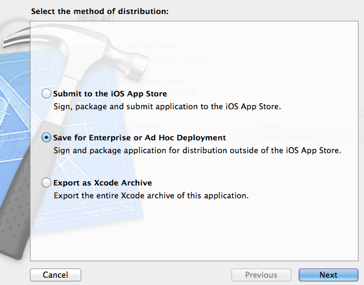 
​      picture (43)

Here will generate a ipa for us to save to the local

​       
​      picture (44)

After saving, select xcode - open develop

er tool — application loader

​       
​      picture (45)

See the picture below, fill in the information, you can upload

​       
​      picture (46)

​      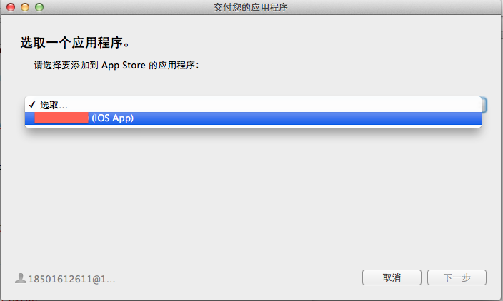 
​      picture (47)

​       
​      picture (48)

Here click on the "Select", we will just have a local upload .ipa file on it

​      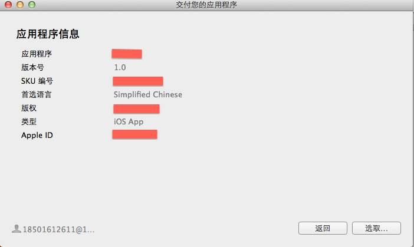 
​      picture (49)

​       
​      picture (50)

​      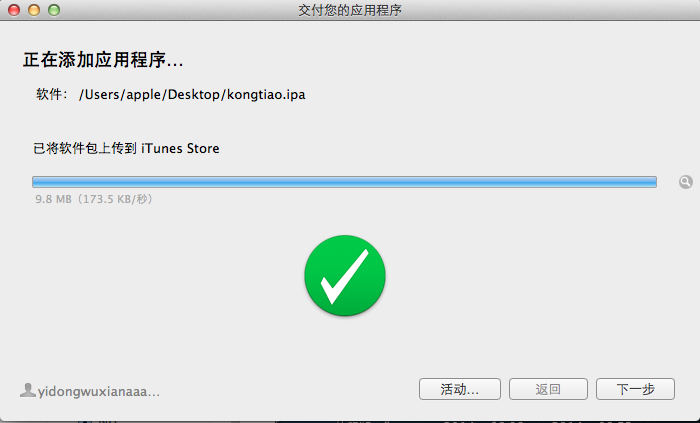 
​      picture (51)

Upload success, this time, you can see the status of your app has become waiting for review. 5,6 days after the upload is complete we can see the status of our application to see if there is any change, no change or a hurry. When Apple reviews, the status will be changed to in review. Next you can know your application is successful or rejected.
