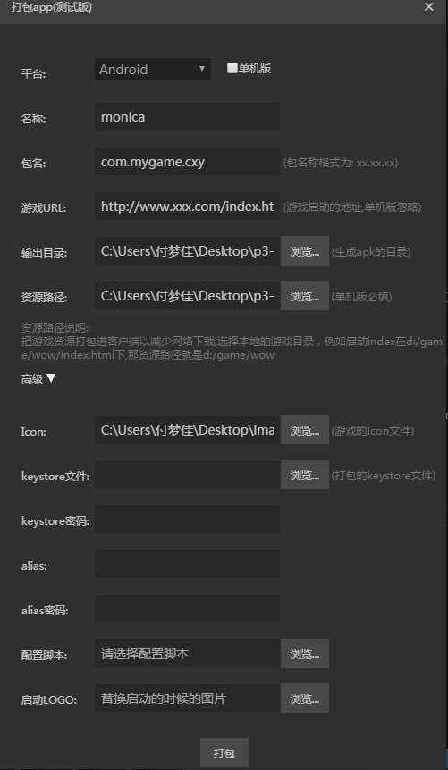

# LayaBox packaging tools

The project created using LayaAir IDE can not only generate H5 pages running on the web site, but also can be packaged into App to install and run at the mobile end. However, at present, only supporting Android version of app is supported, because IOS system can only be packaged through Apple XCode, and can not be packaged by other third party tools. For the construction of the XCode project for IOS, you can refer to the document “build the project”.

Packaging function is used only for quick testing and demonstration. If you really want to release it, it is recommended to use the method of building a project.


## 1. Effect:

　　Unpack the existing layabox package, modify the icon and start the page and other parameters, rebuild a new app. Generated this app can be installed and run directly, can also be released directly to the major platforms (after access login and payment functions).

## 2. Operational requirements:
1. Need to have installed 1.7 above jdk, if not installed, you can get it
   [Here](http://www.oracle.com/technetwork/java/javase/downloads/jdk8-downloads-2133151.html) Download.

   (Now there is a problem: in the MAC system, if you have already installed 1.8, it may lead to a packaging error.)

## 3. Instructions:
Click the menu Tools / package app (beta), as follows:
  
When you fill in the parameters, you can pack it. **Packing takes time**, so there will be a progress prompt， if there is no error,  the progress will reach 100%.
After the output directory will generate the final package results.

The meaning of the specific parameters is shown in the following description.


## 4、Android Apk Package
### 4.1 Main interface: 



### 4.2 The meaning of interface parameters :

#### 4.2.1 Stand-alone app  

　　If selected, is to package stand-alone version, or it is packaged online version.
　　Stand-alone version does not require networking, No corresponding URL. So you don't have to provide URL, But the game resources must be provided, startup page is fixed in the resource path index.html. If the project's launch page is not index.html, startup page is fixed to the resource path.
　　The online version must have a URL to do, and whether the packaging resource can be decided by itself（see the  "Resource Paths" section below）.   
　　  <br />
　　**Tips:  Even in the stand-alone version, network operations can still be done through the XMLHttpRequest or websocket, but does not support dynamic update of resources.**


#### 4.2.2 name  

It is the name of the app, which is displayed under the app icon after installation.  
for example:  
    
 `猎刃2` It's the name to be filled here  
*Tips: At present, only the name under the Chinese system can be modified* 


#### 4.2.3 Package names

Android application package name is not visible in the normal case. The rule of naming anti domain names is generally used (it helps to distinguish and avoid conflicts with the app already available in the system).   
　　for example : com.layabox.runtime.demo   
　　package name must be xxx.yyy.zzzformat, at least two levels, that is xxx.yyy . Otherwise the package will fail.


#### 4.2.4 Game url

　　Because the packaged application is an online project, you need to provide a startup URL, pointing to a HTML page, the entry of the application. If a project is generated by LayaAir, there will be an index.html address inside the QR code. When testing, it can be used directly for convenience. But when it comes to anroid applications, you have to have a real webserver address. For example:  
*LAN address: *  

``` 
    http://10.10.20.19:8888/index.html
```
*Actual address:*  
```
    http://layaair.ldc.layabox.com/layaplayer/index.html
```


#### 4.2.5 Output directory

　　It is the result of the package. If there is no error, this directory will generate a re-packaged files, and now the name is fixed as game.apk. The actual use of the name can be renamed, change the name of the file will not affect the name displayed after the installation of the app.
　　*Tips: If there is a problem in the packaging process, there will be some temporary directory under this directory. If this happens, just delete these directories directly.*


#### 4.2.6 Resource path

　　Resource is the actual game assets, such as scripts, pictures, sounds, etc. For online games, URL can run as long as there is a game, but the resources directly into the package words can avoid network download, speed up resource loading speed. If it is stand-alone game, because there is no game url must give the resource directory, all the necessary resources packaged into the apk. 注意打包进apk resources can still be through our dcc tools（Resource cache management）update.

　　*Tips: online game for packaging resources must be DCC at the server side. Otherwise, it will lose the advantage of packaging, and will still download all the resources. How to play DCC. Reference resources [LayaDcc Packaging tools](https://github.com/layabox/layaair-doc/tree/master/Chinese/LayaNative/LayaDcc_Tool)*


#### 4.2.7 ICON  

　　 Icon file of the APP, the packaging tool will generate the icons of the size required by the Android based on this file. Therefore, this icon is best suited to the size of the maximum icon of Android, such as 144x144, If the original image is too small, the resulting icon will be less effective. Icon file format must be jpg or png, if rounded corner one, it must be png format and transparent.


#### 4.2.8 keystore，keystore Password, alias, alias Password 

　　These are keystore related parameters. keystore is used to sign the generated apk. If not fill, the packaging tool will use own keystore file to sign. But for security, it is recommended to use your own keystore file. If you do not have a keystore file yet, can use java comes with keytool to generate one, specific generation method can look for keytool help or Baidu

　　Why should there be two passwords for the keystore password and the alias password ? If you roughly explain, You can think of the keystore as a collection, can think of the keystore as a set, Each of the certificates in him has an alias, that is alias. If you want to remove a certificate to use, first to enter the keystore, so you need the keystore password, and then to remove the alias inside a certificate, but also the alias password.


#### 4.2.9 Configuration scripts : 

　　Please refer to the relevant configuration script: [Package-related other settings overview](https://ldc.layabox.com/doc/?nav=ch-as-5-1-4)


#### 4.2.10 Start LOGO：

　　The logo in the startup page can be replaced with a custom picture design.

　　*Tips: uses LayaNative package services. The LOGO diagram that contains Layabox must be kept in the Launcher page, which is only changed to start the LOGO design mode. LOGO diagram of Layabox can be combined with product LOGO. *


#### 4.2.11 Package：

　　When you fill in the parameters,  click the `package` button to perform the packing work. Whether packing time takes long, there will be a progress prompt. If there is no error, the progress reached 100% and the output directory will generate the final package results. After the package is complete, a game.apk file is generated in the output directory.

