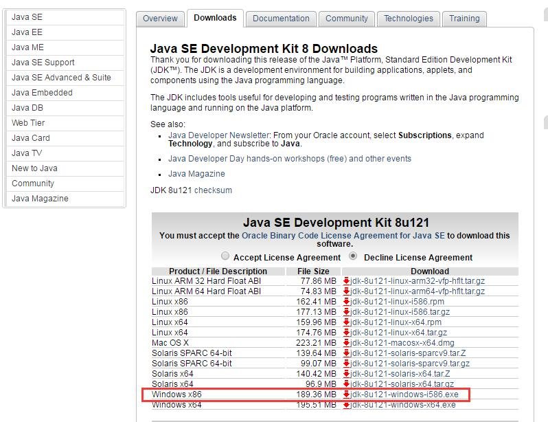
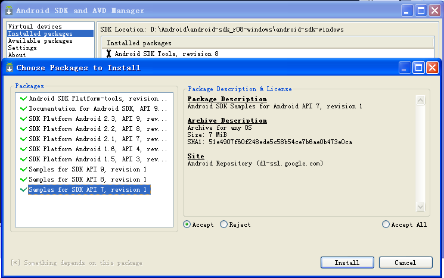
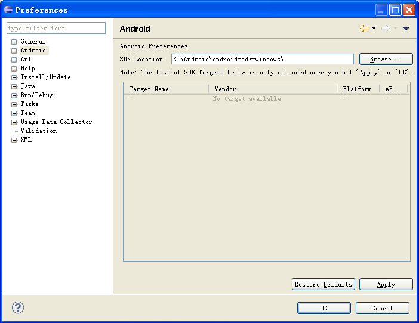
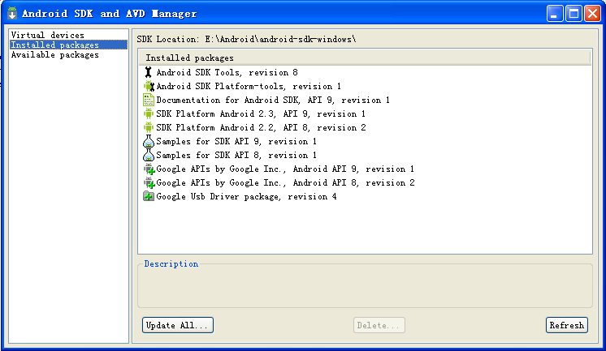
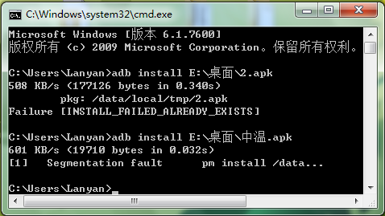
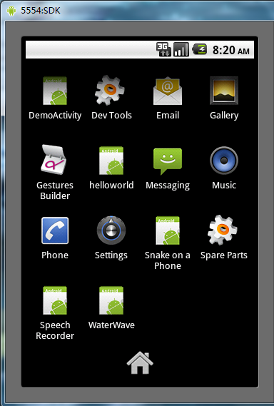
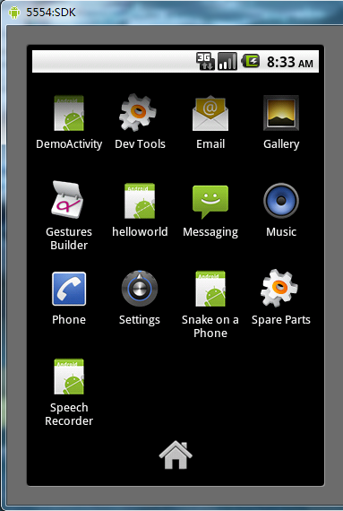
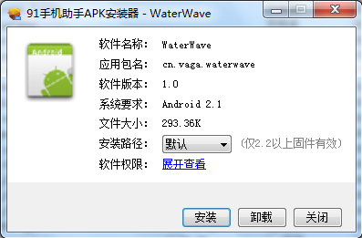

# Eclipse set up the Android environment

## A. Install JDK

### 1. JDK Download

Open the web site [http://www.oracle.com/technetwork/java/javase/downloads/jdk8-downloads-2133151.html](http://www.oracle.com/technetwork/java/javase/downloads/jdk8-downloads-2133151.html)，check “Java SE” Download page, as shown in Figure 1-1, click on the windows x86 version to download.

**Figure 1-1 Java SE download page**

### 2. Install JDK

Double-click jdk-8u121-windows-i586.exe, get the interface as shown in Figure 1-2.

**Figure 1-2 Java SDK settings interface**

Click “Next step”, Change and confirm the installation path（D:\Java\jdk1.6.0_21\, Please note if you change the path please add Java\jdk1.6.0_21\, prevent installation files and D drive files mixed）,Click “Next step”。

**Figure 1-3 Java target folder installation interface**

After changing the path click Next, then “complete”。

### C. Environment variable settings

XP：“My computer” -->Right-click the property --> “advanced” -->“Environment variables” -->System variables（WIN7：“my computer -->Right-click the property -->“Advanced system settings” -->“advanced” -->“Environment variables” -->System variables）.

**Set the following three properties and their values:**

`java_home：D:\Program Files\Java\jdk1.6.0_21`

Pointing to the JDK installation path, you should be able to find bin, lib, and other directories under this path. The installation path of the JDK can choose any disk directory, but it is recommended that the directory is at a lower level.

`path：%java_home%\bin;%java_home%\jre\bin`

Point to the JDK bin directory, compiling execution commands are stored in this directory, so system can identify java commands in any path，And when the console is compiled and run, there is no need to type a large string. Otherwise, every time after running a java program must first move its class file to %java_home%\bin directory, then open the DOS to change the path to the path and execute the class file.

Since JDK has been installed, the directory has two virtual machines (JDK JRE and JRE), so you need to include the bin folder under two virtual machines.

If not added in the path “jdk1.6.0_21\bin”, situation shown in Figure 1-4 will appear:

**Figure 1-4 javac problem**

`classpath：.;%java_home%\lib\dt.jar;`

The search path of the class file that points to the Java program at runtime, JVM tell what path to use or execute on the class, easy to load class files by JVM, purpose of the user can import *，“.;” class file that represents the current directory when the compilation runtime，dt.jar function is the runtime environment class library, Provide support for Java Swing to build display, can open it with WinRAR. jaris the same as the zip  format, only the extension name is different. Only the extension name is different；tools.jar role is to provide non-core classes for utility classes and utilities；lib provide development tools to use the file.

Open “Start” -->“Function”, Enter “cmd”, Access to the DOS system interface. And then enter “javac”, if the installation is successful, the system displays a series of parameters and usage about the javac command.

attention ：java_home Behind can not add “;”，and note that the path name is the path of the JDK, not JRE, and the variable name is not case-sensitive.

#### additional: dt.jar、rt.jar、tools.jar

dt.jar and tools.jar  are the most basic packages of two Java, it contains the most important Lang packages in Java to a variety of advanced functions such as visual swing packages, essential to Java.

| jar Package      | Category                                       | Note description                                     |
| --------- | ---------------------------------------- | ---------------------------------------- |
| tools.jar | The class library, compilation, and running of the class sun.tools.java.*，sun.tools.javac.* | Usually used only in javac，java XXX.java Equivalent to java –classpath=%java_home%/lib/tools.jar XX.XXX.main XXX.java，javac is the encapsulation of the above commands,  so it doesn't have to be added to classpath. The application server is used to compile JSP files, application server will load its own, do not have to set up your own settings. |
| rt.jar    | java Basic class library                                 |  The default is in the load path of the root classloader, No need to add to classpath, same jre/lib Most of the jar below is in this path； Detection method: delete the classpath of rt.jar, use java –verbose Command detection.  |
| dt.jar    | Class library for running environment, Mainly swing packages                        | It's best to add to swing, default of the Eclipse development environment is JRE, so it needs to be set up   |

**Reference resources ：**

3个jar包的作用：[http://blog.csdn.net/hlw881008/article/details/5505251](http://blog.csdn.net/hlw881008/article/details/5505251)

Eclipse下看3个包的作用：[http://blog.csdn.net/dy_paradise/article/details/3909212](http://blog.csdn.net/dy_paradise/article/details/3909212)

JDK各文件夹的作用：[http://blog.csdn.net/qcontriver/archive/2010/03/09/5360975.aspx](http://blog.csdn.net/qcontriver/archive/2010/03/09/5360975.aspx)

## 二、安装Eclipse

### 1、Eclipse下载

打开官方网站[www.eclipse.org](http://www.eclipse.org/)，点击Downloads，选择Windows 32 Bit下的Eclipse Classic 3.6.1下载，即[http://www.eclipse.org/downloads/download.php?file=/eclipse/downloads/drops/R-3.6.1-201009090800/eclipse-SDK-3.6.1-win32.zip](http://www.eclipse.org/downloads/download.php?file=/eclipse/downloads/drops/R-3.6.1-201009090800/eclipse-SDK-3.6.1-win32.zip)。下载到D:\。

### 2、Eclipse安装

将下载到的zip压缩包解压，将eclipse.exe图创建桌面的快捷方式（右键图表 -->“发送到” -->“桌面快捷方式”），以便于启动。

注意：SDK就像是java的JDK，ADT只是一个eclipse的插件，所以两者的安装次序没有严格的要求。

## 三、安装SDK

### 1、下载SDK

打开网站[http://www.onlinedown.net/softdown/32289_2.htm](http://www.onlinedown.net/softdown/32289_2.htm)下载android-sdk_r08-windows.zip，并解压到D:\Android。

### 2、SDK安装

运行文件夹D:\Android\android-sdk_r08-windows\android-sdk-windows中的SDK Manager.exe，出现图3-1，选择需要安装的文件，然后“Install”，等待long long的时间。

**图3-1 SDK安装界面**

如果遇到消息“Failed to fetch URL…”的错误提示，那么需要将HTTPS方式改为HTTP方式，在“Android SDK and AVD Manager”窗口的左侧选择“Settings”，选中“Force https://...”选项，点击“Save & Apply”，并重新运行SDK Setup.exe

在这里我花了很长时间，后来发现下载了一些过时的文件，所以需要注意。点击Available packages选择高版本的SDK。

**图3-2 Available packages**

**图3-3 Installed Packages**

注意：为了让使用者减少长久的等待时间，这里将所下载的目录打包成压缩文件，这样就可以直接解压使用而不需要执行步骤SDK安装。参见软件目录中的android-sdk-windows.rar压缩包。

安装结束之后文件列表如下：其中一部分可能是多余的，网上的解释：

add-ons:一些扩展库，例如 Google APIs Add-On

docs:API文档等等

platforms:各个版本的平台组件

samples:一些实例程序

tools:各种辅助工具

usb_driver:windows下的一些usb驱动

temp:存放下载平台组件过程中的临时文件

### 3、SDK配置

将tools所在文件夹路径（我的路径是D:\Program Files\Android\android-sdk-windows\tools;）加入到path的环境变量中，方法与设置环境变量方法相同。

请注意：此时必须完善Android SDK的安装方可成功，具体操作如下：

1）SDK Location指向android目录

Windowàpreferences中的android选项，SDK Location所填的内容应该是Android SDK的安装路径（在这里是D:\Android\android-sdk-windows）即可。

补充：若在“SDK安装”过程中，是直接解压android-sdk-windows.rar压缩包，那么需要先进行SDK配置，才能完善SDK的安装。

**图3-4 Android SDK路径配置**

如果不设置SDK Location的值，将出现图3-5错误。

**图3-5 未添加SDK路径错误**

2）更新eclipse中的SDK

“Window” -->“Android SDK and AVD Manager” -->“Installed packages” -->“Update All” -->“Accept All” -->“Install Accepted”，详见图3-6。全部安装的时间大约是45分钟，出现“ADB Restart”对话框，单击“Yes”，最后关闭除eclipse之外的对话框即可，此时ADT安装成功。

在“Install Accepted”后出现“Failed to fetch URL http://dl-ssl.google.com/android/repository/repository.xml”

搜了很多资料，方法如下：

1）“Android SDK and AVD Manager”左侧的“Setting”，选中“Force https://…”这个选项；

2）取消选择“Ask before restarting ADB4”，保存设置，该SDK下载器，已经没有"Save and Apply"，修改设置后工具自动到指定地址下载repository.xml（关于save and apply没用的帖子已经很多，有添加环境变量和按enter保存等方法。我第一次下了改版本无法使用，通过以前r05版本修改配置后，才顺利使用r06下载器的。）

3）如果连接成功，则说明OK,接下来就是下载安装

问题：在左侧中没有“Setting”选项，但是实践证明，出现这个状况问题不大。

选择需要的包：

a.如果你只要尝试一下Android 2.0 Emulator（模拟器），那么你只选择“SDK Platform Android 2.0. API 5, revision 1”来安装就可以了。

b.如果你要在此SDK上开发应用程序和游戏应用,那么你需要接受并遵守所有许可内容（Accept All）

**图3-6 SDK更新界面**

如果不对SDK进行更新，那么在创建Android Project时将出现“An SDK Target must be specified”的错误，如图3-7。

**图3-7 An SDK Target must be specified界面**

## 四、配置ADT

打开Eclipse，Help->Install New Software打开图4-1对话框

**图4-1 ADT下载网址设置**

在“Location”中写入[http://dl-ssl.google.com/android/eclipse](http://dl-ssl.google.com/android/eclipse)，即按照红框中的内容填写，最后点击OK，将出现图4-2界面，单击“Select All”之后，将红框所在的关键部分处修改相同，单击两次不同页面下的“Next>”之后，再选择“I accept the terms of license agreement”以及“Finish”，然后耐心等待约20分钟，让系统Install Software，注意此时可能会出现“Security Warning”，主要意思是ADT包含未署名的内容，并且不具有有效性和真实性，询问是否继续安装，关系不大，单击“OK”，最后eclipse将提示重启使ADT生效，单击“Restart Now”即可。

**图4-2 ADT安装**

## 五、创建模拟器（AVD）

Windows -->Android SDK and AVD Manager -->Virtual devices -->New按照图5-1填写，最后点击Create AVD即可。

注意：如果你点击左侧面板的Virtual Devices，再右侧点击New，而target下拉列表没有可选项时，这时候点击左侧面板的Available Packages，在右侧勾选https://dl-ssl.google.com/android/repository/repository.xml，然后点击Install Selected按钮，接下来就是按提示做。

**图5-1 创建新的模拟器**

解释：Target是模拟器的可用平台；SD Card是记忆卡，也就是手机的内存卡；Skin是模拟器显示的屏幕大小，具体参数为：

> WVGA：800*480
>
> QVGA：320*240
>
> VGA：640*480
>
> HVGA：480*320
>
> WQVGA400：240*400
>
> WQVGA432：240*432
>
> WVGA800：800*480
>
> WVGA854：854*480

或者也可以选择Resolution，自由设置模拟器屏幕大小。Hardware（AVD所需要的特殊设备）中的值：Abstracted LCD density（分辨率）其值是由选择的Skin自动设置的等等。

**图5-2 运行模拟器**

选中SDK Android2.2，点中Start -->Launch，将出现图3-3的模拟器。

**图5-3 启动模拟器**

**图5-4 未知虚拟设备**

android模拟器出错，emulator: ERROR: unknown virtual device name

原因：我的文档的默认位置改变，由于创建的文件路径引用错误造成的。

法一：把“F:\Users\<username>\.android”下的文件复制到“C:\Users\<username>\.android“下面即可解决这个问题，不过这样的解决方案有一个明显的缺点，那就是如果又新建立AVD，又得重新复制。

法二：“我的电脑” -->右击属性 -->“高级” -->“环境变量” -->“系统变量” -->“新建”变量名为“ANDROID_SDK_HOME”(注意，这个变量名不能改变，只能是这个名字！)，然后把变量值改为你想把AVD所在的“.android”文件夹放置的位置，比如：”F:\AndroidEmulator”，在这里我把它放在Android SDK包中，值为：“D:\Program Files\Android\android-sdk-windows”

## 六、HelloWorld程序

### 1、创建Android Project

“File” -->“New” -->“Other” -->“Android” -->“Android Project”，出现图3-1界面，然后根据需要填写Project name、Application name、Package name、Create Activity内容，并选择Build Target即可。

**其中：**

Project name：一个项目的名称，实际对应一个文件夹。

Build Target：选择该应用程序所使用的SDK版本。

Application name：程序的名称，一般会出现在应用程序的标题栏。

Pakcage name：此名理论上可以随意，但Pakcage有一定的命名规范，即：第一目指明组织类型，比如com一般指公司，org指组织，edu指教育部分；第二目指该组织的名称，比如sun等，我是自己用了自己的名字；第三目及以后则可根据自己的分类进行定义。

Creak Activity：Activity是一个Andriod程序的一个运行实体，有点类似于C语言的main函数，所不同的是Android程序可以有多个类似与main函数的实体。

Min SDK Version：该项一般与Build Target一一对应，不需要特别指出。

**图6-1 New Android Project**

### 2、创建AVD设备

见第五节。如果没有创建AVD设备，也没有关系，可以右击工程à“Run As” -->“Run Configurations” -->“Android Application” -->“Android”（填上需要运行的工程名） -->“Target”（将部署设备的选择设为Mannul，防止有多个部署设备时的混乱） -->“Run”。在跳出的对话框中选择“Launch a new Android Virtual Device”，选中SDK，点击OK即可。

### 3、编译运行程序

打开hello.java文件，其内容如图6-2所示：

**图6-2 hello.java文件内容**

**图6-3 Java Build Path 设置**

Project -->Properties，出现图6-3对话框，将Android 2.2勾上，点击OK；Run -->Run（Ctrl+F11） -->Yes -->选中SDK，点击Start -->Launch -->OK，等待2分钟将出现图6-4结果界面，表明成功。

注意：右击所要运行的java文件 -->“Run As” -->“Run Configurations” -->“Android Application” -->“Android”（填上需要运行的工程名） -->“Target”（将部署设备的选择设为Mannul，防止有多个部署设备时的混乱） -->“Run”即可。

**图6-4 运行结果界面**

参考来源：[http://blog.csdn.net/zhq56030207/archive/2010/08/31/5852130.aspx](http://blog.csdn.net/zhq56030207/archive/2010/08/31/5852130.aspx)

### 4、调试程序

#### 通过DDMS来调试程序：

（1）将Eclipse开发工具的工作界面切换到DDMS标签。如图6-5和图6-6所示。

**图6-5 打开视图布局显示操作**

**图6-6 视图布局选择框**

（2）在“DDMS”界面中选择“Devices”标签，查看其菜单功能：Debug Process（调试进程）、Update Threads（更新线程）、Update Heap（更新堆）、Cause GC（引起垃圾回收）、Stop Process（停止线程）、Screen Capture（屏幕截图）、Reset adb（重启Android Debug Bridge）菜单选项。

#### 通过DDMS的“Logcat”来调试程序

（1）“Logcat”通过“andrdoi.util.Log”类的静态方法来查找错误和打印系统日志消息。

andrdoi.util.Log常用的方法有以下5个：

Log.v(String tag, String msg);      VERBOSE

Log.d(String tag, String msg);      DEBUG

Log.i(String tag, String msg);              INFO

Log.w(String tag, String msg);     WARN

Log.e(String tag, String msg);      ERROR，适用于“断点”方式调试程序

Log.v、Log.d信息应当只存在于开发过程中，最终版本只可以包含Log.i、Log.w、Log.e三种日志信息。

（2）点击“Run”-->“Debug”菜单命令，进入调试模式。

（3）切换到“DDMS”界面，点击“Logcat”标签，查看我们刚刚在程序中打印的Log信息。用不同颜色表示不同等级的信息，方便跟踪程序。

（4）调试方法

1）设置断点，单步执行：双击某行的标记栏

2）声明条件断点，触发完成：断点在表达式值发生变化时触发。双击设置完断点后右击断点，选择“Breakpoint Properties”在勾上“Enable”、“Conditional”，在框中写上表达式变量，当满足时，程序就会挂起；同时，在输入条件表达式时，也可以使用代码帮助。在上下文菜单中，通过Ctrl+Shift+I或右击变量并选择Inspect选择，会显示结果。

**图6-7 设置调试界面**

## 七、导入一个现有工程

### 导入非Android工程方法：

“File” -->“Import” -->“General” -->“Existing Project into Workspace” -->“Next” -->“Select root directory” -->“Browse”，选择待导入工程所在的位置。

注意：若没有Android的包，则需要重新设置“Build Path”。

### 导入Android工程方法：

“File” -->“New” -->“Project” -->“Android” -->“Android Project” -->“Next” -->“Contents” -->“Project name”（另起一个名称） -->“Create project from existing source” -->“Location” -->“Browse”（选择Android工程所在文件夹，到.xml所在的文件夹为止） -->“Build Target”（选择模拟器平台版本） -->“Finish”。

## 八、安装APK软件

### 1、模拟器上安装APK软件

首先进入Android SDK所在文件夹，由于模拟器启动需要几分钟的时间，所以我们先用命令（emulator -avd youravdname）启动模拟器（注：双击tools文件夹下的emulator.exe无法启动）；然后将plantform-tools下的文件复制到Android SDK文件夹下的tools下（若有重复覆盖即可，也可添加plantform-tools的环境变量），然后打开“运行”，输入cmd，单击“确定”，输入“adb install ”并将要执行的apk拉到cmd中按Enter，之后将会出现图8-1界面，Success！

**图8-1 命令提示符界面**

注意：必须将plantform-tools下的文件复制到tools下或者将plantform-tools的路径加入path 的环境变量中，因为adb命令在plantform-tools中而tools中没有，所以假若没有进行这一操作，将出现图8-2的错误。

**图8-2 ‘adb’不是内部或外部命令界面**

若apk文件名含有中文，将出现图8-3错误，只需要将中文改成英文和数字即可。

**图8-3 “Segmentation fault”出错界面**

**图8-4 apk安装效果界面**

安装成功后将在模拟器面板上出现红色框中的图标，单击即可运行。

### 2、模拟器上卸载APK软件

“Setting（如图8-4中的Setting图标）” -->“Applications”（应用程序） -->“Manage Applications”（管理应用程序） -->“WaterWave” -->“Uninstall”（卸载） -->“OK”（确认）。此时卸载成功面板上的“WaterWave”图标消失。

**图8-5 APK卸载成功**

### 3、真机上安装APK软件

首先“设置” -->“应用程序” -->勾选“未知源” -->“返回” -->“开发” -->勾选“USB调试”。

#### 3.1 方法一

下载并安装91手机助手for Android。然后用USB将手机和电脑相连，打开91助手如图8-6。

**图8-6 91手机助手开始界面**

“手动连接” -->“USB 连接” -->“？” -->“系统维护” -->“文件管理” -->“快速入口” -->“存储卡” -->“上传到设备” -->“文件”（选择要安装的.apk文件） -->双击要安装的.apk文件，出现图8-7，单击安装，完成。

**图8-7 apk安装界面**

或者简便方法：直接双击.apk就可以安装到手机中去。

#### 3.2 方法二

在http://www.hiapk.com/bbs/thread-40417-1-1.html上下载HiAPK Installer（APK安装器），直接双击即可安装完成（只能装在电脑上），如图8-8。这个软件会自动关联你的APK程序，只要双击一下APK程序就可以自动安装到手机里。

**图8-8 HiAPK Installer安装成功界面**

#### 3.3 方法三

安装ASTRO（文件管理器）：将ASTRO.apk放到手机的SD中，然后在手机的文件管理器中的SD卡中点中该apk文件，之后在面板上就会出现ASTRO的图标。以后安装软件时，只要把.apk文件拷到SD卡中，就可以在手机上的APK安装器上进行软件的安装与卸载。

#### 3.4 方法四

下载一个手机的内置APK安装器，然后把.apk文件拷到SD卡中，手机操作安装即可。

补充：文件管理器的功能：文件查看、文件管理、文件搜索、程序卸载和备份、进程管理、SD卡状态。

APK安装器：简化安装apk文件的过程，使其在电脑上操作就可以使apk软件装到手机上。

注意：手机连接电脑时，要下载驱动器或者APK安装器（常用的是豌豆夹，91助手），要不然只是手机的存储卡连上电脑，而手机没连上。
