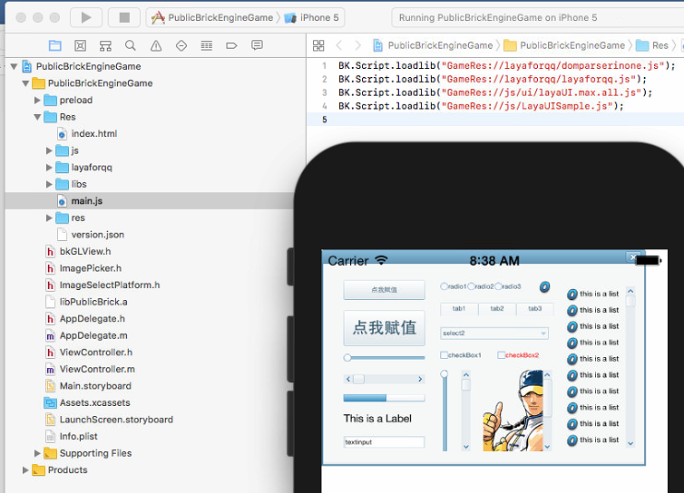

Add a new release panel (beta), replacing the old publishing functionalities

Major update features :

- Add QQ to play a game of release support, easy to release ordinary  projects for QQ play
- Improve WeChat mini-game release support, one key solution to merge JS and TS projects into JS file release
- Improve the old publishing process, improve png, jpg compression, increase json compression, increase js confusion
- Improve the old release process, improve PNG, JPG compression, increase JSON compression, and adding JS obfuscation

In addition, the old publishing system is also moved to the Project menu, follow-up will further optimize the release function capabilities to make it more intelligent.

Publish detailed tutorials: https://ldc.layabox.com/doc/?nav=zh-as-2-0-4

QQ play a emulator display

