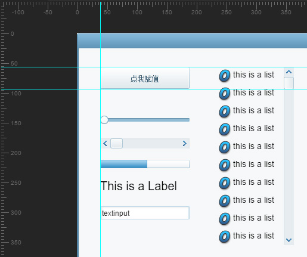

### New features

New reference line,how to use : open the ruler, drag from the ruler (test version)

New adsorption alignment function, use the method: dragging component, press the Ctrl key (test version)

Increase the Ctrl+T conversion component type (or select the component, and then right-click to select the conversion type)

Update the version supported by the Spine transformation tool

### Bugs fixed

The solution to the *.as project has a runclass component that does not export well

The problem of dragging a object to cause the width and height to 0

