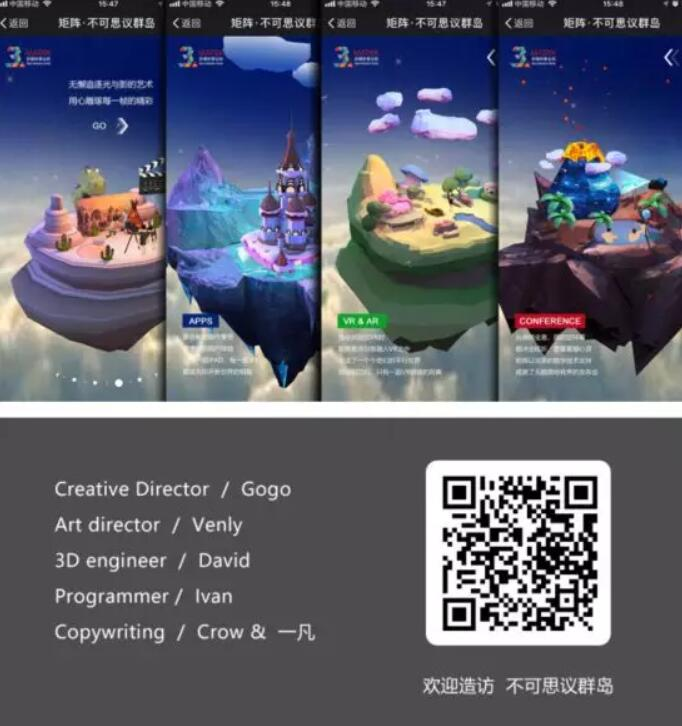
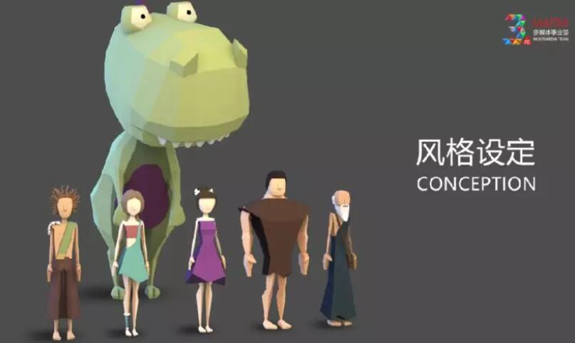
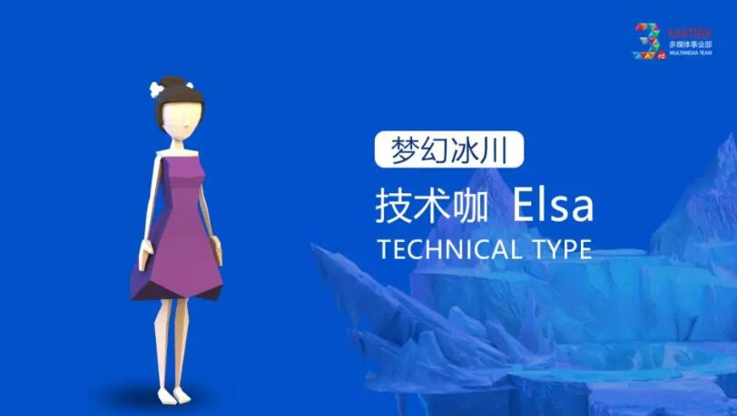

##It's against the sky! 3-D web display can be so wonderful

Previously, I introduced many cool 3D games with LayaAir engine. Today, I'd like to introduce a 3-D web page using LayaAir engine to show the product "Incredible Islands".

This is a non-game HTML5 page, based on three-dimensional space technology, switching between different floating islands. By clicking GO, you can enter each scene, view the island from a 360-degree perspective, and do some simple interactive operations. For example, wearing VR glasses to change the world, clicking on volcanoes will erupt and so on, so that the display of the web page has a game-like interactive experience.

The link experience can be opened by directly pressing the two-dimensional code in the recognition figure or by reading the original text in the lower left corner.

 

**The Origin and Process of Creation of The Incredible Islands**

"The Incredible Islands" is the third anniversary of the establishment of Matrix Multimedia Division of Matrix Interactive. Without the constraints of Party A's various needs, it will be more bold and free to start.

"Introduce us to you in a relaxed and happy atmosphere" is the simplest motive at the beginning of this work.

Since we have to clarify several business sectors to introduce, the concept of "archipelago" was born in the storm meeting.

Four distinctive worlds represent four business sectors respectively. Through the scenarios in each "island", people can intuitively understand and generate associations.

Yellow Desert, Green Rainforest, Blue Glacier, Red Volcano

Next comes style setting. The third anniversary, of course, should be lively and cheerful. We finally choose the simple and fresh style of face. One is to cater to the atmosphere, the other is to consider the efficiency of mobile browsing.

Characters are essential elements of a situation, so we have designed unique characters for each scene.

Interaction is the key, to stick to users so that everyone has a "play" effect. We decided to abandon traditional three-dimensional sequences and videos and use the LayaAir 3D engine as the core so that all links can interact in real time. Immediate rendering makes users almost forget that they are watching an H5 page, but playing a three-dimensional game.

 

Conversion of large scenes and 360-degree viewing are obviously not enough. We have designed some small interactive plots for each "island" to make browsing more fun. Such as wearing VR glasses to change the world, clicking on the volcano will erupt and so on.

**Matrix on Matrix Interaction of Matrix**

Matrix Interactive Matrix is an integrated service provider integrating brand interactive advertising and network marketing, focusing on building a top-notch Internet image for brands and providing interactive solutions for corporate marketing strategies. Its Multimedia Division is a professional and comprehensive technical creation team, covering the late stage of film and television, VR&AR, APP application development, Stage Dancing packaging and other business sectors.