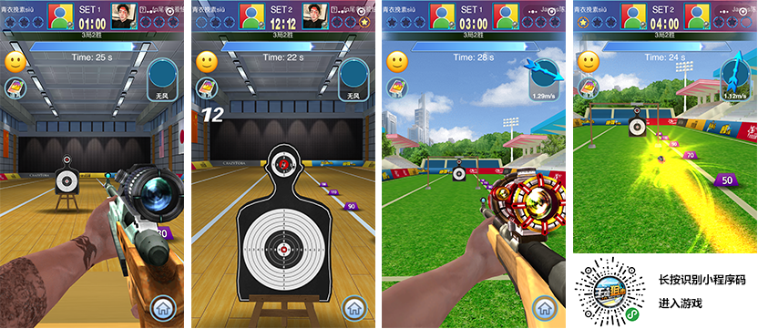
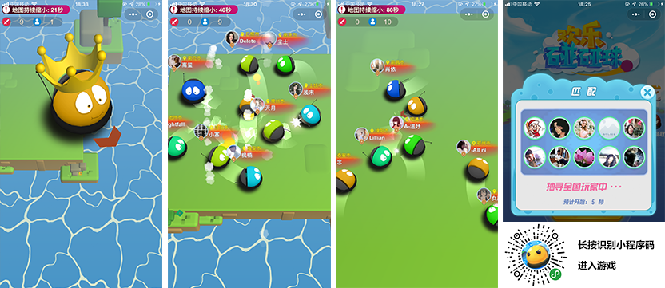
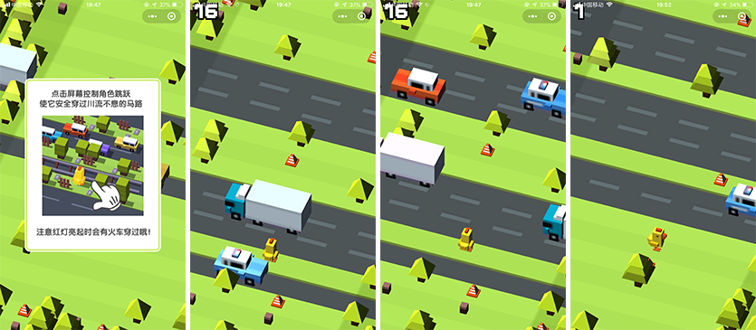
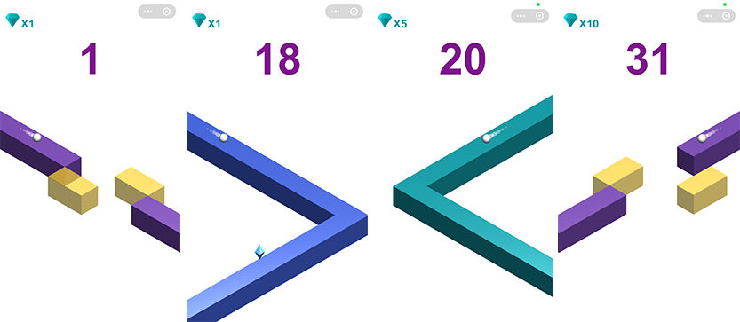

## LayaAir引擎3D小游戏再曝光60款，小游戏引擎11月占比超93%

August. Xiaobian has selected 15 of the numerous 3-D Weixin games to《[原来微信里有这么多好玩的3D小游戏了](http://mp.weixin.qq.com/s?__biz=MzAxMjI4NjA1OA==&mid=2650584197&idx=1&sn=f9f23eb6ca11eda7b2e2039854a042db&chksm=83bc3580b4cbbc963e0f735bc6bf494151b14f384c691de6f82710f90580decff796adf05f95&scene=21%3Ch1%3Ewechat_redirect)》 One article detonates the industry. Now, in the past few months, Xiaobian has found nearly 200 3D games in the top 1000 products that his Weixin friends enjoy. Although the total number of 3D games is still far below that of 2D games, the growth rate of 3D games is showing a much faster explosive growth trend than that of 2D games. In these 3D games, the vast majority of 3D games are LayaAir engine products, and the proportion of 3D engines in small games is more than 93%. The following edition removes the recommended, repetitive and rough quality products from many 3D games, and recommends 60 items for the game industry and players to experience.

> The games mentioned below are all developed using LayaAir engine. If no small program code is provided, you can search the name of the game for experience. The order of introduction is arranged randomly in small editions without any basis for ranking.

####1. Extreme Martial Arts 3D

 

Screenshot of the game "Wonderful Martial God 3D"

**A Brief Review of the Editor**:

"Wonderful Martial Arts 3D" is a 3D ARPG game with well-known IP. The 3D scene is beautiful, and the landscape jump shows the style of immortal swordsman. The interactive experience of hang-up and hand-held enables players not to feel the game is too heavy, but also to fully experience the fun of the game. The only regret for Xiaobian is that, compared with other leisure games, it may have more content to load and a longer loading time. However, for this rare type of 3D mini-games, it is worth waiting for.

> In addition to this large-scale ARPG 3D games, QQ also has a LayaAir Engine 3D MOBA type hand Q light game, which can search for AU plans in Android version of mobile QQ for trial play experience. Since it is not a Weixin game, it is not recommended here alone.

####2. Cardiac Practitioners

 

Screenshot of Heart Trainer Game

**A Brief Review of the Editor**:

"Heart Trainer" is a game of changing clothes and nurturing. The art is fantastic and beautiful. The protagonist of the game is a 3D virtual sexy girl. There are many growth tasks such as changing clothes, nurturing, making money and so on. Players can accompany this attractive girl to eat, bathe, entertain and change clothes. You can also enjoy the image show of other players. Children's shoes with heartbeat can directly recognize the experience of small code.

####3. 3D Warfare Police

Screenshots of the 3-D War Police Game

**A Brief Review of the Editor**:

"3D War Police" is a FPS game (the first person shooting game), the game defaults to give a sniper perspective, players can click on the bandits in the game to achieve sniper shooting, experience the pleasure of a shot. However, in the course of the game, there will be hostages, so we can't shoot them by mistake. The game also has the experience of the plot of the level. Is a very good experience of light FPS games.

####4. Ace Sniper OL

Screenshot of the game "Ace Sniper OL"

**A Brief Review of the Editor**:

"Ace Sniper OL" is a competitive shooting game, in the process of the game experience is very real, with a strong game pleasure after the victory of the opponent PK. In the game, you can buy and replace guns, bullets, sniper mirrors, armor bows and arrows, etc. to make the shooting process more stable. This game is a relatively early product of LayaAir. As early as August, Xiaobian wanted to recommend it. At that time, it was temporarily downloaded because of the server BUG. This recommendation is for the majority of shooting game enthusiasts to experience.

####5. Thumb Archery

Screenshot of Thumb Archery

**A Brief Review of the Editor**:

"Thumb Archery" is a competitive archery game. The core of this game is basically the same as "Ace Sniper OL". Besides the difference between the intuitive feeling of gun and bow, Thumb Archery also has the characteristics of breaking through relationships and inviting friends to fight with Wechat. So it is also recommended for players to experience trial play.

####6. Meng Chong Tank

 

Screenshots of the game "Meng Chong Tank"

**A Brief Review of the Editor**:

"Meng Chong Tank" is a shooting game. The game is exquisite in quality. Tanks are mainly budding anthropomorphic tanks, occasionally helicopter skin. Although the game is wearing tank skins, it is actually a flight shooting game, shooting by moving screen and evading the enemy's shooting barrage.

####7. Chicken City 3D

Screenshot of the game "Chicken City 3D"

**A Brief Review of the Editor**:

"Chicken City 3D" is a round shooting game, the art in the game is not amazing, maybe because of the angle of view, I do not know whether the art is worried about the protagonist's gun can not be seen, or in order to facilitate shooting aiming, from the barrel to extend a small white stick like things. Xiaobian studied for a long time, but did not understand. Fortunately, the game is still interesting. As long as you adjust the angle, shoot the enemy, and jump a shot, you can enter the next level, or you will be hit back by the enemy.

####8. Eating Chicken Meow

Screenshots of the game Eating Chicken Meow

**A Brief Review of the Editor**:

"Chicken Meow" is a jump game based on physical motivation. The word "chicken eat" in the name of the game has nothing to do with the popular shooting game. It's really a chicken meow owner. Miao, the protagonist of the game, leaps forward to eat chickens by clicking on them. The more chickens you eat, the more points you score in the game. In the process of eating chicken, any object (including clouds) can be used as a springboard to jump by force. If you jump carelessly to a place where there is no leverage, the game will end. The feeling for Xiaobian is that the game is simple, although it has some playability, it may be more suitable for students and women.

####9. National Head Iron

 

Screenshot of the game "All Head Rail"

**A Brief Review of the Editor**:

"All Head Iron" is a click-response leisure game, the game is fresh and lovely, easy to operate. All you need to do is to grasp the click rhythm, let the protagonists of the game move forward and hit big and small monsters one by one. If the treasure box is eaten, props, such as darts and spears, will be randomly obtained for throwing and killing monsters.

####10. Wild Flying Ball OL

Screenshot of Wild Flying Ball OL

**A Brief Review of the Editor**:

"Wild Flying Ball OL" is a small ball Parkour game that avoids obstacles and races. It is very magical. It tests the speed and reaction ability of players, and the race speed between small balls has the visual impact of racing car. Xiao Editor recommended in August, "Ball Sprint" game also belongs to this category, and subsequently found a number of similar APP game "Balls Race" play method of Wechat games, some experience is not good to mention, including "Crazy Ball Sprint", "Passionate Ball" and "Crazy Ball Authentic Edition" are also very good games with similar playing methods. The reason why we recommend "Wild Flying Ball OL" here is that there are some micro-innovations in the game. In addition to the basic competition speed and obstacle avoidance methods, it not only shows the current speed of the ball, which is used to prompt players to step on the acceleration belt to accelerate, but also accumulates the sprint energy after each step on acceleration. When the sprint energy bar is full, it will automatically activate the invincible mode for a period of time.（ It can penetrate obstacles without death and further stimulate players to step on acceleration bands.

####11. Ball Cool Racing Game

Screenshot of Ball Cool Racing Game

**A Brief Review of the Editor**:

Balls Race is also an obstacle-avoiding and fast-paced game. Although the core game seems to draw lessons from Balls Race, the detailed experience of color smooth transition, long-term light and fog effects, manipulation feedback and 3D lens visual processing throws off several streets of the APP game Balls Race. Obviously different shapes of roadblocks from other similar games and runway skin imitating highway ground make Xiaobian a little bright after experiencing a lot of games like Balls Race, which can be said to be a high-quality racing game.

####12. Crazy Ball 2

  

Screenshot of "Crazy Ball 2"

**A Brief Review of the Editor**:

The basic operation of "Crazy Ball 2" is the same as the two previous recommended games. It is also a small ball Parkour game to avoid obstacles by sliding left and right, but the runway is straight, without the feeling of bending and climbing. The game can be regarded as a simplified version of the APP game Catch Up, but the experience of the game is not inferior to Catch Up, which even reduces the difficulty of the game and makes the small game players more comfortable to start.

####13. Jump Bar Ball

 

Screenshot of Jump Bar Ball

**A Brief Review of the Editor**:

Jumping Bar Ball is also a simplified version of Catch Up, but it is different from the roadblock used in Crazy Ball 2. Although the overall style and experience of the game is similar to Catch Up, there are acceleration bands (yellow) and deceleration bands (red) in the game that Catch Up does not have, and the springboard has three-dimensional hints to make the jumping experience more friendly. Players can experience it.

####14. Don't stop the ball

 

Screenshot of Ball Don't Stop

**A Brief Review of the Editor**:

The core of "Don't Stop Ball" is basically the same as the previous recommended games, but the art background of the game is exquisite and diverse, and the roadblocks are rich. Accelerated sprint, slope crossing, jumping, obstacle avoidance and other experience is relatively smooth. The overall style will no longer remind Xiao Editor of some APP games.

####15. Cool running ball

Screenshot of Cool Running Ball

**A Brief Review of the Editor**:

"Cool Running Ball" is a small ball Parkour game to avoid obstacles, but unlike previous recommended games, it is a 360-degree shuttle-type 3D hollow running. The only disadvantage is that Parkour's protagonist ball does not have a strong stereo sense.

####16. Boarding

 

Screenshots of the Boarding Game

**A Brief Review of the Editor**:

"Riding Boards" is a leisure click game, by clicking and holding the length of the control boards, built on the opposite pier, you can pass, otherwise short or long, will fall into the abyss. The game prototype may originate from the APP game Plank, and the performance of Boarding in the small game has reached the native APP level. High playability, recommended experience.

####17. Dream of Traveling

 

Screenshot of Dream to Travel

**A Brief Review of the Editor**:

Drawing lessons from the "Plank" games, there are many in the small games, such as "Super Rescue", "Open Road Hero", "Ride the Board", "Go West on the Board" and so on. Each game performs very well, but the innovation is not enough. Only the difference of "Dream to Travel" makes Xiaobian have a bright eye. The game uses checkpoint style, aiming at different urban landmark buildings. In the process of moving forward, real-time prompting is how many steps away from the goal. When you reach your goal, you can enjoy the beautiful three-dimensional architecture. Let this game accompany you all over the world.

####18. Rhythmic Rolling Ball

 

Screenshots of Rhythmic Rolling Ball

**A Brief Review of the Editor**:

"Rhythmic Rolling Ball" is a Parkour game, the role of the game is the budding pet image, in the game can run, jump, avoid. There are also barriers and difficulty adjustment, barriers in the process of breaking through are more playable. Finally, the game has nothing to do with the ball.

####19. Cool Running Chicken

 

Screenshot of Cool Running Chicken

**A Brief Review of the Editor**:

"Cool Running Chicken" is a 3-D Parkour game launched in May. It belongs to the earlier group of 3-D Parkour games. Because the game is relatively simple, compared with Pig Man and other high-quality Parkour, the August edition did not recommend it. A while ago, according to the data revealed to us by R&D, we found that this 3-D mini-game is only developed by one person, without sharing buttons, advertisements, even pure English interface. It is still alive after half a year. There are still thousands of active users every day, which is much better than many new mini-games. So this edition decided to recommend it to you.

####20. Coldrun Heroes

  

Screenshot of the Coldrun Hero game

**A Brief Review of the Editor**:

"Cool Running Hero" is a Parkour game. The full name of the game is "Cool Running Hero Game Parkour Grandma Game", which makes Xiaobian puzzled about why he has a relationship with Grandma. The middleman has been running for a long time and has not found Grandma. However, the quality of the game is still good, the art and feel are good.

####21. Pleasant Goat Running

  

Screenshot of Pleasant Goat Running

**A Brief Review of the Editor**:

"Pleasant Goat Running" is a Parkour game using Pleasant Goat and Grey Wolf IP and art. The plot of Grey Wolf chasing Pleasant Sheep is adopted. The game is exquisitely made and the role image is highly recognized. It belongs to the best of Parkour. Recommend your experience.

####22. Kung Fu Frog

 

Screenshot of Kung Fu Frog

**A Brief Review of the Editor**:

Kung Fu Frog is a leisure physical jumping game. Controlling the direction of the frog falling well and avoiding encountering dangerous areas, the longer the survival time, the more scores. Since the fire of Happy Ball, there have been more than a dozen similar games, many of which are very beautiful and have their own characteristics, such as sprouting downstairs, Happy Adventure, billiards, Happy Ball every day, the ball jumped to the end and so on. Because "Kung Fu Frog" has small program code, it is recommended that you directly identify the experience of small program code, other games can be experienced by searching name.

####23. Hockey Bumper

 

Screenshot of the game "Bumper and Bumper"

**A Brief Review of the Editor**:

"Bumper and Bumper" is a leisure physical jumping game. Comparing with the game of falling and jumping from the horizontal perspective such as Kungfu Frog, Bumper uses the downward angle of falling from deep underground. Falling visual experience is more thrilling, is a very good performance of the small game boutique.

####24. 3D Ball

Screenshots of the 3-D Ball Game

**A Brief Review of the Editor**:

"3-D Ball" is a leisure physical jump game. It also evades the collision-free zone when jumping and falling, or breaks the ice area for continuous falling scores. The visual angle experience is unique, and has the characteristic jump hit music effect and ice breaking effect experience. Recommended Experience Trial Play!

####25. Ball Falling

 

Screenshot of Ball Falling

**A Brief Review of the Editor**:

"Ball Falling" is a leisure physical jump game. The art, music and text details of the game are very good. After playing for a while, I found that the core of the game is actually the version of the Kungfu Frog similar game which was introduced before to remove the pillars. But did not let Xiaobian feel that in playing homogeneous games, in the process of falling and jumping, background color will constantly change, and from the collocation of color and changeable details are very good. Recommended Experience Trial Play!

####26. Mengmeng Square H5

Screenshot of Mengmeng Square H5

**A Brief Review of the Editor**:

"Mengmeng Square H5" is a three-dimensional elimination of wisdom Weixin games. Players need to constantly eliminate useless boxes through different types of digital cues, and ultimately find hidden mysterious gifts. After playing innumerable mindless games, Xiao Biao has to guide many levels to understand how to play after encountering the game. So the game still has some requirements for IQ. If you want to challenge your players, you can experience it.

####27. Super Golf

 

Screenshot of Super Golf

**A Brief Review of the Editor**:

Super Golf is a leisure competitive game with golf theme. Players can control the direction of the ball by clicking and adjusting the angle and hit the golf ball out to get the game money. Then they can hit the golf ball farther by upgrading their strength, speed and elasticity. They can also get more game money. When players hit the perfect hit (pointer in the red center), and golf holes in the lifelike play, good playability.

####28. Dancing every day

  《天天斗舞》游戏截图   

**A Brief Review of the Editor**:

"Dance Everyday" is a music rhythm game, there are single mode and multi-player mode. Through the cooperation of finger and music rhythm, let the finger dance with the characters in the game. This game is difficult for Xiaobian, but more innovative.

####29. Black holes are also crazy

 

Screenshot of Black Hole Crazy

**A Brief Review of the Editor**:

Black Hole Crazy is an iO game. Xiaobian recommended "Black Hole Fighting" in August, and has played many black hole phagocytosis games since then. Unlike other black hole games, Black Hole is also Crazy, which breaks away from the city's swallowing scene and adopts the scenes of the Bay and the island. From the experience of swallowing, the game is also very smooth, unlike some other black hole games, it always encounters the situation that can not be swallowed. The happy experience of "Black Hole is Crazy" makes Xiaobian feel that time passes very fast, and many of them are over before they are swallowed up.

####30. Black Hole Rush

 

**A Brief Review of the Editor**:

Black Hole Rush is an IO game. This black hole game, although there are black hole swallowing game. But we can't find the feeling of a black hole anymore. The pasture scenes used in the game are fresh and elegant, and the playing method is not like other black hole games, but the alien flying saucer is inhaled into the flying saucer. The experience of phagocytosis is also very smooth.

####31. Tornadoes

  

Screenshot of Tornado Fighting

**A Brief Review of the Editor**:

Tornado Fighting is also a game of devouring iO. The unique experience of tornado devouring makes the sense of destruction real and interesting. Whether it is the screen performance or the interactive experience of the game, Xiaobian thinks it is very good. The game belongs to the benchmark level absolutely, and it is necessary to experience it without experiencing it.

####32. Fighting in the End

  

Screenshots of the game "A Painting to the End of the Big Fighting"

**A Brief Review of the Editor**:

"One Paint to the End of Big Fighting" is a multi-player game, in which you can use color brushes to draw more of your own colors. Play is to use the end of the elimination system, every other period of time to eliminate the last one. In order to survive, players have to run constantly to draw more colors of their own. The key to success is the props that appear randomly in the scene. After eating the props, they can have the effect of making their brushes coarser. Competition is fierce and playability is good.

####33. Eating chicken bumps into cars

   

Screenshot of the game "Eating Chicken and Collising Cars"

**A Brief Review of the Editor**:

In childhood, the collision car in the playground was also popular in the small games. Dozens of 2-D and 3-D collision games were made up. There were many excellent 3-D collision games. Compared with other collision games, Eating Chicken Collision Car adopted the features of real networking, random maps, rich and diverse game types. Playability is high.

####34. Happy Touch

  

Screenshot of the game "Happy Touch Ball"

**A Brief Review of the Editor**:

Unlike many collision games, if there is no unique bright spot, it is difficult to retain players for a long time. Happy Touch Ball is not only exquisite in art, but also can send interactive expressions in the course of the game. What's more, it has a similar way of escaping and killing. When the time limit is reached, the area of the stadium will be reduced. Let the pressure of survival become greater and the conflict become more intense.

####35. Gyroscopic Fighting

  

Screenshot of the Game "Gyro Fighting"

**A Brief Review of the Editor**:

After experiencing many collision games, Xiao Editor believes that "Gyroscope Big Race" is one of the most distinctive collision games. Unlike other games, the game has faster movement speed and higher sensitivity of direction. Therefore, gyroscope curved trajectory can be used to collide in the game. Players can win the game better by combining the movement rules of curves.

####36. Chimpanzee Climbing Upstairs

  

Screenshot of the game "Chimpanzee Climbing Upstairs"

**A Brief Review of the Editor**:

When the floods hit, we must firmly grasp the hope of survival! This "Chimpanzee Climbing" is a 3-D recreational climbing game, under the pressure of survival, slightly wrong, will be flooded. Players need to grasp every chance to touch the stairs with their palms by clicking, so they have some playability.

####37. Adventures of the Chicken

  

Screenshot of Chicken Adventure

**A Brief Review of the Editor**:

The Adventure of the Chicken uses a Lego-style 3-D squint view game. Click is straight, left or right slides are left or right respectively. By grasping the time of crossing the road, the player's ability to respond and grasp the time will be tested. If the chicken does not go straight for a long time, it will be captured by the eagle.

####38. Rotary Painting

   

Screenshot of the Rotary Painting Game

**A Brief Review of the Editor**:

"Rotary Painting" is to throw a ball into a revolving ring. The place where it is thrown will be dyed with color, and the place where it is dyed can not hit the second time, otherwise it will be Game Over. Because the rotation of the ring is variable rather than uniform, it sometimes stops or reverses. Therefore, it is very important to restrain the operation of inertia. As the game progresses, the difficulty is increasing, and the quick reaction of eye diseases and hands is also the key factor to win.

When the floods hit, we must firmly grasp the hope of survival! This "Chimpanzee Climbing Tower" is a recreational climbing game, under the pressure of survival, slightly wrong, will be flooded. High playability.

####39. Urban Drift

  

Screenshot of City Drift

**A Brief Review of the Editor**:

"City Drift" is an agile game that tests the players'reactivity. Only when the color of the double rings is consistent with the color of the roadblock, the players can pass smoothly. Every time they click on the red and blue, the players will change their positions. Through the continuous switching of double environmental barriers to smooth passage, always testing the player's ability to predict and respond. Xiaobian recommends trial play experience.

####40. Jumping Ball

  

Screenshots of the "Jumping Ball" game

**A Brief Review of the Editor**:

The core operation of "Jumping Ball" is similar to "City Drift", which avoids collision with Mountain-style roadblocks by clicking on and switching the ball's trajectory. In the process of ball movement and obstacle avoidance, track winding changes give Xiaobian a sense of both sight and roller coaster. In addition to the color in the game is unpleasant for small editors, the overall experience is very praised, the game's three-dimensional feel is also one of the strongest of many 3D games.

####41. 3-D Ball Hitting Bricks

   

Screenshot of the game "3-D Ball Hitting Bricks"

**A Brief Review of the Editor**:

"3-D Ball Hitting Bricks" is a leisure shooting game that uses small balls to eliminate bricks. It is simple to play. Players only need to avoid the protective device in front of the high building and shoot at the high building built by bricks to eliminate them. The game tests the players'ability to grasp the opportunity. However, Xiaobian can break through more than a dozen barriers in one breath, and still does not feel the pressure. Is the design of the barrier too simple? What about it?

####42. Stepped Superman

 

Screenshots of the Ladder Superman game

**A Brief Review of the Editor**:

"Ladder Superman" is also a leisure game to test the players'ability to predict and respond. The players need to observe the terrain and predict the risk in advance, and choose the right path by clicking to change the direction of the little people. Game is a good game, but for Xiaobian, the game is a little difficult, walking speed is a little fast, not yet to observe or react to catch up, the route is wrong, there is no chance to recover. A strong sense of frustration. Players with strong observing and predicting abilities can challenge them.

####43. Three-dimensional Jump

  

Screenshot of 3-D Jump Game

**A Brief Review of the Editor**:

"Three-dimensional Bumper" has a monumental Valley style of art, although it looks like there are many paths, but each key intersection will give a hint of a roadblock, so it does not need too much pre-judgment ability, playing is the ability to react, constantly falling air plate forcing players to continue to move forward, the game experience is very good.

####44. Overlapping every day

  

Screenshots of the game "Overlapping Every Day"

**A Brief Review of the Editor**:

"Overlay Every Day" is a beautiful stacking game. Players control the accumulation of blocks to get higher floors. If the blocks exceed the base below, they will be cut down. Finally, the smaller the cut, but after 8 consecutive strokes (8 consecutive times not cut), the square can be bigger, and each stroke has a distinctive piano sound effect. In short, this is a more interesting relaxation and leisure game.

####45. Colour Parkour

  

Screenshot of Colour Parkour

**A Brief Review of the Editor**:

"Colour Parkour" and the previous ball race obstacle avoidance games, although there are similarities, are ball characters and similar elements of skin, but also through the left and right sliding mobile phones to control the movement of the ball. But there are obvious differences, focusing more on the obstacle avoidance experience of parkour. Collision with homochromosphere scores, collision with homochromosphere stripes to improve the basic score, collision with different chromospheres died. If the ball can change color after hitting the discoloration plate, gold coins can be collected after hitting the gold coin, and gold coins can be automatically absorbed after hitting the magnet for a period of time. Gold coins can be used to unlock new themes. It's an interesting type of parkour games.

####46. Ball racing car

  

Screenshots of Ball Rover

**A Brief Review of the Editor**:

Although there is no magnet and gold coin, the ball racing car adds music balls. Continuous impact can produce a beautiful music beat, which is more distinctive, and the visual effect of the flying car leaping in the air.

####47. Flying Ball 3D

   

Screenshot of Flying Ball 3D

**A Brief Review of the Editor**:

The core of "Flying Ball 3D" is similar to "Flying Ball Car", but the art performance and game experience are the best of the same type of 3D games that Xiaobian has ever seen, none of them. Absolutely the performance of APP boutique level, strongly recommended trial play.

####48. Hot Blood Cell Adventure

  

Screenshots of the game Hot Blood Adventure

**A Brief Review of the Editor**:

Panda, the protagonist of "The Great Adventure of Hot Blood Cells", leaps and climbs through the players'clicks or long clicks. This type of game was recommended by Xiao Editor in August, and has played many similar products since. But this game not only turns the ball into a lovely panda, but also makes the art of the whole game, especially the details of light effect, quite good. The overall experience of the play is also very good, and it is worth experiencing.

####49. Meng Chong rushes together

  

Screenshots of the game "Meng Chong Running Together"

**A Brief Review of the Editor**:

"Meng Chong Running Together" and "The Great Adventure of Hot Blood Cells" play the same way, but the game art is particularly exquisite, in addition to the barriers of the railings, but also increased the air bayonet, aerial missiles, rings of fire and so on. But it is super fine 3D art that makes the small braiding slot vomit. The UI style is very simple. It feels a little out of harmony with the overall game style. Recommend a trial experience for the game itself.

####50. Music Overrun

  

Screenshot of Music Overrun

**A Brief Review of the Editor**:

Under the vigorous electronic rhythm, the obstacle avoidance parkour is carried out. Music Running is an electronic rhythm Parkour game that collects rhythms by sliding left and right and jumps up and down to avoid obstacles. There are many kinds of combat methods, such as primary field, intermediate field, advanced field and so on. Small Knitters have played similar APP games, the game in the details of the experience there are still some gaps. But it's worth experiencing for video game enthusiasts.

####51. Dynamic Badminton

  

Screenshot of Badminton

**A Brief Review of the Editor**:

"Dynamic Badminton" is a very high-quality badminton game. The game uses a hybrid model of 3D engine and 2D. The operation interface is mainly divided into four keys. The left and right arrows control the movement of the characters back and forth. The key on the lower right is swing, and on the top of the swing key is a button for killing. If you master these skills well, you can experience online badminton matches happily.

####52. Multidimensional Russian Tetris

  

Screenshot of Multidimensional Tetris

**A Brief Review of the Editor**:

The classic Russian Tetris game already has a 3D multi-dimensional version. Multidimensional Russian Tetris not only shows the Russian Tetris in the form of 3D, but also superimposes or eliminates the falling angle by rotating the base. And each fall will have a different piano sound as a stacked sound accompaniment.

####53. Thunder Aircraft War

  

Screenshot of Thunder Aircraft Battle

**A Brief Review of the Editor**:

Thunder Aircraft Warfare is a 3-D engine aircraft air combat game, arcade style, endless barrage show intense air combat. Although the effect of blasting is very intense, in the process of controlling the aircraft, the small knitting of the screen shaking is almost faint. I hope developers can optimize this one.

####54. National Crazy Aircraft War

  

Screenshot of National Crazy Aircraft War

**A Brief Review of the Editor**:

"National Crazy Aircraft Battle" and the last recommended airplane battle are the works of the same developer, but the art and experience of this game, Xiaobian feel very comfortable, as a high-quality airplane battle game, recommended to everyone to experience the trial play.

####55. The ball can't stop

  

Screenshot of Ball Can't Stop

**A Brief Review of the Editor**:

"Ball Can't Stop" is a very easy-to-use game, players just need to press the screen to slide left and right. If you drop the football on the court, you can score. If you fall to the center, you will get extra points. Looks like a simple game, or to have some skills, recommended experience trial play.

####56. Strongest Variation

  

Screenshots of The Most Changing Game

**A Brief Review of the Editor**:

There are too many synthetic games. But there aren't many synthetic games in 3D, and "The Most Changing" is just a synthetic game in 3D. Play simple, the same wizard by dragging to another wizard, you can complete the merger into another level of wizard, more play is not introduced, like synthetic game players can experience the 3D version.

####57. Circle-and-Circle Fighting

  

Screenshot of Circle Fighting

**A Brief Review of the Editor**:

"Circle Fighting" is a 3D enclosure-to-ground combat IO game, pixel art style. The prototype is a well-known overseas APP game. There are many similar products in small games. You can experience games like IO.

####58. Don't drop the ball

  

Screenshots of "Don't Drop the Ball"

**A Brief Review of the Editor**:

"Goodbye the Ball" is a simple and easy-to-use leisure game, in which there will be a rolling ball along the road, but there will be a fault waiting for players to repair on the way. The way of repair is to reset the ball by sliding left and right before it passes through. If the ball has not been reset by the time it passes, the game will be over.

####59. All Flying People

  

Screenshots of the All Flying Man game

**A Brief Review of the Editor**:

"All Flying People" is a combination of flying and Parkour games, within a certain distance, there are many circles and bricks. The way to play the game is to drill as many circles and get as many bricks as possible within this distance. Only in this way can we get a better ranking.

####60. Finger Basketball

  

Finger Basketball Game Screenshot

**A Brief Review of the Editor**:

"Finger Basketball" is a leisure game of simulated shooting. Players play not the pitcher but the basketball. In the process of playing, players have to face all kinds of difficult shooting directions, unpredictable. The game looks simple, but there is still some playability. Recommend your experience.

###Write at the end

The number of small 3D games is exploding, but there are not too many original works of high quality. Xiaobian has tried out nearly 200 3D products. In addition to a large number of repetitive products, the phenomenon of copying and plagiarism of APP games is more common. I hope that the next Xiaobian will recommend more original 3D products.