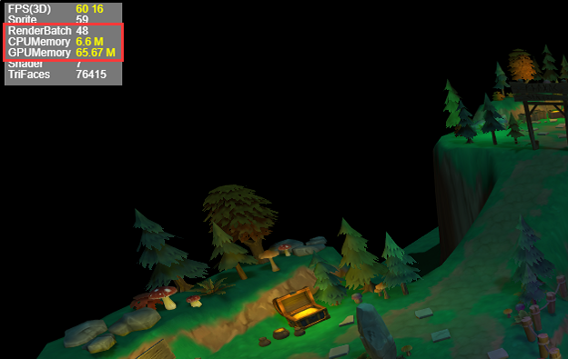

#LayaAir 2.0 has been released, with a comprehensive introduction of key features

> author: Charley Date: 2019-1-19

LayaAir 2.0 Engine Beta since its first release on September 15（[点此查看2.0引擎新特性](http://mp.weixin.qq.com/s?__biz=MzAxMjI4NjA1OA==&mid=2650584322&idx=1&sn=375e3dceaaf2b405e728bcba8f174d1e&chksm=83bc3407b4cbbd11c76ea98a032c328e253b80163cd4e68f3ebe5ced75b36beeccf511e87132&scene=21%3Ch1%3Ewechat_redirect)(diachronic)`4`More than a month, launch`4`2.0 beta version, which fixes several BUG, 2D engine and IDE optimization and new functions`39`Item, 3D Engine and Plug-in Optimizing and Additional Functions`22`Item. With the tireless efforts of the Engine Team, it has finally brought a stable official version of 2.0 to developers. Thank you to the developers who participated in testing and feedback BUG.

First of all, I would like to introduce some of the core updates of this official edition.

###1. Adding DraCall Optimize to 2D Engine

In a 2D engine, a large number of DrawCalls will inevitably lead to performance degradation. LayaAir engine has made many optimization in image rendering, such as the adjacent same atlas will automatically merge and render together when rendering, which can reduce the number of DrawCalls. However, if the UI is used to interpolate different atlases or text, it will inevitably interrupt the merged rendering of atlases. Unnecessary performance overhead due to improper use by developers may result in performance jamming.

In previous Laaya AirIDE optimization schemes, as long as the developer places the same color collection resources in adjacent positions, the engine will automatically merge and render to optimize performance. The optimization method is shown in Figure 1.

 

(Fig. 1)

Although the effect of optimizing atlas resources by color ranking is obvious, there are still a few inevitable text interpolation phenomena in a few complex scenes, in order to pursue more extreme performance optimization. In the formal version of LayaAir 2.0, drawCallOptimize optimization parameters are added to the IDE. The default value is false. As shown in Figure 2, when the drawCallOptimize parameter is set to true, the engine will automatically enable text merge optimization and extract all text to the top level. Developers can achieve the goal of automatic drawCall optimization without any further deliberate adjustment of the atlas resources and text ranking. The optimization is more straightforward and thorough. Therefore, this optimization not only achieves the goal of the ultimate performance optimization, but also improves the user's ease of use and reduces the threshold of optimization operation.

 

(Figure 2)

> It should be noted that the drawCallOptimize optimization scheme does not meet the special requirement that the text must be semi-occluded because it will automatically upgrade the display level. Of course, in most cases, the text is displayed in full text, if there is a full hidden situation, you can directly set the hidden properties. Therefore, developers are advised to start the optimization program.

###2. Increase the new project publishing function (project publishing version 3.0)

LayaAir IDE 2.0 has also added a new 3.0 version of project release function. It makes the functions of compression, version management and mini-game extraction more perfect and flexible. Developers can customize and control the use of each function, which makes the function more free and greatly improves the usability of product release function.

Because this function has more content to introduce, independent documents were released in advance.[《LayaAir IDE项目发布3.0详解》](https://mp.weixin.qq.com/s/AMS7xEqVbLpbfo2F5li3vw)After the developer can read this article, he can click on the document link to read the function introduction of project Release 3.0 in detail.

###3. Optimization of 3D Performance Statistics Panel

####New RenderBatch Statistical Parameter for RenderBatch

2D performance usually depends on the number of drawCalls, that is, a drwaCall is a batch. In fact, it is not accurate to see drawCall in 3D performance, because the 3D engine will merge rendering batches, and it is difficult to judge the performance problem by looking at the number of drawCalls. Therefore, the 2.0 official edition began to introduce a new parameter RenderBatch (RenderBatch) concept, which is more professional and accurate. As shown in Figure 3. Later developers see RenderBatch's value, which is the actual rendered submission batch. The lower the value, the better if it meets the business needs.

 

(Figure 3)

####Separating CPU and GPU Memory Statistical Display

In the past, memory display was put together for statistics. In fact, it is not conducive to the investigation of memory occupancy. The official version of 2.0 began to display CPU and GPU memory statistics separately. Look directly at the CPUMemory and GPUMemory values. As shown in Figure 3.

###4. Increasing GPU Texture Compression

In the official version of LayaAir 2.0 engine, the GPU texture compression function is added, which can greatly reduce the display and memory occupancy of textures, at least 75%. That is to say, if it used to occupy 100M, it would only occupy more than 20M now. This will greatly reduce the cost of program management memory, can increase the space for art to play, so that the quality of the game painting becomes more exquisite.

In addition, with the help of Layabox, the bottom of the game has also supported GPU texture compression since the 7.0 version of Wechat. Developers can be even more appreciative of the quality of small game graphics.

###5. Increasing Mesh File Compression

In the official version of LayaAir 2.0 engine, the compression function of Mesh files has been added, which will reduce the size of Mesh files by about 60%, and reduce the download burden of 3D model files by more than half. That is to say, with the same quality of 3D games, the speed of loading games can be improved. As we all know, game loading speed has a direct impact on the user's transformation data, so developers can use this function as soon as possible.

###6. Increase the interface destroyUnused Resources to release unused resources

In previous engine versions, developers need to manage and release resources through a list, which has always been a headache for developers. Especially in 3D, it is difficult for developers to release resources safely and reliably through list management because of the variety of resources and the sharing problem. In the official version of LayaAir 2.0 engine, an easy-to-use interface for releasing unused resources is added.（`Laya.Resource.destroyUnusedResources();`The ease of resource management of 2D and 3D has been greatly improved.

###7. New exclusive membership functions

Beginning with LayaAir 2.0, without affecting the daily development of ordinary developers, we have introduced membership-specific engine functions. 1024 yuan can be purchased to become an annual member of the engine, enjoy high-end membership exclusive functions (such as GPU texture compression and Mesh file compression is a member function), and the engine's exclusive membership functions will maintain a certain frequency for the launch of new functions, but the price will remain unchanged. In addition, the membership fee revenue based on engine-specific functions will be used for the development of LayaAir engine itself, so this will be the starting point of LayaAir engine self-reliance, hoping that through the support of developers, the engine will have a healthy development and continue.

In addition to the key new features mentioned above in this official edition.

####In the past four months, the new and optimized functions of 2D engine and IDE are as follows:

1. Adding auxiliary line settings for physical engines
2. Physical engine RigidBody adds getWorld Center interface to facilitate access to rigid body centers
3. Physics class of physical engine increases the number of rigid bodies, joints and collisions to obtain interfaces
4. Collision Events of Physical Engine Increase Collision Point Information Acquisition Method
5. Adjust and change the linearVelocity property of the physical engine RigidBody to object type
6. Engine Loader adds automatic recognition of sk, ani and other file suffixes
7. Engine Scene class open method adds param parameters
8. Engine Scene class adds support for singletons
9. Increase Hand Q Light Game Adaptation Support
10. Adding readArray Buffer Method to Engine Byte Class
11. Exception handling of data that may not be accessible by adding skeleton animation to the engine
12. Engine adds Baidu mini-game adapter
13. Engine Scene class adds progresses callback to facilitate access to scenario loading progress information
14. Engine Scene adds loading page settings, sets loading page through setLoading Page method, displays loading page when scene switching, loading page automatically receives program events of current scene.
15. Engine Scene adds show Loading Page and hide Loading Page to manually control loading page display
16. The close method of engine Scene adds type attributes to make it easy to know the reason for the shutdown.
17. Engine Sprite loadImage method adds protection for empty URLs
18. Engine SceneLoader automatically preloads. PNG files when preloading SK files
19. Engine adapter library adds support for regular use of Wechat and Baidu mini-game input boxes
20. To adapt to games, a switch is added to IDE that can export files such as scenarios to json.
21. IDE graphics property panel adds rendertype settings
22. Addition of Wechat Open Data Domain Display Component in IDE
23. Increase the traffic sharing component of Wechat games in IDE
24. UI libraries dynamically load skin components and add resize event distribution after loading
25. Adding multiple selections of the same type of node in IDE to show more attribute functions of this type
26. A new style file (default attribute of resource) change detection function is added in IDE. If a style change is found, IDE will automatically prompt for refresh, effectively preventing the problem of incorrect display of effect.
27. Add tab switching function of input box of nine palace setting interface in IDE
28. The new texture image conversion tool in IDE can greatly reduce the memory footprint of Android and IOS files (VIP function)
29. IDE Scenario Page Right-click Add Find Reference Function
30. IDE adds scenario export cache optimization, files are timeless and not exported, and improves compilation efficiency
31. IDE optimizes listening for class file modification, no modification, no compilation, and improves compilation efficiency.
32. IDE Add Block Chain Project (ETH, NEO, HPB)
33. Optimize and improve the annotations of related physical classes, and add detailed descriptions.
34. Optimize and improve sound release strategy to make it more reasonable
35. Optimizing and Improving DraCirle Draline Vector Interface
36. Optimizing physical components to reduce object creation overhead
37. Optimize and improve the mouse joints of the physical engine. Setting control points becomes optional. If not, the mouse click position is used as control points.

####Over the past four months, new and optimized features of the 3D engine and Unity export plug-in have been added and optimized as follows:

1. Compound ColliderShape adds clearChildShape method
2. Adjust the rootBone association mechanism of Shinned Mesh Renderer, no rootBone will not correlate the skeletal node synchronization matrix.
3. Animator adds wizard activity attribute support
4. Rigidbody3D component adds the sleep state attribute isSleeping
5. Rigidbody 3D component adds sleepLinearVelocity and sleepAngular Velocity attributes
6. Remove the physical component activate () method and add the Rigidbody 3D component wakeUp () method
7. Reconstruct the TrailSprite3D wizard and fix several BUGs, as detailed in most of the API article
8. Refactoring the Pixel Line Sprite 3D Wizard to optimize API for ease of use, as detailed in the API documentation
9. Vector 3 adds SetValue method
10. TrailRender Added TransformZ Mode
11. Camera render function adds replacementTag parameters
12.1 Shader framework adds SubShader concept
13. Increase Programmed Sky Material
14. Streamline customized Shader configuration parameters to enhance ease of use
15. Animator animation supports reverse playback
16. Increase the model file compression function
17. Adjust PrimitiveMesh related subclasses to Mesh generic classes, and change the way of creation to static factory PrimitiveMesh. createXX () method to simplify grid classes.
18. Perfect Rotation Over LifeTime Module related functions in 3D mode
19. Unity plug-in adds account management pages
20. Unity Plug-in adds Mesh file compression
21. Unity plug-in adds vertex color of blinphone material
22. Unity plug-in adjusts the range of output colors in LayaShader in Unity
23. Unity Plug-in Repair Normal Mapping Export BUG
24. Unity Plug-in Optimizes Texture Compression Speed for Android Platform
25. Unity plug-in optimizes LayaAirRun functionality and removes CMD windows
26. Unity plug-ins greatly optimize resource export speed

###If there are developers who don't understand the new features of Laya 2.0. Let's continue with a comprehensive introduction to the new features of the engine during the public beta on September 15.

The links are as follows:

[9月15日LayaAir 2.0 开始测试，引擎新特性全面介绍](http://mp.weixin.qq.com/s?__biz=MzAxMjI4NjA1OA==&mid=2650584322&idx=1&sn=375e3dceaaf2b405e728bcba8f174d1e&chksm=83bc3407b4cbbd11c76ea98a032c328e253b80163cd4e68f3ebe5ced75b36beeccf511e87132&scene=21%3Ch1%3Ewechat_redirect)

