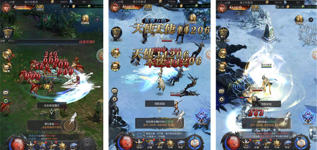

## MOBA、SLG、ARPG、FPS类型3D HTML5游戏案例精品推荐

There are more than 300 kinds of 3D products using LayaAir engine in Wechat games and HTML5. According to Xiaobian, more than 90% of them are 3D engines (H5 and games). Today, Xiaobian will no longer introduce leisure games, recommend several representative cases of different types of high-quality 3D games. You can identify two-dimensional code for experience.

> As early as last December, Xiaobian has introduced a large number of products, which you can click here to see if you haven't experienced.[微信3D小游戏已达数百款，这里肯定有你没玩过的小游戏！](http://mp.weixin.qq.com/s?__biz=MzAxMjI4NjA1OA==&mid=2650584513&idx=1&sn=ee56f4bf9c98aa8030a9bad05e7b57be&chksm=83bc34c4b4cbbdd2bd24ab775167c3eef0e8cb1e57ab52fccb8cd6d4eca0164eeaa5d844399b&scene=21%3Ch1%3Ewechat_redirect)

### **MOBA-type masterpiece: AU Plan**

"AU Plan" is a very popular 3V3-MOBA competitive game based on LayaAir 3D engine. The game adopts Japanese hot-blooded comic style, the appearance of individual heroes and brave men, and the matching of exclusive weapons and props. Play mainly for occupying mode and big fight two popular modes. There are three more modes: 1V1 battle, Miao capable man-machine and big fight man-machine. Playing that model can bring you unlimited fun.

 

Wechat Scanning Recognition Experience

### **SLG-type masterpiece: The Knight's Law**

 

Knight's Law is a multiplayer online, real-time war strategy game based on LayaAir 3D engine. Players will play a lord in the fantasy world, meet legendary heroes, train troops, engage in epic multi-player warfare, capture enemy cities, form alliances with other players, help each other, defeat the enemies who block your domination of the world!

 

Wechat Scanning Recognition Experience

### **ARPG-type masterpiece: The Miracle of the Saint Angel**

  

"Saint Angel Miracle" is an ARPG type case based on LayaAir 3D engine. The game's classic MU play method, 3D scenes and effects make the overall picture quality of the game more dazzling.

 

Wechat Scanning Recognition Experience

###FPS Type Representative Works: King of the Border of the National Gun God

 

The King of the Border is a heavy H5 game of FPS competitive shooting, which perfectly inherits the classical shooting quality and playing method, full 3D perspective, free control of mobile shooting, and real-life combat experience.

  

Wechat Scanning Recognition Experience

**Last,**

For some special reasons, there are also some large and heavy 3D products that have been put on line. The editors can not be published in this article. In the future, we will gradually introduce more high-quality 3D representative works for you.

In addition, there are more than a dozen small known large and heavy 3D products are also under development, including well-known enterprises and well-known IP products. Xiao Editor and everyone are looking forward to these high-quality 3D masterpieces can be launched as soon as possible.

Blessing the 3-D blockbuster already on line~

**Recommended reading related to 3D cases:**

[LayaAir 2.0 3D案例展示：矩阵 • 奇妙之旅](http://mp.weixin.qq.com/s?__biz=MzAxMjI4NjA1OA==&mid=2650584557&idx=1&sn=e5d3609095a6455208a1e17916130233&chksm=83bc34e8b4cbbdfedd9dd4680cb825321e759b7db5f1fe8eacdccc5dd7e156356ceee54b6fd4&scene=21%3Ch1%3Ewechat_redirect)

[微信3D小游戏已达数百款，这里肯定有你没玩过的小游戏！](http://mp.weixin.qq.com/s?__biz=MzAxMjI4NjA1OA==&mid=2650584513&idx=1&sn=ee56f4bf9c98aa8030a9bad05e7b57be&chksm=83bc34c4b4cbbdd2bd24ab775167c3eef0e8cb1e57ab52fccb8cd6d4eca0164eeaa5d844399b&scene=21%3Ch1%3Ewechat_redirect)