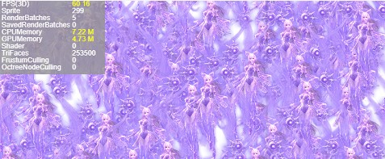
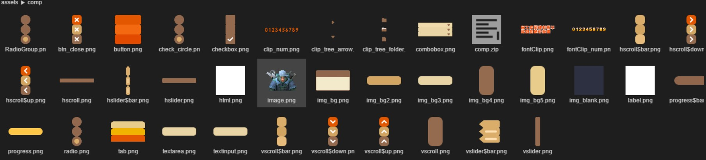

##Layabox took the lead in supporting millet fast games. LayaAir 2.0.2 version greatly improved 3D performance, spine performance and memory optimization, and added screen adaptation settings!

> update: 2019-04-15

A month passed quickly after LayaAir 2.0.1 beta added the functions of 3D animation file compression, memory and performance optimization, and open domain project creation. During this period, we not only added a large number of LayaAir 2.0 3D documents to the official website, optimized some 2D documents, and completely updated the 3D examples of the official website. In today's Laaya Air 2.0.2 beta release, a lot of updates have been made around the core points of 2.0 engine development, such as "performance, ease of use, 3D". It is also the first to complete the engine adaptation of the millet fast game and the release of the integrated millet fast game in LayaAir IDE.

###Background introduction of millet fast game

TEF 2019 Fast App Developers Conference concluded in Beijing on March 20, announcing that Haixin Mobile and China Mobile Terminal Company have joined the Fast App Eco-Platform, and the alliance of manufacturers has expanded to 12. Fast application has the characteristics of low cost, good experience and high retention. It is comparable to native APP in terms of function and experience, and is lightweight for users. Up to now, fast applications have covered 1 billion devices in the whole network, with more than 200 million monthly activities. Fast applications have been opened more than 2 billion times, with more than 100 million desktop icons remaining, with a 7-day retention rate of 18%.

As a member of the alliance of fast application manufacturers, Mimi, a well-known mobile phone manufacturer, will pave the way for the rapid introduction of many game CPs and high-quality products once it is publicly supported and adapted by engine manufacturers. Layabox, as the first engine to adapt and publish the millet fast game, has a complete publishing and access process. Especially in LayaAir IDE, there is a key engine publishing tool. Developers can quickly release the game project based on LayaAir engine to millet fast game, and the whole access process is very convenient, which greatly reduces the access cost of developers.

The entrance of fast Games includes not only typical native applications, but also rich system-level entry scenarios: browser, application store, game center, desktop search/global search, negative screen, lock screen, voice assistant, fast application center, Push, calendar. As long as the user lights up the screen, it can quickly enter the game anytime, anywhere. Supported by the exposure resources of billions of users in the future, fast game will not only become the future of fast application ecology, but also hopefully become a new growth point of the whole game industry.

###Key Points of LayaAir 2.0.2 beta Version

**General section**

1. UseRetinal Canvas is added to the engine. When enabled, the adaptation mode can be automatically adjusted to screen physical resolution to make the game picture more high-definition.

2. IDE mandatory upgrade more powerful release version function, and add the release of millet fast game.

**2D aspect**

1. The engine greatly improves spine efficiency (performance, memory).

2. IDE adds binary file merging function and optimizes the usability of file merging and Atlas compression.

3. IDE adds component recognition of wav audio.

4. IDE fully updates its own UI component resources (Assets comp)

**3D aspect**

1. Engine greatly improves Mesh Sprite 3D performance with the same material and same Mesh

2. The engine optimizes the performance of skeleton animation and improves it by 15%.

3. Adding saved RenderBatches to engine performance statistics to make it easier for developers to see the number of batches saved

4. Engine ShaderPass adds StateMap function, rendering state settings are more flexible, can be per ShaderPass or per material

5. Laya U3D plug-in greatly optimizes and improves skin Mesh export performance by 100 times.

###New Physical Resolution Switch

One of the most important factors we need to consider when we do screen adaptation is design size, which is how many pixels the game is designed according to, for example`750*1334`This is the case. Game design size will not only affect the clarity of the picture, but also affect the size of the picture file, GPU and memory. Compared with the design size, the design size is larger, the image resource size is larger, the GPU rendering pressure is higher, and the memory occupancy is larger. Therefore, there are some requirements for the refinement of the picture is not too high, or because of performance and other reasons, the size of the game picture design is relatively small, such as`960 * 640`This is the case. Then, stretch and zoom in to fit some high-resolution screens. The result is that the HD screen will not be clear, images or text will even have mosaic phenomenon (some of the sawtooth is obvious). Therefore, developers should not oversize the size of the design, but consider the mainstream model to balance.

Before Wechat Android 7.0.3, the bottom of the Android version of the game will force the width of Canvas on the screen to be set at screen physical resolution. That is to say, even if the developer designs the game picture size relatively low, the final picture performance will still be very clear, of course, this will affect the performance. At the same time, for some games that do not need HD display, it is more desirable to save some performance consumption CPs. The bottom of the game deprives developers of their options. However, since 7.0.3, the bottom of the game is no longer forced to set Canvas to physical resolution. While the performance has improved, many games that have not previously exposed design size problems (smaller design size) will find that the high-definition mobile phones become unclear or have a slight mosaic feel. Because LayaAir engine does not have version 7.0.3 compatible with BUG, these problems are basically caused by poor understanding of screen adaptation and lack of experience in adaptation.

In order to make the adaptation threshold lower, but also to solve those existing old games without changing the size of the design premise, can automatically adapt to high-definition physical resolution mode. So, starting with LayaAir 2.0.2 beta, we added useRetinal Canvas, which forces Canvas to be set to a physical resolution setting.`Laya.stage.useRetinalCanvas=true`Whether the LayaAir adaptation mode is used or the design size is used, canvas will be set according to the physical resolution. The advantage is that games with small design sizes can be restored to HD mode without adjusting the image size and worrying about the increase of memory usage. The disadvantage is that forcing high-definition resolution will certainly bring GPU rendering pressure, that is, when this function is turned on, some performance will be sacrificed. So the engine is turned off by default. If developers think that the product's performance is more important, they can use LayaAir's standard adaptation scheme to design game size. When developers think that the high-definition visual performance of each screen is more important, they can turn on the function.

####Release optimization and millet fast game support

As for the release function of Laya AirIDE, the release function of the 2.0 official version, called 3.0 of the release version, once caused some developers confusion or doubt about the engine version and the function version number. Therefore, starting from LayaAir 2.0.2 beta, the concept of version number of small functions is blurred, the old version of the release button is removed, and the original release button is directly pointed to the new version. If you still need to use the old version of the publishing function, you can go to the menu bar to open the project options. We recommend new releases. If you have questions about the use of functions, you can open the publishing function interface and click on the question mark icon to view the description document.

In addition, after taking the lead in supporting Baidu smart games, the LayaAir engine took the lead in completing the engine adaptation and IDE release support of the millet fast game. With the addition of large traffic factories, developers have another chance to get a new platform traffic dividend.

 

Of course, in the early days of access, if developers are not familiar with the access business of millet fast game, they can also contact Layabox's business to get more technical and on-shelf support.

**Business Cooperation Contact Box:**Bd@layabox.com

####Improving Spine Efficiency

In LayaAir 2.0.2 beta, we have greatly improved Spine's efficiency. According to the spine model provided by the Archangel project team of Aurora, 155 skeletons and 845 triangles of each model were used as test case materials, and in the built-in browser test environment of Millet 6. For the previous version of the engine, we compared the data in terms of performance and memory.

 

**Performance comparison:**

Red line is 2.0.2 beta, blue line is 2.0.1 beta, X-axis is sprite number, Y-axis is FPS frame speed of corresponding sprite number.

  

By comparing the performance data, we can see it intuitively. For 100 sprites, 2.0.2 frames are full and 2.0.1 frames are only about 40 frames. In the process of increasing the number of wizards, FPS (frame rate) is declining, but 2.0.2 always maintains the performance advantage.

**Memory comparison:**

The red line is 2.0.2 beta and the blue line is 2.0.1 beta. The X-axis is the number of sprites and the Y-axis is the memory occupancy of the corresponding number of sprites.

 

By comparing the data occupied by memory, we can see it intuitively. With the same number of wizards, the memory usage of LayaAir 2.0.2-based test cases is not only much less than that of LayaAir 2.0.1-based test cases, but also the memory usage growth curve is very stable and slow with the increasing number of wizards.

####Improvement and optimization of VIP functions

In terms of VIP functions, the LayaAir 2.0.2 beta version began to add binary file merging. In this way, for some trivial small files, not only JSON format files, binary files can also be combined. File merge function can greatly reduce the number of file download interaction and improve the efficiency of game loading.

  

Due to the addition of binary file merging, the use of text (json) file merging has also been adjusted in order to unify the operation process and specifications of file merging. In addition, the IDE operation flow of texture compression of atlas is optimized, and the text information of atlas is no longer needed to be manually written by developers. Developers can automatically identify atlas or PNG images directly by dragging them into the toolbar, which further enhances the usability of the functions. For more details, please refer to the introduction of VIP function and usage.

Document links:

Https://ldc2.layabox.com/doc/?Nav=zh-ts-0-3-3

 

 

####Other IDE optimizations

The ease of use of IDEs and engines is something we've been trying to improve. In this edition, we will replace IDE default UI component resources for several years. The new edition of UI component resource pictures not only has a better artistic style, but also adapts to mobile devices, which makes the component resources easier to use and the UI more beautiful when developers make DEMO.

  

Another improvement of IDE is to support wav audio format component recognition. Before LayaAir 2.0.2, IDE could only recognize MP3 files as audio components for visual scene triggering. Now more support for wav audio effect makes the visual editing and authoring process of LayaAir IDE more comfortable.

 

####New 3D Performance Analysis Function

In 3D game production, batch optimization is one of the important ways to optimize performance, but how much Render Batches are saved after batch optimization is started, which makes it difficult for developers to intuitively feel. So, starting with LayaAir 2.0.2 beta, the engine added the saved RenderBatches parameter to the performance statistics panel. This parameter value is the number of batches that can be saved after the optimization operation. By looking at the value of this parameter, we can see roughly how much we have optimized and how much room to optimize. How to turn on the optimization to affect the saved RenderBatches parameter values, there are probably the following aspects:

#####1. Static merge:

Check the static label in Layabox Unity plug-in, the engine will merge static objects when loading the scene, which can reduce RenderBatches and greatly improve the performance of the scene. The merging principle is the same material model, so developers try to use the same material when editing the scene model.

#####2. Dynamic merger:

This optimization does not require any settings from developers, and the dynamic movement of objects is unrestricted. However, the merging principle is relatively strict and needs to be satisfied with both Mesh and the same material. However, this model still exists in a large number of three-dimensional scenes and can greatly reduce Render Batches.

#####3. Dynamic vertex merging:

This optimization also does not need any settings from developers, and the object can move dynamically without restriction. The merging principle is the same material and the model vertex is less than 10, which is relatively strict. However, there is still room for some false shadows and effective models, and Render Batches can be reduced a little.

The priority of the above optimization is static merge > Dynamic merge > Dynamic vertex merge. Generally speaking, the optimization principle of developers is simple. As long as the material of scene model is the same as that of Mesh, static object selection in the scene can save the rendering batch.

 

####Improving 3D performance dramatically

Ultimate performance is one of the important labels of LayaAir engine, so the pursuit of optimum engine performance is also the focus of our engine development. As for the large number of the same material and the same Mesh model in the three-dimensional scene, such as the forest and street lamp in the scene, the difference is only the location and size. Starting from this engine version, the model based on the above characteristics has been deeply optimized, so that a large number of the same material and the same Mesh model can be merged into one batch, which can greatly improve the rendering performance of the scene. Of course, developers should pay attention to ensuring that duplicate models use the same Mesh and Material as possible. And the optimization does not affect the moving transformation of the object. In this case, the engine can dynamically merge and optimize, thus greatly improving the performance.

We did some comparative tests on Surface Pro6. CPU is Intel i5 8250U and GPU is Intel UHD Graphics 620. The model of test case uses 12 triangles. It is hoped that the data comparison chart can give developers some intuitive impression of the effect.

  

From the effect of the test case above, we can see that LayaAir 2.0.2 beta version can reach full frame at the time of more than 20,000 wizards, while 2.0.1 beta version only has more than 20 frames. Under the same conditions of increasing wizards, 2.0.2 beta has always maintained its advantage.

Animator animation is the animation component in LayaAir3D, and skeleton animation is the most commonly used function. Therefore, optimizing the performance and memory of skeleton animation has always been the key optimization task of LayaAir3D. Since the release of LayaAir2.0, the performance of Animator animation component has been optimized many times. This version of LayaAir2.0.2 also optimizes the performance of skeleton animation, and improves it by 15%. In addition, Layabox's Unity export plug-in optimizes the format of skeletal animation resources, and using the new version of Unity plug-in to export resources may also reduce the number of rendering batches and improve the performance of the model.

Finally, we must mention the Unity plug-in optimization of Layabox. This version of the plug-in greatly improves the skin Mesh export performance, which greatly shortens the export time and improves the efficiency by 100 times. The original 300 seconds to do things, 3 seconds to complete.

 

####New 3D Engine Function

In this LayaAir 2.0.2 beta version of the new features, the 3D engine ShaderPass has added the StateMap function, which can make the rendering state settings more flexible, can be set by ShaderPass, can also be set by material.

In addition, some common functions of 3D engines have been added. For example:

Texture2D adds setSubPixels interface texture, mipmapCount attribute, Laya. Loader. create bulk loading callback event parameters, Mesh clone interface, BLEND_ENABLE_SEPERATE hybrid mode

###Write at the end

The engine has done a lot of things in this month. As far as I'm concerned, I've coded for a long time, and I've written all the relevant releases. The developers who can see here are also Layabox's true love. Thank you for your support, and you are welcome to forward and share this article, informing more developers of this numerous updates. In the future, we will have more action on engines. In addition to the engine itself, for the official website learning documents, we have been spitting slots, but we can clearly see that we have continued to improve after the year, for documents, examples, videos, we will continue to invest, continue to improve, in order to reduce your learning threshold and efforts.

