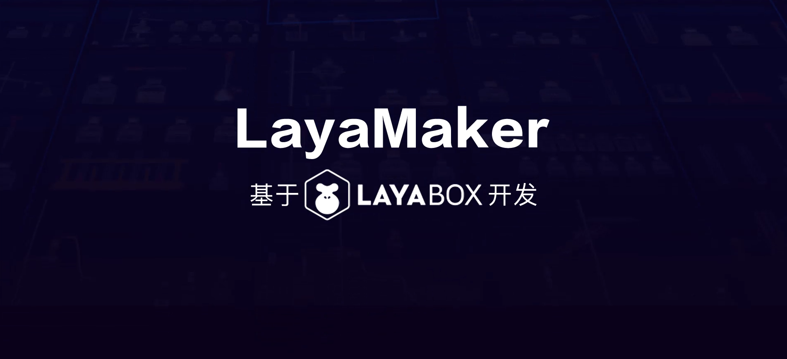

##Layabox launched the unprogrammed 3D production tool LayaMaker, and joined hands with Elite Education Group to enter the new field!

Update: 2019-04-26

Today, Layabox signed a strategic cooperation agreement with UUUabc, a leading enterprise in the field of education. LayaMaker, a product of LayaMaker, announced its formal entry into the field of interactive teaching in the education industry. Layabox will focus on elite education group. The two sides will cooperate in all aspects, including education platform construction, interactive courseware production and training, in order to enhance interactive teaching experience and redefine online education business model through their respective advantages.

 

Layabox and Elite Education Field Signing Strategic Cooperation Agreement

As we all know, with the development of mobile Internet, online education forms are changing with each passing day, product renewal and iteration are fast, and the strong interaction and interesting learning are the urgent needs of educational institutions, teachers and students. It is against this background that the LayaMaker project was hatched by Layabox. Thanks to Layabox's many years of technological advantages and its absolute leading position in the field of 3D engine, LayaMaker has had unparalleled characteristics from the beginning.

####1. Change the content production mode without programming

Through three major reconstructions, 500,000 + line code iterations and volunteer assistance at all ages, LayaMaker has achieved a subversive breakthrough in ease of use, without mastering programming skills. As long as it has planning or creative ability, zero programming foundation can quickly produce exquisite and flexible 3D interactive scene teaching content. To solve the problem once and for all, educational institutions are now at a high threshold for the creation and production of high-quality content, removing the dependence of dynamic interactive content creativity on programmers, and completely changing the content production mode of the industry.

####2. Platform-wide release to reduce customer cost

LayaMaker platform itself and released products can support the operation of PC, mobile APP and small game platform at the same time. Users can make and run content anytime and anywhere, without the limitation of time and equipment. At the same time, relying on the advantages of cloud service, it can run smoothly in the main distribution channels such as Weixin, Baidu and Xiaomi in the way of small programs. Through the social relationship fission of mobile Internet, it has innovated the promotion methods of educational institutions, and the efficiency of product customers has been improved more than ten times. At the same time, due to the innovation of content, the way of teaching and enjoying has improved the conversion rate of customers. Step by step to reduce the cost of customer acquisition. In the Post-internet era when traffic dividends are lost, the core pain points of educational institutions are really solved.

####3. Tools are communities

LayaMaker is not only a tool, but also a community platform that integrates communication, collaboration and work transaction promotion. Whether it is the acquisition of product materials (models, roles, props) and educational content (tutorials, live broadcasts, etc.), or the establishment of remote joint development team, until product distribution and promotion, it can be accomplished quickly in this platform to form a perfect content production. Pin closed loop.

The birth of LayaMaker platform has a breakthrough and innovative significance for online education enterprises. Its impact on the future of education is no less than that of Flash at the beginning of the century.

Strategic cooperation with Elite Education Group is the first step for Layabox to enter the field of online education. On this basis, it will cooperate with more educational enterprises to promote the growth of interactive teaching field in the future. This is also a key step for LayaBox to move from a game engine provider to a "game engine + interactive content solution" provider. In the future, LayaBox will further expand the application area of LayaMaker, providing more excellent solutions for traditional industries such as education, games, short video, advertising and so on.

 

In the era of mobile internet, content is the king, and content forms with visual expression and excellent interaction will be the general trend of industrial development. LayaBox and its LayaMaker platform will become the cradle and promoter of new content forms'sprouting and development prosperity, and help the industry to build the product characteristics and business ecology of the new era.

In the era of mobile internet, content is the king, and content forms with visual expression and excellent interaction will be the general trend of industrial development. LayaBox and its LayaMaker platform will become the cradle and promoter of new content forms'sprouting and development prosperity, and help the industry to build the product characteristics and business ecology of the new era.