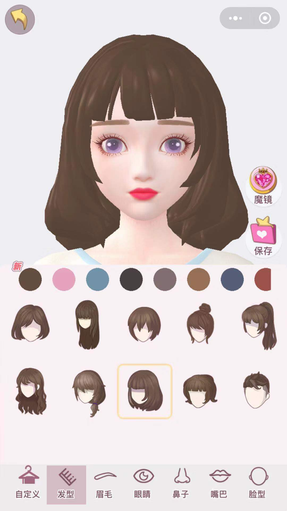
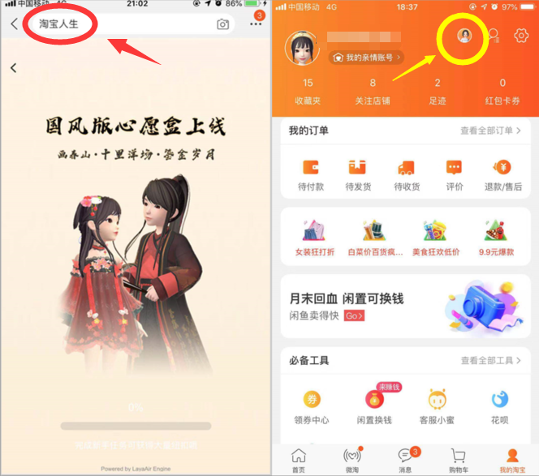

##LayaAir Engine 3D Face Kneading and Replacement Game Cases Taobao Life and Heart Trainer

2019-09-27

In this issue, we recommend two high-quality 3D games, "Taobao Life" and "Heart Trainer".

The so-called "face-pinching and dressing" game refers to the players in the game can "pinch" the appearance of the game characters like clay-pinchers, and then carefully dress up the virtual themselves.

In August, the circle of friends exploded.**Taobao's Life Achievements**It is a built-in function of the game Taobao Life.

In this 3-D face-shaving game based on LayaAir 2.0 engine, we can not only see the achievements of Taobao consumption. More can create their own unique Taobao virtual image, the image of hairstyle, face, eyebrows, eyes, nose, you can "pinch" at will, you can also choose lipstick, blush color and so on, in short, every player can "pinch" out the most perfect oneself.

In addition, you can also buy clothes, pants, shoes and socks, glasses, jewelry and other decorations in the game. In the process of creating a flourishing beauty, we enjoy great pleasure in purchasing and dressing up, no longer cut hands, buy and buy.

If you have not experienced the game, you can open the "mobile Taobao" APP, enter Taobao life in the search bar, or in my Taobao panel, click on the top Taobao life icon (Android version is Taobao avatar), you can immediately enter.

Face-pinching and dressing games, in the APP game, there are many well-known blockbuster, this type of game has been a popular type. In the field of HTML5 and small games, technical support, whether it is customized vertex and shader or PBR and 3D skeleton support, LayaAir engine is sufficient to ensure that the game achieves the original performance of APP. For example, the HTML5 face-shaving game Taobao Life has reached the same effect and experience as the original game of APP.

In addition to the 3D benchmarking masterpiece "Taobao Life" launched by mobile phone Taobao, as early as 2018, Leshu Game launched its first 3D face-shaving and Weixin game using LayaAir 1.0 engine.《[心动练习生](https://mp.weixin.qq.com/s?__biz=MzAxMjI4NjA1OA==&mid=2650584802&idx=1&sn=05536d73f1fa21fc0b2700e67d125836&chksm=83bc37e7b4cbbef117d036d56c1864564d58d6a11dc38a2027d9e58c7a5bf6195bf63e934475&token=567138876&lang=zh_CN)So far, it has maintained a high level of activity.

Picture of Cardiac Practitioners'Game

Wechat Code Sweeping Experience《[心动练习生](https://mp.weixin.qq.com/s?__biz=MzAxMjI4NjA1OA==&mid=2650584802&idx=1&sn=05536d73f1fa21fc0b2700e67d125836&chksm=83bc37e7b4cbbef117d036d56c1864564d58d6a11dc38a2027d9e58c7a5bf6195bf63e934475&token=567138876&lang=zh_CN)》

In the future, we will introduce more good examples of LayaAir engines from time to time. At the same time, we also welcome developers of high quality 3D products to contact us for more exposure and industry cooperation opportunities.

  **Recommended reading:**

[**In response to Apple's new iOS regulations, Layabox successfully reviewed HTML5's App package and launched iOS review assistance service.**](http://mp.weixin.qq.com/s?__biz=MzAxMjI4NjA1OA==&mid=2650584788&idx=1&sn=4e199fbd4f412ac6c0e8e2ee671e2970&chksm=83bc37d1b4cbbec751b6b886ca59f4fe955f1522729c20b759dbad8f7b839cc54d49b129786e&scene=21%3Ch1%3Ewechat_redirect)

[**LayaAir started submitting in real time in GitHub. Version 2.3 supports arbitrary multi-source rendering, and the 3D effect is gorgeous! The 3D export plug-in supports Unity2018!**](http://mp.weixin.qq.com/s?__biz=MzAxMjI4NjA1OA==&mid=2650584789&idx=1&sn=a90819e9fff70565c2c86053bbf13855&chksm=83bc37d0b4cbbec6b24ba8a84165e565a2633e58342b520ed24c5f6c9c26a7b6ccfd5800ec2b&scene=21%3Ch1%3Ewechat_redirect)

[**Heavy weight:****LayaAir 2.2 switches engine source code to TypeScript, supports WebGL 2.0, and adds a lot of 3D utility functions.**](http://mp.weixin.qq.com/s?__biz=MzAxMjI4NjA1OA==&mid=2650584703&idx=1&sn=57f46519d954afc8305a320aec4840fe&chksm=83bc377ab4cbbe6c3ad13626b961364d62a2a173aca2715a20b6551de35b3bb2217febd2ec9f&scene=21%3Ch1%3Ewechat_redirect)

