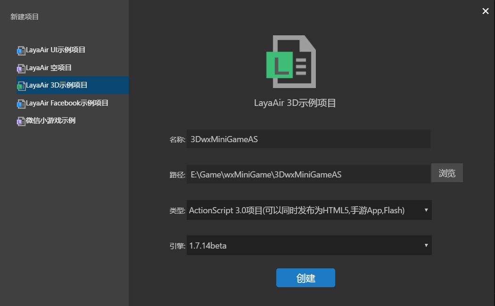
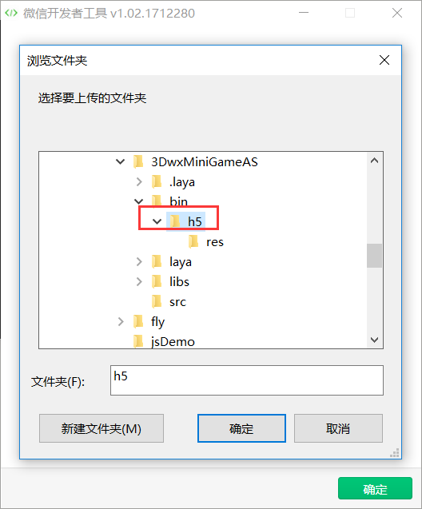
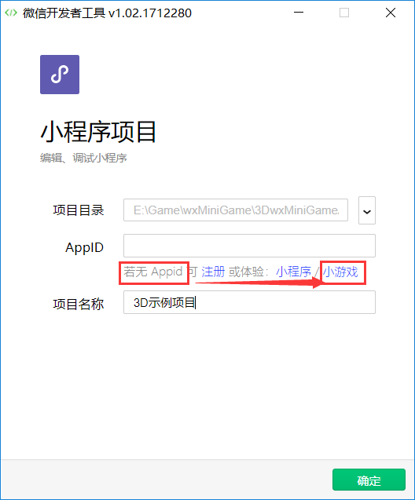
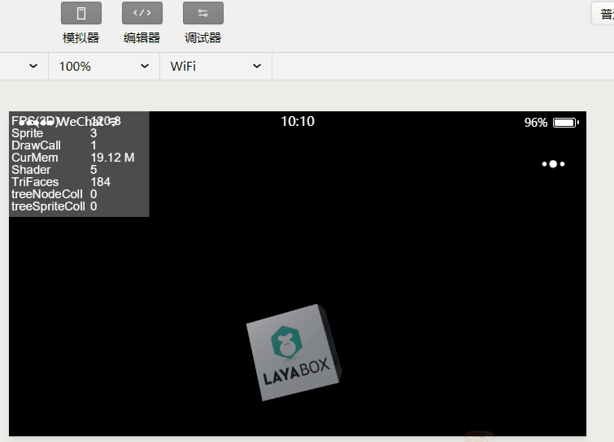

# Demonstrate how adapt old projects to  WeChat mini-games with the 3D

Based on the development needs from some developers in 3D games as well as general old projects,  this article will introduce how 3D sample project creation and the detailed adaptation of the old project. The complete matching process for mini-game development.

####  Must-know tips:

> 1. In the official 1.7.14 version of the LayaAir IDE, it support creating WeChat mini-game 3D sample projects.
>
> 2. Before reading this article, please look at "create WeChat mini-Games" first. So the basic content of configuration environment is no longer repeated.
>
> 3. This process for mini-game adaptation, is also applicable to the older version of the IDE for create and develop projects.


### A. create a 3D example project (old project adaptation can skip this step)

Open LayaAirIDE, enter the new project interface. Choose the LayaAir 3D sample project.

 

Enter the project name, path, select the AS3 language project type, 1.7.14beta version of the engine.

Click Create to complete the creation of 3D project.

### B. match with WeChat mini-games

After creating the 3D sample project, click **Run** (or F5) to see a three-dimensional cube. It shows that our 3D example project can run normally.

 

Close run debugging pop-up window, we are in the encoding mode ** file ** click on the file menu ** new window ** (ctrl + shift + N), and then create a new project. Select WeChat mini-game example project creation, open the "bin \ h5" directory of the game demo project and copy the four files game.js, game.json, project.config.json and weapp-adapter.js to the "bin \ h5" directory of the 3D sample project . The effect of the copy is shown as shown in the following figure.

 

> Tips: copy the matching files of mini-games, if you don't want to create new mini-game items, you can also copy them directly under the “resources\app\out\vs\layaEditor\laya\code\as\wxminigame\bin\h5\” directory under the LayaAirIDE root directory.

After the copy of the adapter file is completed, you need to modify the main program of game.js

To open game.js for editing, you need to first recommend mini-game to match library file weapp-adapter.js, and then import the game entry procedure of project (this example is LayaAir3D.max.js).

game.js modified as follows:

```javascript
require("weapp-adapter.js");
require("LayaAir3D.max.js");
```

Then we modify the game entry program and add the adaptation code.

Open the src directory into the sample LayaAir3D.as program

First import the adapter Library

```java
import laya.wx.mini.MiniAdpter;
```

Then, before initializing the engine, mini-game is initialized.

```javascript
//微信小游戏适配
MiniAdpter.init();
```

The effect is shown in the following figure:

 

When you add the fit code, click the compile or run the debug button, and do the mini-game without error message.


### C. Create a WeChat game

Open the WeChat developer tool, select the mini-game program project, in the project created interface. Run the debug button, then complete the project directory is set to the bin/h5 directory of the 3D sample project.

 

AppID this column, whether there is an enterprise's mini-program developer ID to fill out. if not, click on the ID input box of the mini-game. As shown in the following figure.

 

**Tips**：

If you don't see the words of a small game, please link the developer tool in the previous document, and it must be wrong.
> 1. If you do not see the displaying words of the mini-game, please press link in the previous document under the developer tools, must be wrong.
>
> 2. If it is not the enterprise's AppID, do not fill in, personal AppID does not support the development channel of mini-game project.

After the completion of the project is created, the game development interface will be entered. By default, the simulator is open, and it's no problem if you see the LayaAirIDE effect. As shown in the following figure. (unless the configuration of the project is wrong, it is generally not a problem.)

 

> Tips：At the top of the state there is a simulator of real environment, the real game is full-screen displayed. So do not control, if you feel that the impact of the performance statistics panel, you can reduce the position of the statistical panel in the project code.


### 4. Understand the process of daily development and debugging

Since we were just creating a WeChat game, we used release directory in the LayaAirIDE project. So, after each compilation, the mini-game development tool will automatically refresh the compiled display effect.

If, let's turn the 3D cube up and modify the entry program LayaAir3D.as of the example project.

Added after the last part of the code

```javascript
//旋转方向与角度设置
var vect:Vector3 = new Vector3(1,1,0);
//每10毫秒旋转一次
Laya.timer.loop(10,null,function():void{
	box.transform.rotate(vect,true,false)
})
```

Then, compiling at the LayaAirIDE and opening the WeChat developer tool, we can see the turned 3D cube, as shown in the following figure:

 

In this case, we point the preview button, through WeChat scan code, can be directly carried out real experience and testing in WeChat.

However, when our project is over 4M, the preview will prompt "the upper limit is 4096kb, please delete the file and try again", as shown in the following figure:

 

The matter is, case with more than 4M large game, then how to handle and solve this issues?

First of all, we want the game project to be placed within the 4M package and put it into cloud server dynamically loaded seperately.

In the previous example, we are using the local path, so we can access local resources directly, so let's see how to deal with the official development. We recommend that the resources in the local 4M package be put in the layaNativeDir directory, including the entry JS and the project configuration file. Because of this, it is convenient for us to use a unified, dynamically loaded URL path. The engine has been processed when the game is adapted. When it is in the layaNativeDir directory, even if it uses the URL dynamic path, it will still load from the local directory.

From the official development, if you want to use the preview feature in the real machine test, to create a dynamic loaded resources game project, only less than 4M local package content are supported. Copy to the game's project directory, other resources are loaded in a dynamic way.