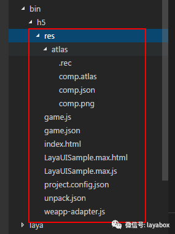
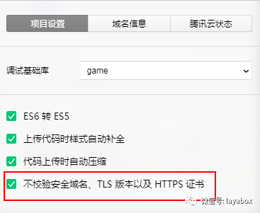
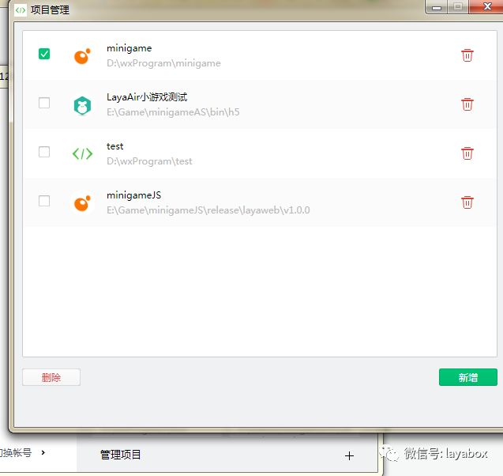

# Comprehensive description to WeChat games

### A. Introduction to the structure directory of mini-game in LayaAirIDE

 

#### 1. Resource Catalog Planning

The res directory is a resource directory, and the res directory in LayaAirIDE is the resource used in the game project.

Here is the key point. WeChat games allow each game to have 4M local physical capacity, which is used for pre game loading. Over 4M games are refused to upload. So, once your entire project (the sum of resources and JS) exceeds 4M, the content of non local 4M packages, you will have to load the resources from the outer network.

The directory structure on the screenshot is generated and created by IDE, and a layaNativeDir is missing (the subsequent version should be supplemented). Here should explain, LayaAir engine is processed at the bottom of the 4M local package directory, when the Laya.loader.load loading method using engine (loading) resources, the contents of the layaNativeDir directory will be used directly from the local directory, the other will from the network dynamic loading. So, we need to manually create a layaNativeDir directory to store the resources in the small game 4M package.

Need to remind developers that, in the development of testing, if you want to use dynamic resources outside the network, need to check security cross domain name issues (as shown below).

 

Because of the limitation of 4M. So, in the game, developers need to plan what is required to load and upload content, which is the content that needs to be loaded from the outside network. It is suggested that all the contents with high frequency and high update frequency be put into the external network to load dynamically. The uploaded project package includes only initialization, loading, and rarely changing contents. In particular, large game projects may add more 2M to JS, so the only space left is only for the background map resources of the Loading page.

> Tips：4M local package content can not be dynamically updated or deleted. Each edit must be uploaded again.

#### 2. Game application main file

In the example, LayaUISample.max.js is the project file created by LayaAirIDE, which is also the main file of the game application. If the TS or JS project has multiple project files when it is developed, it needs to be merged into a JS file as a game application Main document

#### 3. Game project files

game.js, game.json, project.config.json, weapp-adapter.js are all micro-project files, and LayaAirIDE will only be created when creating a mini-game project.

### B. Commons problems encountered

#### 1. Management projects can only be created, switched and deleted.

In WeChat developer tools, once the project is set up, there is no place to edit and modify the information of the project. If you want to modify the project information, don't bother to find the function, and delete the project to re create it. Because the deletion in the tool only removes the content related to the project information, the project itself will not be deleted.

In **Project**Click in the menu** Look at all the projects ** You can see the existing list of items, click on the project directly, and you can switch, and click the add number create button to create a new project.

If you want to delete a project, click the management project to enter the interface of the project batch deleting.

 

**2. Reading local files must be ASCII encoded**

Mentioned before each game has 4M local physical storage space, Here need special attention, If you need to read the configuration file within the local physical space, For example json file. There is no limit to the file size of the browser to load the file. The engine does not reserve the code to set the interface. The game will read the local resources will check the encoding, so when the local game encoding format is not ASCII, it will be an error. If there are 4M configuration files exist within the local package. At present, we must change to ASCII code, follow-up engine version plan supports encoding read settings.

> Tips：References between local program files (such as require or import) or dynamically loaded reads from the network, have no encoding restrictions.

**3. Does not support loader when use sound preloading**

When we use LayaAir engine to develop small games, we must pay attention to the way of pre loading the voice files through loader, and play the voice directly with SoundManger audio management class.

**4. Size of the cache**

The limit cache for WeChat game is only 50M, so pay attention to controlling the use of caching resources.