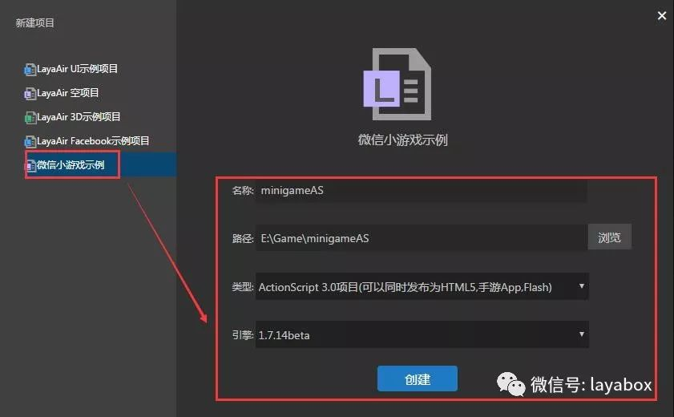
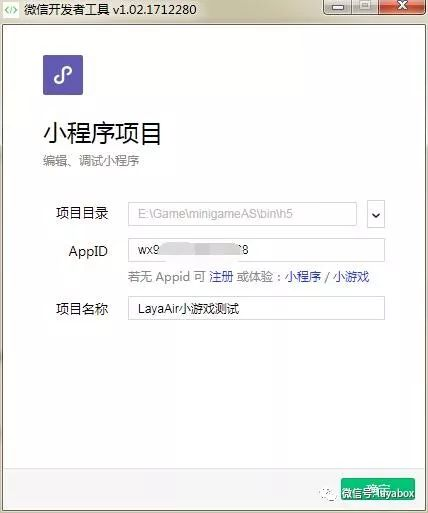

# Create a WeChat mini-game

### A. Setting environment for development

#### 1. Download and install LayaAirIDE integrated development environment

LayaAirIDE is an integrated development environment for the LayaAir engine, integrating with LayaAir engine and example projects, UI, animation and other visual editing, project code development and management tools. **Developers can directly use LayaAirIDE to create a sample project for Wechat Games.**

**Official website to download address** ：[http://ldc.layabox.com/layadownload/?type=layaairide](http://ldc.layabox.com/layadownload/?type=layaairide)

> Tips：LayaAirIDE 1.7.14 Version began to integrate micro-channel game development

#### 2. Download and install WeChat game development tools

WeChat game development tool is a small game development and testing environment, because LayaAir engine developers can use LayaAirIDE for project development, installing this game development tool is mainly used for small game project compilation, preview, real machine test and Debugging, upload and publish issued.


In the first page of the game development document, go to the Developer Tools download page via the navigation link to download the development tools.

 

**Development tool downloading address**：
https://mp.weixin.qq.com/debug/wxagame/dev/devtools/download.html

#### 3. Create an enterprise developer account for a mini-program, get the developer ID (AppID)

Although debugging can be developed without AppID, functionality is limited. So before development, it is best to create a small program of enterprise developer account for  optimal conditions.

Registered address: https://mp.weixin.qq.com/cgi-bin/registermidpage?action=index&lang=zh_CN

 

> Tips:WeChat game does not support individual registration, if it is a personal developer can only create a small program, can not create a small game project. So, personal developers if you want to experience, first do not enter AppID, click on the input box under the **mini-game** words.

### 

### B. Create micro-channel game project

#### 1. Create a game demo project with LayaAirIDE

Open LayaAirIDE and build a new project. Select the ”WeChat mini-game example“, set the name of the project, the project path, the development language type, engine version. You can create a small game, as shown in the following figure.



> Tips：This example is temporarily ActionScript3 development language, and the difference between the TS and JS projects and the AS3 project will be described later.

#### 2. See the sample project results

After creating the project, we can click the debug button (as shown below). You can see what our example looks like.


> Tips：In addition to compiling JS, this step is mainly to let you remember what our example looks like. Later, if the effect of the small game is the same , result should be not wrong.

#### 3. Simple understanding of the project's release directory.


LayaAir developers should understand that the h5 directory under the project directory / bin is the running directory. LayaAirIDE has automatically created a mini-game adapter and project files within the sample project, so in the development phase, when creating a game project, direct the game project directory to this sample run directory. (The TS and JS projects are different from the AS projects. In addition, when the large-scale game project is officially released, in our experience, it is best to create a separate game project for official release in the game development tool, Specific related introduction, will be put into the advanced document details)

**special reminder** ：

> 由于TS与JS目录下的引擎js文件是多个，没有合并。是不被微信小游戏支持的，如果是TS或JS项目，1.7.14 beta版本只能先采用第三方的JS合并工具（比如webPack）将JS合并，然后再复制到小游戏的项目目录运行。LayaAirIDE计划1.7.14正式版本开始集成微信小游戏自动合并发布的功能。在LayaAirIDE中实现任何语言版本都可以一键发布为小游戏项目的目标。

### 三、创建小游戏项目

#### 1、开发者帐号登录，选择项目类型

打开”微信web开发者工具“，用开发者的微信扫码登录。然后选择**小程序项目**点击进入项目设置。


#### 2、设置小程序项目

在小程序项目设置面板里，`项目目录`可以选择LayaAirIDE创建的小游戏示例项目的运行目录。（如果想另外创建目录，那么在小游戏调试与发布前，要将LayaAirIDE里的运行目录内容，手动复制到这个目录内）



AppID在小程序开发者帐号里获得（如下图所示）。如果没有，可以点击AppID输入框下的小游戏进行体验，但是功能会受到限制。

 


**需要特别注意**的是小游戏不支持个人注册，如果是个人开 发者，那输入AppID后只能进入小程序的开发，进不了小游戏的开发。所以个人开发者如果要体验，不要输入AppID，点击输入框下的小游戏进行体验。如果你看不到小游戏几个字，那你下的版本一定是错的，不支持小游戏。要重新按本文档中提供的地址重新下载。


#### 3、微信开发者工具的编译与调试

完成小游戏项目的创建后，点击编译，即可在工具内预览效果和调试，AS3项目的话，由于JS在编译时自动合并了，所以到这一步应该非常顺利，可以看到模式器中的效果与LayaAirIDE中的调试效果是一致的。

 

如果是TS或JS版本。如果不手动修改一定会报错。我们可以在调试器里看到报错信息，这块的调试就是chrome的调试方式，所以就不细讲了。

报错的原因基本上是由两个问题导致。

第一、TS与JS版本目前还没有集成小游戏的JS合并功能，所以多个JS文件会因为跨文件的执行域问题报错。

第二、同样是由于LayaAirIDE暂时还没有集成JS合并，所以小游戏的入口程序game.js里，引擎并未自动引入游戏的入口文件。所以不手动修改，肯定是找不到入口文件的。

**解决方案**：

第一、要使用第三方JS合并工具，将多个JS合并成为一个JS。然后修改入口程序game.js，将合并后的js引入即可。

修改后的game.js参考：

```javascript
require("./weapp-adapter.js");
require("./main.min.js");
```

第二、如果引擎JS不想合并到一起，也是可以的，只把项目JS合并到一起就行了。但是要在入口程序里将多个引擎JS引用进来。

修改后的game.js参考：

```javascript
require("./weapp-adapter.js");
require("./libs/min/laya.core.min.js");
require("./libs/min/laya.wxmini.min.js");
require("./libs/min/laya.webgl.min.js");
require("./libs/min/laya.ui.min.js");
require("./main.min.js");
```

第三、有没有不合并的解决方式呢，也是可以的，因为JS之间的执行域问题导致的报错，那么，我们将执行域设置为全局域，那就可以解决了。比如，我们的小游戏示例程序，通过调试器可以看出是找不到TestPageUI，那么我们在layaUI.max.all.js找到TestPageUI将其变为window.TestPageUI（如下图所示），然后再修改入口程序game.js，引用所有的JS就可以了。

 

The modified game.js reference:

```javascript
require("./weapp-adapter.js");
require("./libs/min/laya.core.min.js");
require("./libs/min/laya.wxmini.min.js");
require("./libs/min/laya.webgl.min.js");
require("./libs/min/laya.ui.min.js");
require("./js/ui/layaUI.max.all.js");
require("./main.min.js");
```

It needs to be reminded that if the project is larger, there will be more places to change. **Currently this is not recommended*, because IDE will be overlaid every time it releases and updates the project. It is suggested that JS merge is adopted to merge multiple project JS into a JS.

#### 4. The testing and debugging of the prototype

Unless it is a small game for some novice encountered compatibility issues, because LayaAirIDE can also debug project, basically the effect of both sides will different. So the most important thing here is the ** preview ** feature, through the mobile WeChat scan code, in the WeChat real machine testing and debugging.

 

Scan the QR code with wechat, it launch the application project, click the floating window button in the upper right corner, you can open the debug and open the performance monitoring panel.


Open the device debugging and performance monitoring panel, as shown below.

 


At this point, a complete process of small game development is over. Is it not very simple? The small game developed by LayaAirIDE is basically intuitive to release WeChat mini-game.