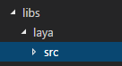
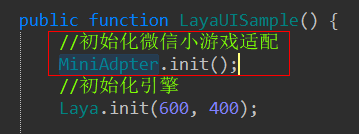
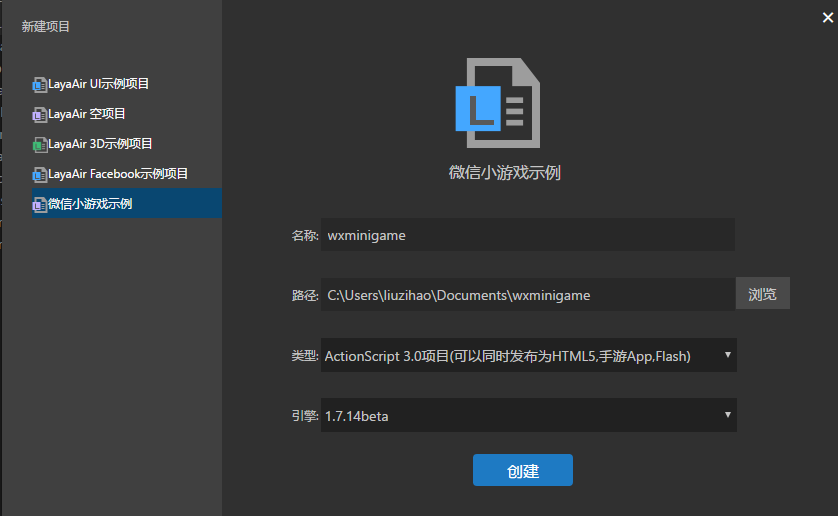
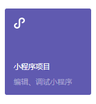
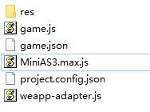
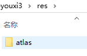
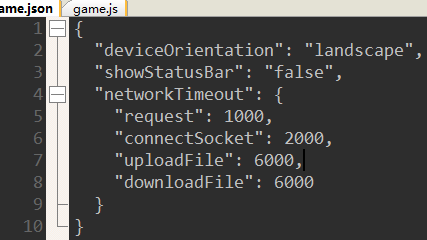

# LayaAir WeChat mini game adapter tutorial

​	The WeChat mini-game has come, and the LayaAir engine has been well equipped. **Prior to the use of LayaAir development projects, only the initialization of the adaptation program, without changing the other project code, seamless adaptation of WeChat games**A quick way to open a small game.

​	notice that  **WeChat game environment is not a browser**, it's a runtime made with C++ and V8. The interfaces are compatible with most Canvas and Webgl, but there are also incompatible places:

​	won't support DOM，Bom API

​	Only one canvas

​	not support eval

​	Network to use a secure domain name

​	Code package can not be exceeded 4M

​	Support file cache, but can not be exceeded 50M

​	Not support XML(LayaAir engine provides a solution)

​	Please refer to the official documents for more details  address：https://mp.weixin.qq.com/debug/wxadoc/dev/api/

​	The LayaAir engine matches these differences, and developers don't have to pay special attention to it, just use the LayaAir engine normally, and then publish it as a small game.

## Old project adaptation process：

**AS3 project：**

1. Replace AS3 engine class library (if it is 1.7.13 and above, only a separate copy wx class library) Download the latest class library: https://ldc.layabox.com/layadownload/?type=layaair-LayaAir

 

2. Before Laya.init, call MiniAdpter.init () initialize the adapter, get it!

 

**JS,TS project:**

1. Download the latest library, reference laya.wxmini.js download address: https://ldc.layabox.com/layadownload/?type=layaair-LayaAir

2. Before Laya.init, call Laya.MiniAdpter.init () to initialize the adapter and get it done !

 

## New project development

Use the IDE to create a new game project

## Test the game

LayaAir development of the application, you can use a way to test (WeChat game development tools may not yet fully open):

1. Download WeChat web developer tools, select mini-program projects

 

2. Build a new small program project

 

 

3. Delete all of the original files

4. Copy applications and small game configuration files (temporarily Copy, it is expected that WeChat's new tools will be generated automatically)

 

The structure of the document is as follows:
**res** 
The game is to use some resources, local resources directory, a small program allows each game has a capacity of 4M package, we can put the pre loaded loading images into local, most of the resources required from the external load, which can then be loaded from the file to write to the local save up to second calls to start
**game.js** Is the small game start entry file (provided by official WeChat)

 

**game.json**Is the project configuration file, you can configure the game's vertical and horizontal screen, network request parameters (WeChat provide) 

 

**MiniAS3.max.js** For applications, [note] if it is a TS and JS project, it is best to use a tool to synthesize all JS to a JS, otherwise a reference error may occur

**project.config.json** For project documents (WeChat official)

**weapp-adapter.js** It's a small game library (WeChat's official)

 

The running effect is as follows：

 

**If you can't show it sometimes, try cleaning the cache**

 

 