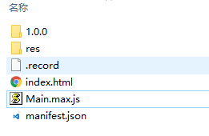

##リソースバージョン管理

プロジェクトがオンラインになってから、資源バージョンの更新が避けられません。しかし、ブラウザのキャッシュの問題により、引き出したリソースは最新バージョンではなく、プロジェクトバージョンが一致しないため、正常に動作しません。だから合理的に資源を管理して、資源を更新するのはとりわけ必要です。LayaAirエンジンが提供するリソースバージョン管理ツールは、この問題を効果的に解決します。具体的な使い方を見てみます。**注意：エンジンのバージョン番号は1.7.3以上が必要です。**

ここではコマンドラインに合わせて使います。次は手順を見ます。

-nodejsをインストールして、公式サイトでnodejsダウンロードアドレスhttps:/nodejs.org/en/をダウンロードします。

-layacmdツールをインストールします。ダウンロードアドレスhttps://www.npmjs.com/package/layacmd

ここではwinシステムでデモンストレーションします。cmdウィンドウを開けて、コマンドラインにnpm install layacmd-gを入力すればいいです。

このコマンドラインツールは、コンパイル、リリース、リソースの導出、スタティックサーバの作成など、多くの機能を提供しています。ここでは資源管理の機能について説明します。

-新規LayaAirプロジェクトを作成します。ここではas言語を例にします。

それから、h 5のディレクトリに入ります。新しいresのフォルダを作って、資源をresディレクトリの下に置きます。ここにはいくつかの資源を勝手に追加します。ここに音声フォルダを追加します。中に音声ファイルa.mp 3を入れて、外の階には一つのファイルを置いて、写真1.pngの写真を入れます。

bin/h 5ディレクトリでコマンドラインを開き、コマンドラインに入力します。`layacmd resourceVersion -i res -o . -n 1.0.0`。ここで-iはリソースパスを表しています。-o.代表バージョンのリソース出力パスは現在のパスです。もちろん開発者も独自の出力パスを指定してもいいです。例えば、経路がバージョンVersionフォルダなどを定義しています。-n 1.0.0初期化バージョンは1.0.0です。車を返した後、いくつかのファイルとフォルダが生成されているのを見ました。図のように:


  

1.0.0のフォルダの中は1.0.0バージョンのリソースです。`.record`ファイルの記録のはファイルのmd 5情報で、削除します！`manifest.json`ファイルに記録されているリソースのバージョン番号。

次はプログラムの中でどうやって適用されますか？


  
```java

  package
  {
      import laya.net.Loader;
      import laya.net.ResourceVersion;
      import laya.utils.Handler;
      
      public class Main
      {
          //设置资源配置文件的地址，我这里加了随机参数，保证每次加载的都是最新的。
          private var configUrl:String ="manifest.json?"+Math.random();
          public function Main()
          {
                Laya.init(500,500);
                ResourceVersion.enable(configUrl,Handler.create(this,this.completeHandler));
          }
          private function completeHandler(e:Object):void
          {
             Laya.loader.load([{"url":"res/sound/a.mp3","type":Loader.BUFFER}],Handler.create(this,loadSound));
          }
          private function loadSound():void
          {
              var obj:Object = Laya.loader.getRes("res/sound/a.mp3");
              
          }
          
      }
  }
  ```


エンジンを初期化してから、私たちがやるべき最初のことはこれをロードすることです。`manifest.json`このファイルです。エンジンは、対応する方法を提供しています。バージョン管理を有効にします。

`ResourceVersion.enable`この方法はmaifest.jsonファイルの経路を伝え、Resource Version類はURL.ctomFormatを書き換えた方法です。ロードリソースの場合は、maifest.jsonのリソースのバージョン番号に合わせてロードされます。manifist.jsonファイルをロードし終わったら、私達のプロジェクトを開始する正式なロジックです。

プロジェクトロジックにサウンドファイルをロードします。上のコードをコンパイルして実行します。Googleのコンソールを開きます。ファイルを読み込む情報を見てください。図のように:


ロードが見えるのは`1.0.0/res/sound/a.mp3`フォルダのリソース私たちはリソースを追加して、テキストファイルを新規作成しています。data.dataと名づけられました。res/data/data.dataファイルに入れます。ローディングコードは以下の通りです。


```java

package
{
    import laya.net.Loader;
    import laya.net.ResourceVersion;
    import laya.utils.Handler;
    
    public class Main
    {
        
        private var configUrl:String ="manifest.json?"+Math.random();;
        public function Main()
        {
              Laya.init(500,500);
              ResourceVersion.enable(configUrl,Handler.create(this,this.completeHandler));
              
        }
        private function completeHandler(e:Object):void
        {
           var obj:Object = Laya.loader.getRes(configUrl);
           var data:Array =[
               {"url":"res/sound/a.mp3","type":Loader.BUFFER},
               {"url":"res/data/data.data","type":Loader.TEXT}
           ]
           Laya.loader.load(data,Handler.create(this,resComplete));
        }
        private function resComplete():void
        {
            
        }
        
    }
}
```


上のコードをコンパイルして、Googleマネージャを開いてロードのパスを見てください。


私たちは開発モードの時に資源を全部resディレクトリに置いて、正式にバージョンを出す時にコマンドラインツールでバージョン管理をしています。

​

コマンドラインに先ほどのコマンドを入力します。それでも1.0.0バージョンと定義します。`layacmd resourceVersion -i res -o . -n 1.0.0`実行が完了したら更新ページを見てください。


すでにロードされているのは1.0.0フォルダの下のリソースです。

上に述べたのは資源を増加したということです。もし資源を修正したら？私たちはバージョンをリリースする時にバージョン番号を追加すればいいです。例えば、data.dataの内容を修正します。そしてリリースします

`layacmd resourceVersion -i res -o . -n 1.0.1`コマンドライン実行下。そしてページを更新して読み込み状況を見ます。


​**この時点でロードされているのは1.0.1フォルダの下のリソースです。a.mp 3このファイルは修正されていません。彼はやはり1.0.0フォルダの下のリソースをロードします。**

まとめ:

ここまで私たちは資源があれば、リリースされたバージョン番号を修正することができます。このように該当するフォルダに行ってリソースをロードします。manifist.jsonファイルに記録されているバージョン情報が変更されます。