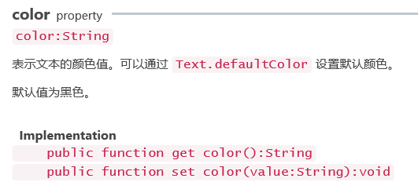
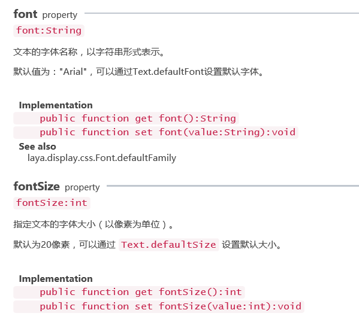

#テキストのベーススタイルを設定

私達のいくつかの項目では、テキストはよく使われます。このテキストのフォントサイズ、フォント色、テキストの内容などを設定することは避けられません。

まず基本的なデモを作ってテキストを作成し、このテキストにテキストの内容を追加し、フォントの色を設定します。

Laya.display.textにおけるテキストスタイルに関するAPIパラメータ：




```java

package {
  import laya.display.Text;
  public class LayaSample {
   
  public function LayaSample() {
  //初始化引擎
  Laya.init(1136, 640);
   
  var  txt:Text = new Text();
  txt.text = "hello_world";
  txt.color = "#ffffff";
   
  Laya.stage.addChild(txt);
  }  
  }
}
```


この時、私たちはtxtがステージに追加されているのを見ることができます。txtの中に白いハローワールドが表示されます。

次に私たちのテキストに他のフォントスタイル、太字、斜体、フォントサイズなどを追加します。

 


 


```java

package {
  import laya.display.Text;
  public class LayaSample {
   
  public function LayaSample() {
  //初始化引擎
  Laya.init(1136, 640);
   
  var  txt:Text = new Text();
  //设置文本内容
  txt.text = "hello_world";
  //设置文本颜色
  txt.color = "#ffffff";
  //设置文本字体
  txt.font = "Ya Hei";
  //设置字体大小
  txt.fontSize = 32;
  //设置文本区背景
  txt.bgColor = "#c30c30";
  //设置文本框的颜色
  txt.borderColor = "#23cfcf";
  //设置粗体、斜体
  txt.bold = true;
  txt.italic = true;
   
   
  Laya.stage.addChild(txt);
  }  
  }
}
```


ここでは、フォントのスタイル、フォントのサイズが明らかに変化し、テキストボックスの一番外側に明るい青色の枠が見えます。テキストエリアの背景は赤色になります。関心があるのは、これらの属性の使用方法をより深く理解するために、値を修正することができます。