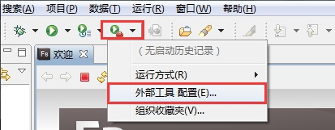
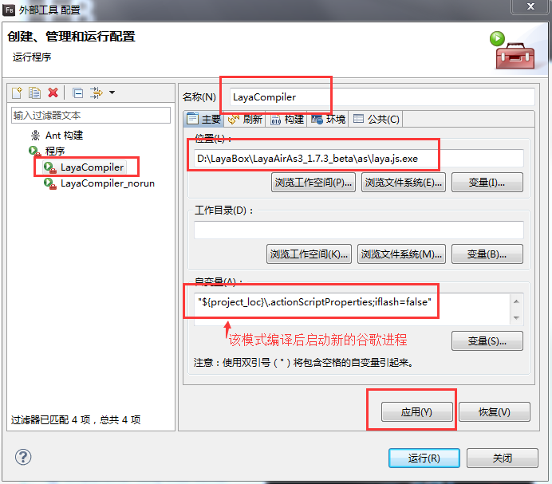

#Flash Builder開発環境構成

###第一歩：LayaAir Egineダウンロード

####1.1エンジンのダウンロード

LayaAirIDEを使って開発すれば、LayaAirIDEをダウンロードしてエンジンパックを持参します。開発者が第三者ツールを使って開発するなら、まずエンジンをダウンロードする必要があります。公式サイトのトップページや開発者センターメニューには、エンジンからダウンロードされたリンクの入り口があり、リンクを開くとエンジンの各バージョンのダウンロードリストが表示されます。各バージョンはAS 3、TS、JSの3つの開発言語を提供しています。対応する開発言語パッケージを選択して、直接クリックしてダウンロードすればいいです。

####1.2エンジンパッケージの構造紹介

AS 3バージョンのエンジンパックをダウンロードします。ダウンロードして解凍すると、AS 3バージョンのディレクトリ構造が下図のように見えます。

 (図1)

-「LayaAirFlash」カタログにはFlashのバージョンをリリースするために必要なエンジンライブラリコードがあります。

-「libs」エンジンコードディレクトリ、LayaAirエンジンライブラリコードはこのディレクトリのSrcサブディレクトリにあります。

-「laya.js.exe」はWindowsシステムのAS 3コードコンパイラで、AS 3コードをJSコードにコンパイルします。

-「LayaJSMac」はアップルMACシステムのAS 3コードコンパイラで、AS 3コードをJSコードにコンパイルします。

-「plyerglobal.swc」はAS 3原生コンパイラSDKを置き換えるために使用され、元のAPIシンタックスのヒントを取り除き、エンジンAPIのヒントを追加します。

－「ワードローダー.js」は、ワードローダー.jsパスを指定して、ワードローダーを使って復号画像をロードする機能を開始し、ローディング最適化の役割を果たし、関連文書を具体的に参照することができます。

​

###二番目のステップはGoogle Chromeブラウザをインストールします。

AS 3コードコンパイルを実行すると、デフォルトでChromeブラウザを呼び出して実行項目を開きます。このブラウザをインストールしてプロジェクトのデバッグを行う必要があります。インストールされたものはこのステップをスキップできます。

###第3段階Flash BuilderのAS 3コンパイル環境を設定します。

​**ステップ1**：Flash Builderを開き、「外部ツールの設定」を見つけ、設定ウィンドウを開きます。

​ 
図(2)

​**ステップ2**：設定ウィンドウで、右クリックで「プログラム」を選択し、「新規作成」をクリックして、新規設定ウィンドウを開きます。

​ 
図(3)

**ステップ3**:

まず外部プログラムの名前を変更します。`LayaCompiler`」をクリックします。

そして「ファイルシステムをブラウズ」をクリックして「`laya.js.exe`」または直接コピーします。`laya.js.exe`」のパスを「位置」入力欄に貼り付けます。

最後に「引数」欄に入力します。`"${project_loc}\.actionScriptProperties;iflash=false"`をクリックします。

もし私たちが毎回コンパイルしたくないなら、新しいGoogleブラウザのプロセスを起動して、先ほどの構成で再度外部プログラムを作成します。変数パラメータを変更するだけでいいです。`"${project_loc}\.actionScriptProperties;iflash=false;chromerun=false;"`図4、図5に示すように。

 (図4)

 (図5)

＊Tips：「D:\LayaBox\LayaAirAs 3_1.7.3怯\as\laya.js.exe」はlaya.js.exeの実際の所在経路であるべきです。MACシステムの下では「D:\LayaBox\LayaAirAs 3_1.7.3 beta\as\LayaJSMac」*です。

これでプロジェクトを立ち上げる前のLayaAirエンジンのダウンロード、ブラウザのダウンロード、Flash Builderの環境下のAS 3コンパイラの配置が終わりました。開発者が他の章で引き続き勉強することを歓迎します。