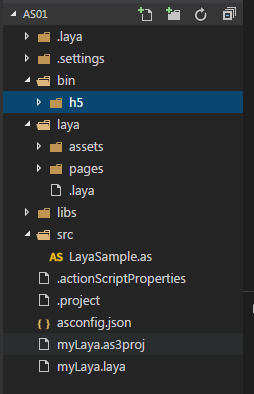

#LayaAirIDEでAS 3プロジェクトを作成し、ディレクトリ構造を詳しく説明します。

現在はAS 3開発者がFlashDevelopとFlash Buiderの環境開発を推奨していますが、LayaAirエンジンのHTML 5プロジェクトです。しかし、まずLayaAirIDEでプロジェクトを作成し、FlashDevelopまたはFlash Buiderで編集を開くことを提案します。LayaAirIDEでプロジェクトを作成するとデフォルトでクリアなディレクトリ構造が作成されます。LayaAirIDEツールでAS 3空プロジェクトを作成することを皮切りに、プロジェクトを作成し、プロジェクトの構造を紹介します。


##一、LayaAirIDEでAS 3プロジェクトを作成する

ステップ1：LayaAirIDEを開いて、新しいプロジェクトをクリックして、図1のようです。

<br/>(図1)


ステップ2：「LayaAir空項目」を選択し、項目名、パス、タイプを設定し、エンジンバージョンを選択したら、「作成」をクリックして新しい空項目を作成します。図2のように。

<br/>(図2)


ステップ3：「作成」をクリックすると、プロジェクトの構造が見えます。プロジェクトフォルダの構造は図3に示すようになります。

<br/>(図3)


これまでに、AS 3プロジェクトを成功的に作成しました。Flash DevelopまたはFlash Buiderを採用してプロジェクトを開くことをお勧めします。


##二、AS 3プロジェクト構造を紹介する。

**次に、前のセクションで作成したプロジェクト構造を組み合わせて、各ディレクトリの役割を紹介します。**

​

###2.1プロジェクト配置ディレクトリ(.layaフォルダ)

layaフォルダの下に保存されているのは、図4に示すように、プロジェクトの開発運転中の配置情報です。

<br/>
（図4）


####2.1.1`.laya/launch.json`ファイル紹介


 `.laya/launch.json`ファイルはプロジェクトデバッグのいくつかの設定情報を保存しています。それぞれLayaAirIDEのデバッグ設定とchromeブラウザデバッグ設定です。簡単に変えないでください。間違ったらプロジェクトのデバッグに影響します。

　　`configurations`：この属性には`layaAir`和`chrome`二つのデバッグの設定が可能です。

　　`"name": "layaAir"`：LayaAirIDE内蔵のデバッグ方式を表します。

　　`"name": "chrome调试"`：ローカルchromeブラウザでデバッグすることを表示します。

　　`"file": "${workspaceRoot}/bin/h5/index.html"`：プロジェクト運転開始の入り口ファイルのパスを示します。

　　`"runtimeExecutable": "C:/Program Files (x86)/Google/Chrome/Application/chrome.exe"`：ローカルchromeブラウザのパスのために、開発者は自分の必要に応じてこのパスを設定します。

　　`"userDataDir": "${tmpdir}"`chromeデバッグキャッシュを表す一時ディレクトリは、デフォルトではユーザの一時ディレクトリであり、開発者は設定を変更することができます。例えば、キャッシュを現在のプロジェクトのルートディレクトリのcacheディレクトリに設定します。`"userDataDir": "${workspaceRoot}/cache"`。

​

####2.1.2.`tasks.json`ファイル紹介

`tasks.json`ジョブ設定ファイルです。開いたら下記の図のようになります。

<br/>(図7)

**argsパラメータの説明：**

　　`command`属性はどのファイルを起動するかを表します。ASプロジェクトが起動するのはLayaComplerコンパイラツールです。

　　`args`属性は伝達のパラメータを表していますが、デフォルトは伝達のためのactionScript Proptiesというファイルです。

もしあなたがfdのプロファイルだったら、変更できます。


```

"args": ["${workspaceRoot}/LayaUISample.as3proj;iflash=false;windowshow=false;chromerun=false"];
```


####2.1.3`astool`目次

​`astool`LayaCommpilerコンパイラのカタログです。`layajs`MACシステムのAS 3コンパイラです。`layajs.exe`windowsシステムのAS 3コンパイラです。


###2.2項目の出力ディレクトリ（bin/h 5）

​`bin/h5`ディレクトリが保存されているのは現在のプロジェクトの出力ファイルです。プロジェクトの中のアクションScript 3.0ファイルを保存して作成したjsファイルとHTML 5ページをコンパイルします。

​*Tips：開発者が新規リソースなどの運転ディレクトリやファイルを必要とする場合は、`bin/h5`の同級またはサブディレクトリにあります。*


 


###2.3 UIプロジェクトディレクトリ（laya）

「`laya`」ディレクトリはLayaAirIDEの現在のUI項目を保存するために使用されます。

「`laya/assets`UIページや粒子などのコンポーネントに必要な写真リソースを保存するためのディレクトリです。

「`laya/pages`」ディレクトリは、LayaAirIDEがページレイアウトを作成して生成したファイルを保存します。

「`laya/.laya`」ファイルはLayaAirIDEのUI項目設定ファイルです。


 


###2.4プロジェクトライブラリディレクトリ（libs）

「`libs`」プロジェクトで使用するライブラリファイルを保存するためのディレクトリです。

「`libs/laya/src`」カタログにLayaAirエンジンライブラリファイルを保存します。


###2.5プロジェクトのAS 3コードディレクトリ（src）

プロジェクトで使用するAS 3コードファイル（.asファイル）はデフォルトでsrcディレクトリに保存されます。


##三、プロジェクト配置ファイルの紹介

###3.1 LayaAirIDEプロジェクトプロファイル（プロジェクト名.laya）

​`项目名.laya`LayaAirIDEプロジェクトのプロファイルです。ファイルには現在のプロジェクトの項目名、使用するライブラリバージョン番号とプロジェクトタイプが記録されています。

たとえば:


```json

{"proName":"myLaya","version":"1.5.4","proType":0}
```


###3.2 Flash Developプロジェクト配置ファイル（プロジェクト名.as 3 proj）

​`项目名.as3proj`ファイルはFlash Developプロジェクトのプロファイルです。Flash Developエディタを使ってAS 3プロジェクトを開発する場合は、リソースマネージャを開いてディレクトリをダブルクリックしてFlash Developでこのプロジェクトを開くことができます。

<br/>(図8)

まずFlash Developツールを開き、メニューバーで「ファイル」->「開く」を通じてプロジェクト名を見つけます。as 3 projのディレクトリはこのプロジェクトを開きます。

<br/>(図9)


###3.3 Flash Builderプロジェクトのプロファイル

​`.settings`ファイル`.actionScriptProperties`ファイルと`.project`ファイルはFlash Builderプロジェクトのプロファイルです。Flash Buiderを使用すると、メニューバー「ファイル」->「Flash Builderプロジェクトを導入する」ことでLayaAirIDEが作成したAS 3プロジェクトを導入することができます。Flash Builderプロジェクトを導入するには、次の図のようになります。


 <br/>(図10)


 