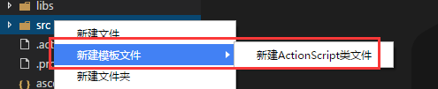
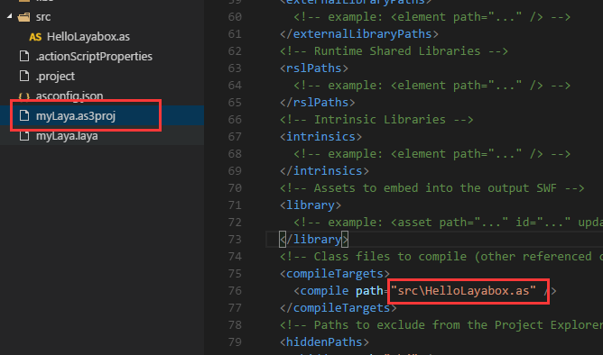
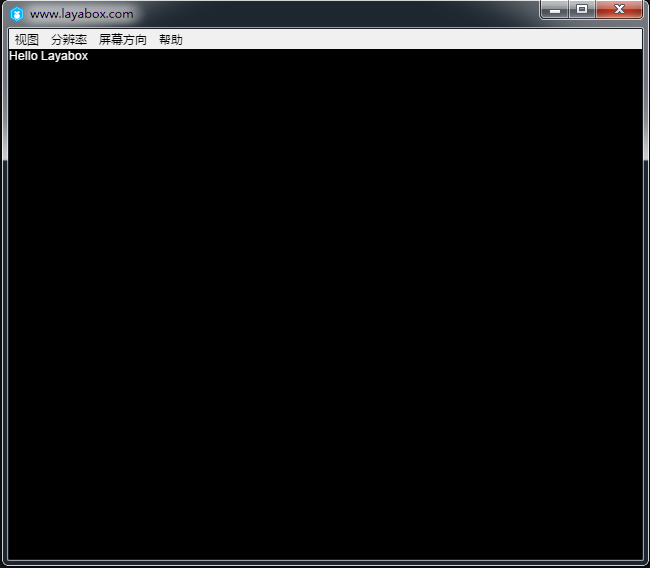

#LayaAirIDEの最初のプログラム「Hello Layabox」

>本編ではAS 3言語でLayaAirIDE環境にテキストハローLayaboxを表示します。
>
>本編を終了するとLayaAirエンジンを完成するための最初のプログラムです。本編を学ぶ前に必ず先に読んでください。**『LayaAirIDEでAS 3プロジェクトを作成し、ディレクトリ構造を詳しく説明する』**
>

​


 **ステップ1**：LayaAirIDEのAS 3項目を開いて、srcディレクトリの下で、「新規アクションScriptファイル」をクリックして、図1に示すようにします。

​<br/>
図(1)


​**ステップ2**：クラス名のハローLayaboxを入力して、確定をクリックして、HellLayabox.asのas 3種類のファイルを作成できます。図2に示すように。

​<br/>
図(2)


​**ステップ3**：HellLayabox.asを文書類に設定します。Flash Developのプロジェクトファイルを開くにはクリックしてください。`“项目名.as3proj”`（ここは`myLaya.as3proj`を選択します`<compiletargets></compiletargets>`ラベル内のドキュメントクラスのコンパイルパスは、図3に示すように、本例で新たに作成したクラスファイルのHellLayabox.asのパスに変更され、具体的な操作は下図のようになります。

​<br/>
図(3)


​**ステップ4**:一つを`“Hello Layabox”`ステージにテキストを追加します。Helle Layabox.asをクリックしてコードを追加します。
​<br/>
図(4)


**HellLayabox.asコード：**


```javascript

package 
{
    /**
     * ...
     * @author Charley
     */
    import laya.display.Text;
    public class HelloLayabox
    {
        public function HelloLayabox()
        {
            //创建舞台，默认背景色是黑色的
            Laya.init(600, 300);
            var txt:Text = new Text();
             
            //设置文本内容
            txt.text = "Hello Layabox";
             
            //设置文本颜色为白色，默认颜色为黑色
            txt.color = '#ffffff';
             
            //将文本内容添加到舞台 
            Laya.stage.addChild(txt);       
        }
    }
 
}

```


​

**ステップ5**：コード作成が完了したら、F 5ショートカットキーでコンパイルし、実行結果は下図のようになります。

​<br/>
図(5)


​**ステップ6**：上の図のように、`“Hello Layabox”`もう表示されましたが、ちょっと地味です。`“Hello Layabox”`もっと良くなって、コードの修正を続けます。

​<br/>
図（6）

**HellLayabox.asコード：**


```javascript

package 
{
    /**
     * ...
     * @author Charley
     */
    import laya.display.Text;
    public class HelloLayabox
    {
        public function HelloLayabox()
        {
            //创建舞台
            Laya.init(600, 300);//舞台默认背景色是黑色的
            var txt:Text = new Text();
            txt.text = "Hello Layabox";
             
            //设置文本颜色
            txt.color = '#FF0000';
            //设置文本字体大小，单位是像素
            txt.fontSize = 66;
             
            //设置字体描边
            txt.stroke = 5;  //描边为5像素
            txt.strokeColor = '#FFFFFF';
             
            //设置为粗体
            txt.bold = true;
             
            //设置文本的显示起点位置X,Y
            txt.pos(60, 100);
             
            //设置舞台背景色
            Laya.stage.bgColor = '#23238E';
             
            //将文本内容添加到舞台
            Laya.stage.addChild(txt);
        }
    }
 
}
```


​

運転結果は下図のようになります。

​<br/>
図（7）


ここで、もしあなたがこの入門教程に従って、上図の表示を完成したら、ご入門の成功をおめでとうございます。LayaAirIDEで最初にAS 3言語で開発したHTML 5プログラムを完成しました。LayaAirの開発環境構成にも間違いがないと説明しました。LayaAirエンジンが開発したAPIの使い方は、オンラインAPIとオンラインDEMOを公式サイトLayabox開発者センターに確認してください。

