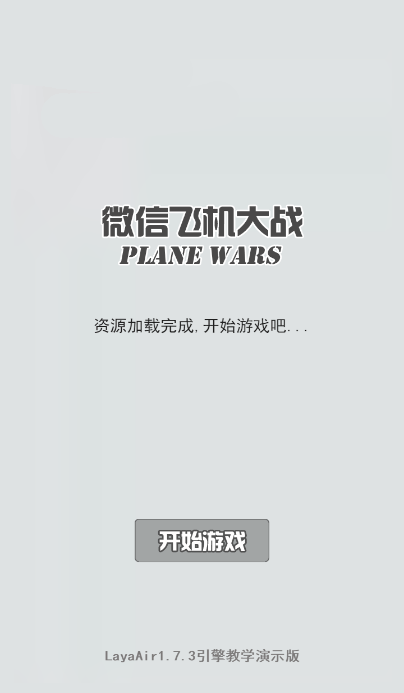

#一、「飛行機大戦」プロジェクトの需要分析と資源準備

>本教程は旧版の「微信飛行機大戦」のビデオ教程とは違って、LayaAirIDEのエディター方式を採用して開発され、プロセスUIの機能と教程を追加し、コード量を減らし、プログラム構造も最適化されました。ビデオ教程を勉強したことがある開発者もこの教程に従ってもう一度勉強し直してもいいです。

###前言

当時の微信のゲーム《飛行機大戦》を覚えていますか？ダウンロードする必要がなくても微信で直接遊んで、しかも自分の順位を分かち合うことができます。

クラシックに敬意を払うという理想に基づいて、今回はLayaAirを使った高速開発を実演し、クラシックゲームを再現します。先に声明します。ゲーム内のシーンとキャラクターの資源はすべて元の開発者が所有しています。この例では研究のためだけに使って、ソースと資源は商用にしないでください。

**ゲームのプレイアドレス**:[http://layabox.github.io/layaair-examples/](http://layabox.github.io/layaair-examples/)

ゲームのソースコード:[https://github.com/layabox/layaair-doc/tree/master/project/AS3/AirWar](https://github.com/layabox/layaair-doc/tree/master/project/AS3/AirWar)

 (図1)

 (図2)

 (図3)

###プロジェクトの需要分析

すべてのゲーム項目の開始段階において、プロジェクトの需要分析は大きな時間スケールを占めています。プロジェクトの需要を計画した後、経験のあるプログラマーも自分で論理的な思考図を構築して、プログラムの構造上でもっと合理的に考えて、開発の構想の上で更にはっきりしています。

このため、本教程では開発ニーズに応じて基本的な論理的思考図を参考に提供しています。開発者にプロジェクト開発計画の習慣をつけるよう提案します。

 (図4)

以上の思惟導図に基づいて分析して、以下の開発構想を得ます。

1.可視化素材の作成は、二つのステップに分けて、一つはUIを編集し、美術は効果図を作成し、IDEの命名規則に合致した画像リソースを出力し、UIページ編集を行います。二つは可視化キャラクターのアニメーション制作で、IDEの時間軸を通してキャラクターのアニメーション効果を作ります。見たところ、プログラムは直接アニメーションの作成ファイルを呼び出して、コード量を減らすことができます。
2.ゲームの流れを制御し、ゲームの開始、ゲーム中、ゲームの終了画面を処理し、UI機能を実現する。
3.ゲームの主な論理機能はステップ別に開発され、ゲーム地図、ゲームキャラクター、ゲーム操作、ゲームロジック、ゲームアップグレードなどがあります。

基本的な開発構想ができたら、まずゲームの準備を始めましょう。

###新規LayaAirプロジェクト

LayaAirIDEを開いて、空いている項目を新規作成します。図5に示すように、プロジェクト名はカスタム可能で、この例はアクションScript 3.0言語をバージョンとして、他の言語は同じです。作成ボタンをクリックするとIDEデフォルトの「コードモード」プロジェクトマネージャにプロジェクトディレクトリが表示されます。

 (図5)

プロジェクトディレクトリ構造とLayaAirIDEでプロジェクトと環境構成を作成するにはどうすればいいですか？知らない学生は先に見てください。

高層ビルは足下から始まります。何事も初めがあります。簡単から難しいまで、まず美術資源の処理から始めます。

 

###ゲームリソースの準備

生成されたアイテムを開いて、「デザインモードに入る」をクリックして、美術で作成された画像リソースを「リソースマネージャ」にドラッグします。または右ボタンで場所ディレクトリを開けて拷問し、ディレクトリは"…\AirWar\laya\asets"です。コピーが完了したら(ショートカットキーF 5)エディタを更新してください。

リソースマネージャでは、各フォルダはエディタからエクスポート（ショートカットキーF 12）すると自動的にパッケージマップリソースが生成されます。図セットのサイズが1024 x 1024を超えないことを提案します。一枚の図が512 x 512を超える場合、包装しないことを提案します。メニューを開くことができます**プロジェクトの設定**「パネル（ショートカットキーF 9）は、オートパックのサイズ制限を行います。

ゲームリソースのフォルダとリソースのサイズ管理は重要です。うまく処理すれば、ロード速度も速く、実行効率も高いです。例えば、本ゲームのリソース素材（図6）を作成し、二つのフォルダに分けて、UIリソースフォルダとキャラクターアニメーションリソースフォルダ、及び512を超える背景図をパッケージングしない。

  (図6)

gameUIリソースフォルダ（図7）では、bj.jpgのバックグラウンドリソースはより小さく作られています。九宮のスケールで拡大できます。ボタン文字はbtnubg.pngボタンの背景と分離されています。ボタン背景は省資源を繰り返し使用できます。

  (図7)
（図6）

gameRoleフォルダにはキャラクターアニメーションリソースのみが格納されており（図8）、IDEでアニメーションを作成するために使用されています。

 (図8)

###ゲームリソースのリリース

リソースファイルの準備が完了したら、リソース（ショートカットキーF 12）をリリースしてみてもいいです。マップリソースを生成するディレクトリは、「…AirWar\bin\h 5\res\atlas」の下（図8）で、ゲームプログラムにロードします。

 (図8)

以上の手順を通じて、プロジェクト開発の構想を明確に整理し、ゲーム美術素材資源を準備しました。これから本格的にゲーム制作の流れに入ります。まずは可視化されたUIとアニメ制作から始まります。