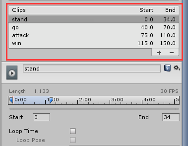

##LayaAir 3 Dアニメーション

現在、LayaAir 3 Dエンジンはアニメーション部分に対して多くの調整を行い、古いバージョンのアニメーションを保留していますが、開発者たちに新しいアニメーションコンポーネント方式を使うよう提案しています。新版アニメーションアニメーションアニメーションアニメーションアニメーションのいくつかのタイプを統合し、分類せずに作成し、開発時間を節約しました。骨格アニメーション、材質アニメーション、剛体アニメーション、ビデオカメラアニメーションなどが含まれています。

アニメイトの動画モジュールはユニティが導出した動画をサポートしています。骨格アニメーションモデルはユニティを導入して統合編集ができます。材質アニメーション、剛体アニメーションは直接unityで編集できます。


###キャラクター骨格アニメーション

ゲームキャラクターの骨格隠し動画は3 Dゲームで多く使われており、キャラクターの動画モデルをunityに導入して編集し、LayaAirにエクスポートして使用することができます。

####unityでアニメーション編集ステップ

1、モデルを導入する。ユニティリソースマネージャでは、FBXフォーマットのリソース、スタンプリソースを右クリックして導入し、モデルをシーンにドラッグして、材質のスタンプを調整して保存します。この例では保存シーンの名前は「mokey」です。

2、アニメーションコントローラを作成します。unityリソースマネージャでは、右クリックメニューからアニメーションコントローラ（Animtor Controller）を作成し、アニメーションの名前に基づいて、この例では「mokeyAction」と名づけます。

3、アニメーションコントローラを編集します。アニメーションコントローラをダブルクリックして開くと、ビューエリアにアニメーションコントローラの編集画面が表示されます。ドットオンで導入されたモデルの右側の「小さな三角」が表示されます。「再生フラグ」ファイルはモデルのアニメーションファイルで、デフォルトは「Take 001」と呼ばれ、アニメーションコントローラ編集画面（図1）にドラッグして保存されます。

<br/>

（図1）

4、アニメーションコントローラをバインドします。シーン中のキャラクターモデルを選択して、キャラクターアニメーションコントローラを選択したモデルのアニメーションコンポーネント（図2）に付与します。アニメーションコンポーネントがないと、追加する必要があります。そうでないと、エクスポートされたアニメーションは再生できません。

<br/>(図2)

以上の手順を経て、キャラクターアニメーションのunityでの編集が完了しました。unityでボタンを押すと、動画が再生されます。動画再生に問題がなければ、以前の「unityプラグインツール」の教程方法でLayaAirに必要なリソースを導き出すことができます。

**Tips：他のアニメーションもunityでの処理方式が一致しており、シーンモデルにアニメーションコンポーネントを追加する――アニメーションコントローラを作成する――アニメーションをアニメーションコントローラに加える――アニメーションコントローラにモデルを追加するアニメーションコンポーネントにアニメーションを追加するステップが必要です。**


####LayaAirでのキャラクターアニメーションの実現

エクスポートされたリソースはプロジェクトh 5のディレクトリにコピーされ、コードを通してキャラクターリソースをロードし、作成後に自動的にアニメーションを再生して循環します（図3）。参照コードは以下の通りです。


```java

package {
	import laya.d3.component.Animator;
	import laya.d3.core.Camera;
	import laya.d3.core.Sprite3D;
	import laya.d3.core.scene.Scene;
	import laya.d3.math.Vector3;
	import laya.display.Stage;
	import laya.events.Event;
	import laya.utils.Handler;
	import laya.utils.Stat;

	public class LayaAir3D_Animator
	{
		public function LayaAir3D_Animator() 
		{
			//初始化引擎
			Laya3D.init(1000, 500,true);
			
			//适配模式
			Laya.stage.scaleMode = Stage.SCALE_FULL;
			Laya.stage.screenMode = Stage.SCREEN_NONE;

			//开启统计信息
			Stat.show();
			
			//预加载角色动画资源
			Laya.loader.create("monkey/monkey.lh",Handler.create(this,onModelOK),null,Sprite3D);
		}		
		
		private function onModelOK():void
		{
			//添加3D场景
			var scene:Scene = new Scene();
			Laya.stage.addChild(scene);
			
			//创建摄像机(横纵比，近距裁剪，远距裁剪)
			var camera:Camera = new Camera( 0, 0.1, 1000);
			//加载到场景
			scene.addChild(camera);
			//旋转摄像机角度
			camera.transform.rotate(new Vector3( -25, 0, 0), false, false);
			//移动摄像机位置
			camera.transform.position=new Vector3(0, 5, 10);
			//加入摄像机移动控制脚本
			camera.addComponent(CameraMoveScript);
			
			//添加蒙皮动画角色模型
			var role3D:Sprite3D=Laya.loader.getRes("monkey/monkey.lh");
          	//加载到场景
			scene.addChild(role3D);
		}
	}
}
```


<br/>(図3)


####キャラクターアニメーションのコントロールと分解

**アニメーションコンポーネントを取得**

上記の例を通して、アニメーションが自動的に放送されているのを見ました。いくつかの動作が含まれていますが、アニメの放送はどうやって制御されますか？まず、モデル上のアニメーションコンポーネントを取得してから、再生、停止などを制御することができます。

LayaAir 3 Dエンジンの3 DモデルSprite 3 Dクラスは、get ComponentByType（）方法を提供して、モデル上のコンポーネントを取得します。動画付きモデルは、ロード作成時にデフォルトでアニメイトに付与されていますので、以下のコードを参照してください。

開く.lhファイルを見ると、アニメーションコンポーネントはモデルのサブオブジェクトに結合されているので、「get ChildAt（0）」を使用して、サブオブジェクトモデルを取得します。そして、アニメーションコンポーネントをget ComponentByTypeで取得します。


```java

//获取角色动画组件
var ani:Animator=role3D.getChildAt(0).getComponentByType(Animator) as Animator;
```


**Tips：場合によっては.lhまたは.lsファイルには複数の親子レベルの関係が存在しています。アニメーションコンポーネントはすべて第1の階層にあり得ません。第2の層かもしれません。第3の層かもしれません。したがって、アニメーションコンポーネントを取得する前に、lsまたは.lhを開いてアニメーションコンポーネントモデルの階層関係を調べ、get ChildAt()、またはget ChildByName()などの方法でモデルを取得してからアニメーションコンポーネントを取得することができます。プログラムが間違っています。**


**コントロール**

アニメーションのセットがあったら、どのように一つの動作だけを再生しますか？動作の制御と切り替えを実現する方法は二つあります。

####1.コード定義アニメーションクリップ再生

上記の例では、unityではアニメーションを分離していません。モデルのデフォルトアニメーションTake 001を使用して、プラグインは一つのlani形式のアニメーション解析ファイルだけを導出しました。

そのため、あるアニメーションの再生を制御し、コードにカスタムアニメーションクリップを追加し、アニメーションクリップに開始と終了フレームレートを設定して実現する必要がある。

アニメイトのアニメーションコンポーネントでのプレイ方法を見て、具体的な方法は以下の通りです。

**Tips：1.7.10版の後、play（）方法はloopがループするかどうか、フレームレートの開始、フレームレートの終了パラメータをキャンセルしました。アニメーションがループされているかどうかはunityエディタのアニメーション属性にチェックを付けて設定してください。エクスポート後はエンジンが設定に従ってアニメーションを再生します。図5、6のloop Time選択ボックスを参照してください。**


```java

/**
* 播放动画。
* @param	name 如果为null则播放默认动画，否则按名字播放动画片段。
* @param	playbackRate 播放速率。
*/
play(name:String=null,playbackRate:Number=1.0)
 
```


**アニメーションを再生するフレームがあるフレームにある場合、既存のアニメーションに基づいてアニメーションクリップを追加したAnimation Clipを作成することができます。最新のAnimationカテゴリーはaddClipを提供します。**


```java


/**
* 添加动画片段。
* @param	clip 动画片段。
* @param	playName 动画片段播放名称，如果为null,则使用clip.name作为播放名称。
* @param   开始帧率。
* @param   结束帧率。
*/
public function addClip(clip:AnimationClip, playName:String = null, startFrame:int = 0, endFrame:int = 4294967295
```


変更例のコードは以下の通りです。


```java

......
//添加蒙皮动画角色模型
var role3D:Sprite3D=Laya.loader.getRes("monkey/monkey.lh");
//加载到场景
scene.addChild(role3D);
//获取角色动画组件
var ani:Animator=role3D.getChildAt(0).getComponentByType(Animator) as Animator;

//加载一个动画文件创建动画剪辑（可以是已有的动画，也可以是此角色需增加的新动画文件）
//var clip:AnimationClip=AnimationClip.load("monkey/Assets/monkey-Take_001.lani");
//从现有的动画中获取动画剪辑（默认根据.lani文件创建的动画剪辑）
var clip:AnimationClip=ani.clip;

//增加一个动画剪辑引用，从clip中的0-34帧创建名为stand的动画剪辑
ani.addClip(clip,"stand",0,34);
//增加一个动画剪辑引用，从clip中的40-70帧创建名为move的新动画剪辑
ani.addClip(clip,"move",40,70);

//播放某个动画剪辑
ani.play("move");
//可获取动画剪辑总数
trace("当前动画剪辑总数为："+ani.getClipCount());
```


コンパイル運転後の効果は以下の通りで、0-34フレームのスタンディング動画クリップだけが循環的に再生されます。

<br/>(図4)


####2.ユニティでアニメクリップ再生を定義する

unityでは、アニメーションをセグメント化し、クリップのセグメントを名前にすることができます。エクスポートされたリソースは、コントロール時に、名前でアニメーションに切り替わり、開発者たちが使いやすいです。（このような方法では、リソースをエクスポートする時にアニメーション解析ファイルを追加し、Httpアクセス回数を増やすために、どのような方法で開発者が状況に応じて自分で考えてもいいです。）

unityにおけるアニメーションセグメントの区分方法は以下の通りである。

1）「リソースマネージャ」でモデルファイルを選択し、右側のinspector画面でAnimationsを選択し、デフォルトのアニメーションTake 001が現れました。ユーザー定義の名前を編集し、プラス記号をクリックしてアニメーションセグメントを追加し、セグメントの開始と終了フレームを修正します（図5）。

Tips：ゲーム中の動画の循環再生は、下図の「Loop Time」にチェックしてください。

<br/>(図5)

この例では全部で4つの動作が、美術によって提供されるアニメーションフレーム数に応じて4つのアニメーションセグメントに追加されるように修正される（図6）。

<br/>(図6)

2）修正が完了すると、リソースマネージャモデルにも対応する動画ファイルが追加されますので、アニメーションコントローラを変更して、新しく生成したアニメーションセグメントをアニメーションコントローラに追加します。そうでないと、完全なアニメーションリソース解析ファイルをエクスポートできません。

<br/>(図7)

前のステップを完了したら、再エクスポートし、出力されたリソースにも4つのlaniアニメーション解析ファイルが生成されます。

例コードを修正して、動画名の再生方式を適用します。


```java

......

//添加蒙皮动画角色模型
var role3D:Sprite3D=Laya.loader.getRes("monkey/monkey.lh");
//加载到场景
scene.addChild(role3D);
//获取角色动画组件
var ani:Animator=role3D.getChildAt(0).getComponentByType(Animator) as Animator;			
//监听默认动画完成后播放站立动画
ani.on(Event.COMPLETE,this,onAniComplete,[ani]);
//播放攻击动画
ani.play("attack");
/***当前动画播放完成后回调***/
private function onAniComplete(ani:Animator):void
{
  //切换站立动画
  ani.play("stand");
}
```

<br/>(図8)


