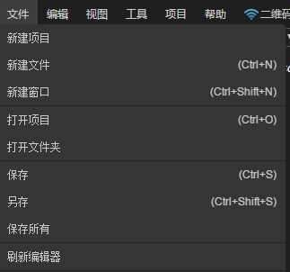

#メニューバーの詳細

コードモードメニューバーには、一連の一般的な機能とオプションのセットが含まれています。ここではコードモードメニューバーを詳しく紹介します。

  
（図1）メニューバーパネル

 

##一、ファイル

​ 
（図2）ファイルリスト

​**新規プロジェクト**：新規プロジェクトウィンドウをイジェクトして、新規プロジェクト名、位置、プロジェクトタイプを選択します。現在のプロジェクトタイプはAS、JS、TSの3種類のプロジェクトタイプに対応しています。

​**新規ファイル**：新しいファイルは編集ビューウィンドウでコードドキュメントを新規作成します。リソースビューウィンドウのワークファイル欄でドキュメントの位置を確認できます。新規作成したコードドキュメントは保存操作を行う場合のみ本当に生成されます。

​**新しいウィンドウ**：新しいウィンドウは、新しいプロジェクトの作成または他の項目の編集を行うために、新しいコード編集ウィンドウをイジェクトします。

​**プロジェクトを開く**：プロジェクトを開くと、WINDOWSリソースマネージャのスタイルのブラウズウィンドウが開き、プロジェクトの場所を選択します。確認後はIDEが開いている新しい項目に切り替わります。

​**フォルダを開く**：フォルダを開くと、WINDOWSリソースマネージャスタイルのブラウズウィンドウがフォルダの場所を選択します。確認後、リソースビューウィンドウに自動的にフォルダを追加します。

​**保存**：現在の操作のファイルを保存します。

​**保存**：現在操作されているファイルを新しいファイルとして保存します。

​**すべてを保存**：すべてのファイルに対して一回の保存操作を行います。

​**エディタを更新**:エディタのリアルタイム状態を更新します。

  

##二、編集

​ 
（図3）リストの編集

​**取り消す**：現在の操作を一回キャンセルします。

​**やり直す**：取り消された操作を一回で回復します。

​**切り取り**:選択した段落またはファイルを切り取ります。

​**貼り付け**：コピーした段落または切り取ったファイルを貼り付けます。

​**コピー**:選択した段落またはファイルをコピーします。

​**すべて選択**：現在のファイルの内容をすべて選択します。

​**検索**：編集ビューウィンドウの右上に検索機能ウィンドウをポップアップし、キーワード検索を行います。

​ 
（図4）検索パネル

​**置換**：編集ビューウィンドウの右上に、代替機能ウィンドウをポップアップし、キーワードを置換します。

​**グローバル検索**：リソースビューウィンドウをグローバル検索ウィンドウに変換し、キーワードを全項目検索し、キーワードを含むファイルパスとキーワードの行、キーワードの数を一覧表示します。コード編集ウィンドウでこのキーワードをハイライト表示します。

 

##三、ビュー

​ 

（図5）ビューリスト

​**ファイル**：リソース管理ビューが遮蔽されている場合、このオプションはリソースマネージャウィンドウを再現します。

​**検索**:グローバル検索ウィンドウが遮蔽されている場合、このオプションはグローバル検索ウィンドウを再現します。

​**GIT**：GITウィンドウが遮蔽されている場合、GITウィンドウが再現されます。

​**デバッグ**：デバッグウィンドウがブロックされている場合、このオプションはデバッグウィンドウを再起動します。

​**コマンドパネル**:このオプションは編集ビューウィンドウの上にコマンドウィンドウを表示します。

​ 
（図6）コマンドパネル

​**エラーと警告**:このオプションは編集ビューウィンドウの上にエラーと警告ウィンドウを表示します。

​**出力パネル**:このオプションは編集ビューウィンドウの下に出力ウィンドウを表示します。

​**ターミナル**：この選択項目はシステムコマンドライン端末を起動します。

​**デバッグパネル**:このオプションは編集ビューウィンドウの下にデバッグコンソールウィンドウを表示します。

​**フルスクリーン**：IDEフルスクリーンを最大化して表示します。

​**エディタを分割**：編集ビューウィンドウを複数の分割画面に分割します。

​**サイドバーを切り替え**:サイドバーを表示/非表示にします。

​**サイドバーを移動**：サイドバーを一番左/一番右側に移動します。

​**拡大**：LayaAirIDEの表示スケールを全体に拡大します。

​**縮小**：LayaAirIDEの表示スケールを全体的に縮小します。

​**ズームをリセット**：LayaAirIDEの表示スケールをデフォルトにリセットします。

##四、工具

​ 
（図7）ツールパネル

##を選択します。**SWF変換**：SWFリソース変換ツールウィンドウを開き、ユーザによるSWF変換操作を行う。 **JS圧縮ツール**：JS圧縮ツールのウィンドウを開けて、ユーザがJSファイルを圧縮して混淆するようにします。
##を選択します。**竜骨アニメーション**：竜骨アニメーションの変換ウィンドウを開き、ドラゴンズの骨格アニメーションをLayaAirの識別フォーマットに変換する。 **Spineアニメーション変換**：Spineアニメーション変換ウィンドウを開き、ユーザーがSpine骨格アニメーションをLayaAir識別のフォーマットに変換する。
##を選択します。**Psd 2 UI**：padファイルを直接UIページに変換し、リソース命名規則を参照することができます。[这里](https://ask.layabox.com/question/7365) **図セットの包装**：図セットのパッキングウィンドウを開けて、ユーザーに図セットのパッキング操作を行うようにします。
##を選択します。**ダウンロード**：運転器がダウンロードした二次元コードウィンドウを開けて、ユーザーがコードをスキャンしてLayaNativeの運転器をダウンロードします。 **パッケージアプリ**：APPパッケージの環境配置と操作ウィンドウは、LayaAirプロジェクトをAndroidとしてパッケージ化するためのAPP（appkファイル）
##を選択します。**アプリ構築**：構築機能ウィンドウを開き、LayaAirエンジンプロジェクトをAndroid d-eclipse、Android d-studio、XCode(IOS)の3つのモバイル端末のAPPプロジェクトとして構築する。 **3 D変換ツール**：3 D変換ツールのURLリンクを開き、圧縮パッケージ内で3 DMAxとユニティ3 Dエディタのリソース変換ツールを提供し、3 DMAxとユニティ3 DのリソースをLayaAirエンジンがサポートするリソースにします。

##五、プロジェクト

​ 
（図8）プロジェクトパネル

​**クラス管理**：現在の項目で使用するクラスのバージョンを設定します。

##六、手伝います

​ 
##（図9）ヘルプパネル **開発者ツール**:エディタのデバッグページを開くために使用します。
##を選択します。**公式サイト**：Layabox公式サイトのリンクを開きます。 **公式サイトの例**：公式サイトのLayaAirエンジンの例のリンクを開きます。
##を選択します。**開発者センター**：Layabox開発者センターのリンクを開きます。 **エディタローカルキャッシュディレクトリを開く**:エディタのローカルキャッシュファイルの場所ディレクトリを開きます。
##を選択します。**更新を確認**：LayaAirIDEのバージョンのダウンロードリストリンクを開きます。 **ログを更新**：gitHubのエンジンとIDEバージョンの更新ログのリンクを開きます。
を選択します。**現在のバージョン番号**：LayaAirIDE現在のバージョン番号が表示されます。