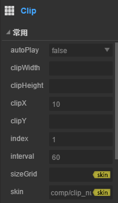

#Clipコンポーネント参照


##一、LayaAirIDEでClipコンポーネントを作成する

###1.1 Clipの作成
Clipコンポーネントはビットマップスライスアニメーションを表示するために使用できます。Clipは、各スライスの幅clipWidth、縦方向に分割し、各スライスの高さclipHeightを横方向に分割し、左から右に、上から下に分割して、一つのスライスアニメーションに結合することができる。

Clipコンポーネントは、スライス動画を再生し、スライス動画のあるフレーム画像を表示するために使用することができる。
リソースパネルのClipコンポーネントをクリックして、ページ編集エリアにドラッグ＆ドロップします。Tabコンポーネントをページに追加できます。
Clipのスクリプトインターフェース参照[Clip API](http://layaair.ldc.layabox.com/api/index.html?category=Core&class=laya.ui.Clip)

Clipコンポーネントのリソース例：

​<br/>
（図1）

clipX属性の値を10に設定した後の表示効果：

​<br/>
（図2）

index属性の値を1に設定した後の表示効果:

​<br/>
（図3）

###1.2 Clipコンポーネントの一般的な属性

​<br/>
（図4）

𞓜**属性**𞓜**機能説明**𞓜
|------|---------------------------------|
現在の切片アニメーションが自動的に再生されるかどうかを示します。𞓜
|clip Width𞓜が画像リソースを横方向に分割する場合、各スライスの幅。𞓜
|clipHeight𞓜が画像リソースを縦に分割する場合、各スライスの高さ。𞓜
|clipX|が画像資源を横に分割する場合、等幅に切断された部数。𞓜
|clipY|が画像リソースを縦に分割する場合など、高カットの部数が求められます。𞓜
アニメーションフレームインデックスは現在表示されています。𞓜
テレビアニメの放送間隔。𞓜
|sizeGrid画像リソースの有効グリッドデータ（ハヤーグデータ）。𞓜
|skin 124;タブボタンの画像リソース。𞓜


##二、コードでClipコンポーネントを作成する

コードを書く時は、コード制御UIを通して作成することが避けられません。`UI_Clip`クラスをコードにインポート`laya.ui.Clip`Clip関連のプロパティをコードで設定します。

**実行例の効果:**
​<br/>
（図5）コードによるカウンタ作成

​<br/>
（図6）

Clipの他の属性もコードで設定でき、上記の例では、各秒ごとにclip.clipXスライスを更新する方法を示しています。デジタルを毎秒更新することにより、タイマの機能が実現されます。興味のある読者は自分でコード設定Clipを通じて、自分のプロジェクトに必要なClipを作成することができます。

**サンプルコード:**


```javascript

package
{
	import laya.display.Stage;
	import laya.events.Event;
	import laya.ui.Button;
	import laya.ui.Clip;
	import laya.ui.Image;
	import laya.utils.Handler;
	import laya.webgl.WebGL;
	
	public class UI_Clip
	{
		/***控制器按钮资源***/
		private var buttonSkin:String = "../../../../res/ui/button-7.png";
		/***切片资源***/
		private var clipSkin:String = "../../../../res/ui/num0-9.png";
		/***背景资源***/
		private var bgSkin:String = "../../../../res/ui/coutDown.png";
		
		/***计数器***/
		private var counter:Clip;
		/***计数器当前索引***/
		private var currentIndex:int;
		/***控制器按钮***/
		private var controller:Button;
		
		public function UI_Clip()
		{
			// 不支持WebGL时自动切换至Canvas
			Laya.init(800, 600, WebGL);
			//画布垂直居中对齐
			Laya.stage.alignV = Stage.ALIGN_MIDDLE;
			//画布水平居中对齐
			Laya.stage.alignH = Stage.ALIGN_CENTER;
			//等比缩放
			Laya.stage.scaleMode = Stage.SCALE_SHOWALL;
			//背景颜色
			Laya.stage.bgColor = "#232628";
			
			//加载资源
			Laya.loader.load([buttonSkin, clipSkin, bgSkin], 
                             laya.utils.Handler.create(this,onSkinLoaded));
		}
		
		/***加载资源完成***/
		private function onSkinLoaded(e:*=null):void
		{
			//显示背景图
			showBg();
         	//创建计数器
			createCounter();
            //显示总数
			showTotal();
            //创建控制按钮
			createController();
		}
		
		/***显示背景***/
		private function showBg():void 
		{
			//实例化背景图
			var bg:Image = new Image(bgSkin);
			//设置图片大小
			bg.size(224, 302);
			//位置居舞台中间
			bg.pos(Laya.stage.width - bg.width >> 1, Laya.stage.height -bg.height >> 1);
			//加载到舞台
			Laya.stage.addChild(bg);
		}
		
		/***创建计数器切片***/
		private function createCounter():void
		{
			//实例化计数器切片
			counter = new Clip(clipSkin, 10, 1);
			//自动播放
			counter.autoPlay = true;
			//播放间隔时间1秒
			counter.interval = 1000;			
			//计数器切片位置
			counter.x = (Laya.stage.width - counter.width) / 2 - 35;
			counter.y = (Laya.stage.height - counter.height) / 2 - 40;
			//加载到舞台
			Laya.stage.addChild(counter);
		}
		
		/***显示总数切片***/
		private function showTotal():void 
		{
			//实例化总数切片
			var clip:Clip = new Clip(clipSkin, 10, 1);
			//总数切片索引为最后一个
			clip.index = clip.clipX - 1;
			//总数切片位置
			clip.pos(counter.x + 60, counter.y);
			//加载到舞台
			Laya.stage.addChild(clip);
		}
		
		/***创建控制按钮***/
		private function createController():void 
		{
			//实例化控制按钮
			controller = new Button(buttonSkin, "暂停");
			//标签字体为粗体
			controller.labelBold = true;
			//按钮标签字体颜色的四种状态
			controller.labelColors = "#FFFFFF,#FFFFFF,#FFFFFF,#FFFFFF";
			//按钮大小
			controller.size(84, 30);
			//按钮点击事件——计数器状态控制
			controller.on(Event.CLICK, this, onClipState);
			//按钮位置
			controller.x = (Laya.stage.width - controller.width) / 2;
			controller.y = (Laya.stage.height - controller.height) / 2 + 110;
			//加载到舞台
			Laya.stage.addChild(controller);
		}
		
		/***计数器状态***/
		private function onClipState(e:*=null):void 
		{
			//如果计数器为播放状态
			if (counter.isPlaying)
			{
				//停止播放动画
				counter.stop();
				//记录当前播放索引（如果不记录，重新播放时，索引会从0开始）
				currentIndex = counter.index;
				//按钮标签改变
				controller.label = "播放";
			}
			else//计数器为停止状态
			{
				//播放动画
				counter.play();
				//从当前记录的索引播放
				counter.index = currentIndex;
				//按钮标签改变
				controller.label = "暂停";
			}
		}	
	}
}
```


 