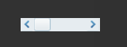

#HScrollBarコンポーネント参考


##一、LayaAirIDEを通じてHScrollBarコンポーネントを作成します。

###1.1 HscrollBarを作成する

HScrollBarコンポーネントは、水平方向のスクロールバーコンポーネントです。
データが多すぎて表示領域が収容できない場合、最終的にユーザはHScrollBarコンポーネントを使用して表示されたデータ部分を制御することができる。
スクロールバーは4つの部分から構成されています。一つのレール図と一つのスライダボタンと二つの矢印ボタンです。
リソースパネルのHScrollBarコンポーネントをクリックして、ページの編集エリアにドラッグします。HScrollBarコンポーネントをページに追加できます。
HScrollBarコンポーネントのスクリプトインターフェースを参照してください。[HScrollBar API](http://layaair.ldc.layabox.com/api/index.html?category=Core&class=laya.ui.HScrollBar)。
HScrollBarコンポーネントの画像リソース例：

​<br/>
（図1）

​<br/>
（図2）

​<br/>
（図3）

​<br/>
（図4）

HScrollBarをエディタエリアにドラッグして、効果を表示します。

​<br/>
（図5）

HScrollBarの属性maxの値を10とし、属性minの値を0とし、属性valueの値を3とした後、次のように表示されます。

​<br/>
（図6）

プログラムを実行すると、スライダをドラッグしたり、矢印ボタンを押してプログレスバーの値を制御できます。

​<br/>
（図7）

HScrollBarのプロパティshowButotonsの値がfalseの場合の表示効果を設定します。

​<br/>
（図8）

プログラムを実行する時の効果:

​<br/>
（図9）


 


###1.2 HScrollBarコンポーネントの一般的な属性

​<br/>
（図10）

𞓜**属性**𞓜**機能説明**𞓜
|-------------------------------------------------|
|skin 124;スクロールバーの画像リソースアドレス。𞓜
|sizeGrid|動バーの軌道図資源の有効スケーリンググリッドデータ（九宮格データ）。𞓜
|value 124;は現在のスクロール位置の数字を表します。𞓜
|min124;は最低スクロール位置の数字を表します。𞓜
|max 124;は最高スクロール位置の数字を表します。𞓜
|scrollSize 124;は、スクロールバーの軌道を押した時のページのスクロールの増分を表します。𞓜
|mouseWheelEnable 124;は、ホイールがスクロールするかどうかを指定し、デフォルトはtrueです。𞓜
タッチをオンするかどうかを指定します。デフォルトはtrueです。𞓜
オートスクロールバーを隠すかどうかを指定します。標準値はfalseです。𞓜
|show Button 124;ブール値は、上向き、下向きのボタンを表示するかどうかを指定し、デフォルトはtrueです。𞓜


 


##二、コードでHScrollBarコンポーネントを作成する

コードを書く時は、コード制御UIを通して作成することが避けられません。`UI_ScrollBar`クラスをコードにインポート`laya.ui.HScrollBar`のパッケージを作成し、コードでHScrollBar関連の属性を設定します。

**実行例の効果:**
​<br/>
（図11）コードによりHScrollBarを作成する

HScrollBarの他の属性もコードで設定できます。下記の例ではコードでHScrollBarを作成する方法を実証しました。興味のある読者は自分でコードでHScrollBarを設定して、自分の必要に合うHScroll Barを作成します。

**サンプルコード:**


```javascript

package
{
	import laya.display.Stage;
	import laya.display.Text;
	import laya.ui.HScrollBar;
	import laya.ui.ScrollBar;
	import laya.ui.VScrollBar;
	import laya.utils.Handler;
	import laya.webgl.WebGL;

	public class UI_ScrollBar
	{
		/***水平滚动条资源**/
		private var skins:Array=["../../../../res/ui/hscroll.png", 
							 	 "../../../../res/ui/hscroll$bar.png", 
								 "../../../../res/ui/hscroll$down.png",
								 "../../../../res/ui/hscroll$up.png"];

		/***提示信息文本框**/
		private var promptText:Text;		
		/****水平滚动条****/
		private var hScrollBar:HScrollBar;		
		
		public function UI_ScrollBar()
		{
			// 不支持WebGL时自动切换至Canvas
			Laya.init(800, 600, WebGL);
			//画布垂直居中对齐
			Laya.stage.alignV = Stage.ALIGN_MIDDLE;
			//画布水平居中对齐
			Laya.stage.alignH = Stage.ALIGN_CENTER;
			//等比缩放
			Laya.stage.scaleMode = Stage.SCALE_SHOWALL;
			//背景颜色
			Laya.stage.bgColor = "#232628";
			
			//加载资源
			Laya.loader.load(skins, Handler.create(this, onSkinLoadComplete));
		}

		/***加载资源完成***/
		private function onSkinLoadComplete(e:*=null):void
		{
			//创建水平滚动条
			createHScroller();
		}
		
		/***创建水平滚动条***/
		private function createHScroller():void 
		{
			//实例化垂直滚动条
			hScrollBar= new HScrollBar();
			//加载皮肤资源（其他资源根据规范命名后，会自动加载）
			hScrollBar.skin = "../../../../res/ui/hscroll.png";
			//设置宽度
			hScrollBar.width = 400;
			//设置位置
			hScrollBar.pos(150, 170);
			//最低滚动位置数字
			hScrollBar.min = 0;
			//最高滚动位置数字
			hScrollBar.max = 100;
			//滚动变化事件回调
			hScrollBar.changeHandler = new Handler(this, onChange);
			//加载到舞台
			Laya.stage.addChild(hScrollBar);
			
			//创建提示信息
			createPromptText(hScrollBar)
		}		
		
		/***创建提示信息***/
		private function createPromptText(scrollBar:ScrollBar):void
		{
			//实例化提示信息
			promptText=new Text();
			//提示框字体
			promptText.font="黑体";
			//提示框字体大小
			promptText.fontSize=26;
			//提示框字体颜色
			promptText.color="#FFFFFF";
			//提示框初始文本
			promptText.text="您的选择是： ";
			//加载到舞台
			Laya.stage.addChild(promptText);
			//设置提示框位置
			promptText.pos(scrollBar.x,scrollBar.y-50);
		}
		
		/***滚动条位置变化回调***/
		private function onChange(value:Number):void 
		{
			promptText.text= "滚动条的位置： value=" + value;
		}
	}
}
```


