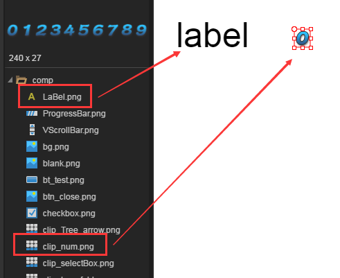

##3、コンポーネントのための動的な割り当て

一般的に固定された値は、IDEのプロパティ設定器にセットされていますが、リスト（List）コンポーネントのような、コンポーネントのための動的な割り当てが必要な場合が多いです。次に、コンポーネントの属性値を動的に変更する方法を紹介します。

dataSourceはComponentコンポーネントクラスで定義されているコンポーネントの基本的な属性の一つであり、Componentクラスから派生されたすべてのコンポーネントがこの属性を実現しています。私たちは動的な割当値を実現するには彼に頼っています。dataSourceにはデフォルト属性の賦値パターンと指定属性の賦値パターンがありますが、それぞれの例を紹介します。

###3.1簡単なUI DEMOを作成する

**編集UI**

まず一つを作成します`ComponentDemo.ui`のUIページを開きます。そして私たちは`资源管理器`の中で、一つを`label`コンポーネントと一つ`clip`コンポーネントをドラッグします`场景编辑器`で、最後に初期属性を設定する必要があります。

`var`は、設定されている必要があります。プロジェクトコードでコンポーネントを動的に割り当てるには、`var`設定したグローバル変数。ここで、私たちは`label`コンポーネントのvarは`lab`を選択します`clip`コンポーネントのvarは`numb`。

デフォルトで`label`フォントが小さいので、ここではプレゼンテーションをしやすいように、`label`コンポーネントの`fontSize`属性値を`50`。

IDE持参の`clip`スライスコンポーネントは`0-9`全部で10の数字で構成されていますので、ビットマップスライスのX軸数も必要です。`clipX`）に設定します`10`を選択します

初期開始属性を設定した後、IDEの効果は図4に示します。

<br/>(図4)

**コードの作成**

ショートカットキーF 12を使ってUIをエクスポートした後、プロジェクトコードモードに切り替え、ComponentDemo.asのエントリクラスを作成します。次のようにエンコードします。


```java

package
{
	import laya.ui.Image;
	import laya.utils.Handler;
	import laya.webgl.WebGL;	
	import ui.ComponentDemoUI;

	public class ComponentDemo
	{
		public function ComponentDemo()
		{
			Laya.init(1334,750, WebGL);
			Laya.stage.bgColor = "#ffffff";
			//加载图集成功后，执行onLoad回调方法
			Laya.loader.load("res/atlas/comp.atlas", Handler.create(this, onLoaded));
		}
		
		private function onLoaded():void {
			//创建一个UI实例
			var comp:ComponentDemoUI = new ComponentDemoUI();

			//添加到舞台上显示
			Laya.stage.addChild(comp);
		}
	}
}
```


ページでの運転効果とIDEの1つは、図5に示すように、

<br/>(図5)


####3.1.2標準属性の値付けでコンポーネントに値を付ける

IDEの基本的なコンポーネントにはデフォルトの属性があります。dataSourceを通じてコンポーネントのデフォルト属性に直接付与されます。コンポーネントの属性名を指定する必要はありません。コンポーネントのデフォルト属性を動的に変更するだけであれば、この割り当て方式を採用するほうが便利です。

次に、図5のデフォルトのコンポーネントを割り当てます。修正後のコードは以下の通りです。


```java

package
{
	import laya.ui.Image;
	import laya.utils.Handler;
	import laya.webgl.WebGL;	
	import ui.ComponentDemoUI;

	public class ComponentDemo
	{
		public function ComponentDemo()
		{
			Laya.init(1334,750, WebGL);
			Laya.stage.bgColor = "#ffffff";
			//加载图集成功后，执行onLoad回调方法
			Laya.loader.load("./res/atlas/comp.atlas", Handler.create(this, onLoaded));
		}
		
		private function onLoaded():void {
			//创建一个UI实例
			var comp:ComponentDemoUI = new ComponentDemoUI();
			
			//为label组件设置组件默认属性值
			comp.lab.dataSource = "LayaAir";
			
			//为clip组件设置组件默认属性值
			comp.numb.dataSource = 6;
			
			//添加到舞台上显示
			Laya.stage.addChild(comp);
		}
	}
}
```


ページでの運転効果は図6に示す通りです。

 <br /> (图6)


コードのコメントを通して、簡単なコードだけでコンポーネントの割り当てが完了しました。しかし、慎重に対比すると、labelコンポーネントのデフォルト属性はtextであり、clipコンポーネントのデフォルト属性はindexであることが分かりやすいです。他のコンポーネントのデフォルト属性は何ですか？

次に、コンポーネントのデフォルト属性のリストを提供します。

|コンポーネント名|のデフォルト属性𞓜
|-----------------------|
|Button 124;ラベル124;
|LinkButton 124; label 124;
|Radio Button 124; label 124;
|Label|text𞓜
|Text Input text𞓜
|TextArea text𞓜
|Cobox 124; selectedIndex 124;
|Tab124; selected Index 124;
|Radio Group 124; selectedIndex 124;
|View Stock 124; selectedIndex 124;
|List(124;selected Index 124;)
|Clip|index 124;
124プログレスBar 124 value 124
|Sroll value 124;
|Slider124; value 124;
|CheckBox 124; selected 124;
|Image𞓜skin 124;


###3.1.3コンポーネントの割り当てとして属性を指定します。