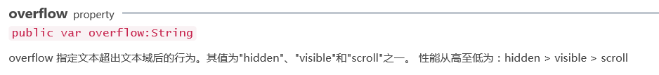
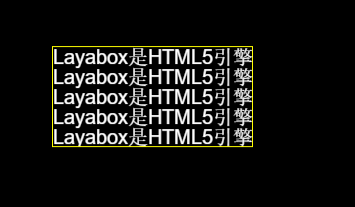

#テキスト範囲外の処理&スクロールテキスト

テキストは内容を追加する時、私達が設定したテキストエリアを超えてはいけません。この時テキストを処理します。処理しないと内容が私達の舞台を超えるかもしれません。

Laya.display.textで使用されるAPIパラメータ：

<br/>

hidden:テキスト領域を超えた文字は表示されません。

visible:いかなる裁断も行いません。

scroll:テキスト域外の文字画素を表示せず、scrollインターフェースをサポートします。


```typescript

//初始化引擎,不支持WebGL时自动切换到Canvas
Laya.init(500,400,Laya.WebGL);
setup();
function setup(){
    var t1 = createText();
    //设置不进行任何裁剪
    t1.overflow = Laya.Text.VISIBLE;
    t1.pos(10,10);

    var t2 = this.createText();
    //设置不显示文本区域外的字符像素
    t2.overflow = Laya.Text.SCROLL;
    t2.pos(10,110);

    var t3 = this.createText();
    //设置不显示超出文本域的字符
    t3.overflow = Laya.Text.HIDDEN;
    t3.pos(10,210);
}
function createText(){
    var txt = new Laya.Text();
    txt.text = "Layabox是HTML5引擎技术提供商与优秀的游戏发行商，面向AS/JS/TS开发者提供HTML5开发技术方案！\n" +
    "Layabox是HTML5引擎技术提供商与优秀的游戏发行商，面向AS/JS/TS开发者提供HTML5开发技术方案！\n" +
    "Layabox是HTML5引擎技术提供商与优秀的游戏发行商，面向AS/JS/TS开发者提供HTML5开发技术方案！";
    txt.borderColor = "#ffff00";
    //设置宽高以后的自动裁剪会按照这个区域裁剪
    txt.size(300,50);
    txt.fontSize = 20;
    txt.color = "#ffffff";
    Laya.stage.addChild(txt);
    return txt;
}
```


</br>

3つの方法のテキスト処理の違いが見られます。それぞれの処理にはそれぞれの長所と短所があります。性能が一番高いのはやはりhiddenです。

テキスト領域にoverflowを設定するだけでなく、scrollXとscrollyを使ってテキストビューをスクロールさせ、テキストをスクロールさせることによってすべてのテキスト内容を表示することもできます。

スクロールテキストを実現するにはoverflow=Text.SCROLLを使ってText.HIDDENを使う必要があります。すぐにスクロールを設定しても効果がありません。


```typescript

//初始化引擎,不支持WebGL时自动切换到Canvas
Laya.init(500,400,Laya.WebGL);
createText();
function createText(){
    this.txt = new Laya.Text();
    this.txt.overflow = Laya.Text.SCROLL;
    this.txt.text = "Layabox是HTML5引擎技术提供商与优秀的游戏发行商，面向AS/JS/TS开发者提供HTML5开发技术方案！\n" +
    "Layabox是HTML5引擎技术提供商与优秀的游戏发行商，面向AS/JS/TS开发者提供HTML5开发技术方案！\n" +
    "Layabox是HTML5引擎技术提供商与优秀的游戏发行商，面向AS/JS/TS开发者提供HTML5开发技术方案！\n" +
    "Layabox是HTML5引擎技术提供商与优秀的游戏发行商，面向AS/JS/TS开发者提供HTML5开发技术方案！\n" +
    "Layabox是HTML5引擎技术提供商与优秀的游戏发行商，面向AS/JS/TS开发者提供HTML5开发技术方案！\n" +
    "Layabox是HTML5引擎技术提供商与优秀的游戏发行商，面向AS/JS/TS开发者提供HTML5开发技术方案！";
    this.txt.size(200,100);
    this.txt.x = Laya.stage.width - this.txt.width>>1;
    this.txt.y = Laya.stage.height - this.txt.height>>1;
    this.txt.borderColor = "#ffff00";
    this.txt.fontSize = 20;
    this.txt.color = "#ffffff";
    Laya.stage.addChild(this.txt);
    this.txt.on(Laya.Event.MOUSE_DOWN,this,startScrollText);
}
/*开始滚动文本*/
function startScrollText(){
    this.prevX = this.txt.mouseX;
    this.prevY = this.txt.mouseY;
    Laya.stage.on(Laya.Event.MOUSE_MOVE,this,scrollText);
    Laya.stage.on(Laya.Event.MOUSE_UP,this,finishScrollText);
}
/* 停止滚动文本 */
function finishScrollText()
{
    Laya.stage.off(Laya.Event.MOUSE_MOVE, this, this.scrollText);
    Laya.stage.off(Laya.Event.MOUSE_UP, this, this.finishScrollText);
}
/* 鼠标滚动文本 */
function scrollText()
{
    var nowX = this.txt.mouseX;
    var nowY = this.txt.mouseY;
    this.txt.scrollX += this.prevX - nowX;
    this.txt.scrollY += this.prevY - nowY;
    this.prevX = nowX;
    this.prevY = nowY;
}
```


<br/>

<br/>

ここでは、テキストをスクロールしてより多くのテキスト内容を表示し、実際のコードの中で項目によってはoverflowの3つの処理方法を使い、自動的に改行したり、テキストをスクロールしたりしてテキストを処理します。