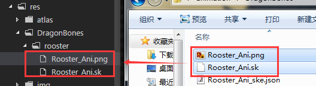
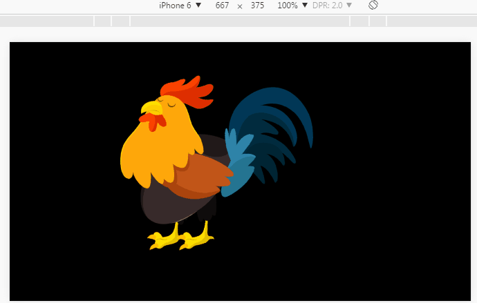

#LayaAirエンジンでドラゴンズ動画を再生

>本編ではLayaAirIDE 1.7.6バージョンのスクリーンショットを用いて説明していますが、違いがあれば最新の安定バージョンのLayaAirIDEをダウンロードして最新バージョンに準じてください。

ドラゴンズ骨格アニメーションは、ゲームでよく使われる骨格アニメーションの一つであり、LayaAirIDEが持参した変換ツールで、ドラゴンズ骨格アニメーションフォーマットをLayaAirエンジンがサポートする骨格アニメーションフォーマットに変換することができます。


###1、オリジナルドラゴンズ骨格アニメーションの導出

####1.1エクスポート時のテクスチャ設定はテクスチャセットでなければなりません。

LayaAirIDEのドラゴンズ変換ツールは、ドラゴンズの骨格アニメーション変換のみをサポートしていますので、ドラゴンズ骨格アニメーション編集ツールを使ってエクスポートする場合は、`纹理设置`の`纹理类型`オプションで選択`纹理集`を選択します。

 


（図1）

####1.2エクスポートしたドラゴンズバージョン

LayaAirIDEはすべてのドラゴンズバージョンが変換をサポートしているわけではない。サポートされているバージョン番号はLayaAirIDEのです。`龙骨转换工具`パネルには図2に示すように表示されています。

 


（図2）

本文書に至るまで、ドラゴンズは4.5バージョンから5.1バージョンまでサポートされています。その後LayaAirIDEは不定期でドラゴンズ版のサポートの更新を行い、開発者は変換ツールパネル上のバージョン番号のサポート状態の変化に注目することができます。


###2、ドラゴンズアニメーションをLayaAirエンジン識別のフォーマットに変換する

####2.1変換ツールパネルを開く

LayaAirIDEの`设计模式`で、メニューバーの`工具`—>`龙骨动画转换`を選択します。図3に示すように、開くことができます。`DragonBones格式转换`ツール。

 


（図3）


####2.2生成.sk拡張の骨格アニメーションファイル

開く`龙骨格式转换`ツールパネルの後、ドラゴンズからエクスポートするリソースディレクトリ`拖入`変換パネルに行くか、またはクリックします。`浏览`ボタンをクリックしてDragonBonesからエクスポートするリソースディレクトリを選択します。をクリックします`确定`を選択します。元のリソースディレクトリで生成できます。`.png`和`.sk`拡張子の2つの同名ファイル。図4に示すように。

 


（図4）


###3、ドラゴンズアニメーションのロード表示

####3.1変換後のドラゴンズ動画資源をプロジェクト対応のディレクトリにコピーします。

私たちは竜骨変換ツールから生まれた同名のものです。`.sk`を選択します`.png`拡張子のファイルをプロジェクトのディレクトリにコピーします。図5に示すように。(*竜骨工具でエクスポートした元のファイルは構いません。変換ツールのみに使用します。＊）

 


（図5）

####3.2ドラゴンズアニメ放映例

以下の例を使用します。`laya.ani.bone.Skeleton`クラス、具体的なAPIの説明はリンクを直接開いて見ることができます。[https://layaair.ldc.layabox.com/api/?category=Bone&class=laya.ani.bone.Skeleton](https://layaair.ldc.layabox.com/api/?category=Bone&class=laya.ani.bone.Skeleton)

DragonBones Demo.jsを作成します。コードの作成は以下の通りです。


```java

//初始化舞台
Laya.init(1334,750);
//创建一个Skeleton对象
var skeleton = new Laya.Skeleton();
//添加到舞台
Laya.stage.addChild(skeleton);

skeleton.pos(600,350);

//通过加载直接创建动画
skeleton.load("res/DragonBones/rooster/Rooster_Ani.sk");
```

運転効果は図6に示すようになります。

 


（図6）