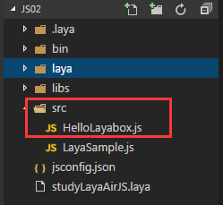

#最初のプログラム：テキストを表示する「ハローLayabox」


 **【ヒント】本文を読む前に、まず「JSプロジェクトを作成し、ディレクトリ構造を詳しく理解する」を読まなければなりません。**


ステップ1：src右クリックを選択し、左クリックして「新規ファイル」をクリックし、srcディレクトリの下にハローLayabox.jsのファイルを作成します。


​	<br/>


ステップ2：srcディレクトリの下にあるハローLayabox.jsをクリックして、次のコードを作成します。


```javascript

//创建舞台，默认背景色是黑色的
Laya.init(600, 300); 
var txt = new Laya.Text(); 
//设置文本内容
txt.text = "Hello Layabox";  
//设置文本颜色为白色，默认颜色为黑色
txt.color = "#ffffff";  
//将文本内容添加到舞台 
Laya.stage.addChild(txt);
```


ステップ3：コードが完了したら保存し、F 5でコンパイルし、ポップアップページでコードの運行結果を見ることができます。
​<br/>


ステップ4：表示に成功したら、表示ウィンドウを閉じます。私たちはコードを作り続けて、文字を美しく見せるようにします。コードを引き続き改善すると以下の通りです。


```java

//创建舞台，默认背景色是黑色的
Laya.init(600, 300); 
var txt = new Laya.Text(); 
//设置文本内容
txt.text = "Hello Layabox";  
//设置文本颜色
txt.color = "#FF0000";
//设置文本字体大小，单位是像素
txt.fontSize    = 66;  
//设置字体描边
txt.stroke = 5;//描边为5像素
txt.strokeColor = "#FFFFFF";  
//设置为粗体
txt.bold = true;  
//设置文本的显示起点位置X,Y
txt.pos(60,100);  
//设置舞台背景色
Laya.stage.bgColor  = '#23238E';  
//将文本内容添加到舞台 
Laya.stage.addChild(txt);
```


ステップ5：作成後保存し、再度F 5でコンパイルし、美化後の運転結果は下図のようになります。
​<br/>


ここで、もしこの入門教程に従って、上図の表示を完成したら、入門成功をおめでとうございます。最初のJavaScript言語で開発されたLayaAirエンジンHTML 5プログラムを完成しました。LayaAirエンジンによって開発されたAPIの使い方は、公式サイトLayabox開発者センターに行って教程を確認してください。