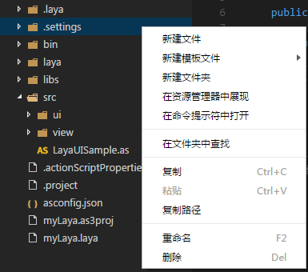
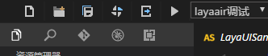

#コードパターンレイアウトの概要

 

###一、コードコンパイル環境

コード編集環境は複数のパネルで構成され、パネルは異なるプロジェクトや開発者のニーズに合わせて自由に隠すことができます。この章では、デフォルトの環境レイアウトの編集を例にとって、各パネルとその機能を素早く閲覧します。

 
図（1）LayaAirIDEホームページ面

###二、プロジェクトマネージャ

プロジェクトマネージャウィンドウには、プロジェクトフォルダ内のすべてのコードとリソース構造がツリー構造で表示されます。フォルダは自動的に同期されます。オペレーティングシステムでフォルダの内容を変更します。また、新規作成、改名、削除などの常用操作も可能です。

 

図(2)ファイルの作成方法

 

###三、コードエディタ

コード編集ウィンドウは、プロジェクトマネージャで選択したドキュメントを表示したり編集したりします。

 

図（3）コード編集ページ

###四、ツールバー

ツールバーは、プロジェクトおよびコードドキュメントを高速で操作するためのツールセットです。コードモードツールバーで紹介します。具体的な使用について詳しく紹介します。

  
図（4）ツールバーパネル

 

###五、メニューバー

メニューバーには、一連の編集に必要な操作と機能のセットが含まれています。コードモードメニューバーで紹介します。メニューバーを詳しく紹介します。

 
図（5）メニューバーパネル

 

###六、モード切替ボタン

モード切替ボタンは、デザインモード、コードモード、クイズコミュニティの間で迅速に編集を切り替えることができます。

 
図（6）モードパネル