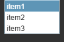

#Compboxコンポーネントの参考


##一、LayaAirIDEでCompboboxコンポーネントを作成する
###1.1 Compboxを作成する
Compboxはドロップダウンリストオプションボックスのコンポーネントです。
資源パネルのCompboxコンポーネントをクリックして、ページ編集エリアにドラッグ＆ドロップして、Compboxコンポーネントをページに追加します。
Commboboxのスクリプトはインターフェースを参照してください。[ComboBox API](http://layaair.ldc.layabox.com/api/index.html?category=Core&class=laya.ui.ComboBox)。

Compboxコンポーネントの画像リソース例：

​<br/>
（図1）

Commboboxの属性labelsの値を設定して「label 1,label 2」としたら、次のように表示されます。
常態:

​<br/>
（図2）

クリックしてドロップダウンオプションのリストを表示します。

​<br/>
（図3）

ドロップダウンオプションでアイテム1を選択した後：

​<br/>
（図4）


###1.2 CommboBoxコンポーネントの一般的な属性

​<br/>
（図5）

𞓜**属性**𞓜**機能説明**𞓜
|-------------------------------------|
選択ボックスのラベルテキストの内容セット文字列をカンマで区切ります。𞓜
|visibleNumプルダウンリストに表示される最大行数。𞓜
scrollBarSkinプルダウンリストのスクロールバーの画像リソース。𞓜
|selected Index 124;は現在選択されている項目の索引を表します。𞓜
|sizeGrid𞓜プルダウンリスト画像リソースの有効スケーリンググリッドデータ（九宮格データ）。𞓜
|skin 124;プルダウンリストの画像リソース。𞓜


 


###1.3 Commboboxコンポーネントのドロップダウンオプションに関する属性

​        <br/>
（図6）

​<br/>
（図7）

𞓜**属性**𞓜**機能説明**𞓜
|------|-----------------------------------------|
|itemColorsプルダウンリスト項目の各状態のラベルテキストの色値セット。詳細はAPIを参照してください。𞓜
|itemSizeプルダウンリスト項目のラベルテキストのフォントサイズ。𞓜


 

 


###1.4 Commboboxコンポーネントドロップボタン関連属性


​        <br/>

（図8）

​<br/>
（図9）

𞓜**属性**𞓜**機能説明**𞓜
|-----------------------------|
|label Bold|プルダウンボタンのラベルテキストは太字表示です。𞓜
|label Color𞓜プルダウンボタンの各状態におけるテキストの色値のセット。詳細はAPIを参照してください。𞓜
|Label Font𞓜プルダウンボタンのテキストフォント。𞓜
|labelPaddingプルダウンボタンのテキスト余白。詳細はAPI 124を参照してください。
|LabelSizeプルダウンボタンのテキストフォントサイズ。𞓜


 


##二、コードでCoboboxコンポーネントを作成する

コードを書く時は、コード制御UIを通して作成することが避けられません。`UI_ComboBox`クラスは、コードでCobox関連の属性を設定します。

**実行例の効果:**
​<br/>

（図10）

Compboxの他の属性もコードで設定できます。下記の例では、コードを使って選択ボックスのドロップダウンオプションを作成する方法を示しています。クリックして自分のクリックを取得するには、どのオプションがありますか？興味のある読者は自分でコードを通じてCoboboxを設置し、自分の必要に合うプルダウンフレームを作成することができます。


```javascript

(function()
{
	var Stage    = Laya.Stage;
	var ComboBox = Laya.ComboBox;
	var Handler  = Laya.Handler;
	var WebGL    = Laya.WebGL;

	var skin = "res/ui/combobox.png";

	(function()
	{
		// 不支持WebGL时自动切换至Canvas
		Laya.init(800, 600, WebGL);

		Laya.stage.alignV = Stage.ALIGN_MIDDLE;
		Laya.stage.alignH = Stage.ALIGN_CENTER;

		Laya.stage.scaleMode = Stage.SCALE_SHOWALL;
		Laya.stage.bgColor = "#232628";

		Laya.loader.load(skin, Handler.create(this, onLoadComplete));
	})();

	function onLoadComplete()
	{
		var cb = createComboBox(skin);
		cb.autoSize = true;
		cb.pos((Laya.stage.width - cb.width) / 2, 100);
		cb.autoSize = false;
	}

	function createComboBox(skin)
	{
		var comboBox = new ComboBox(skin, "item0,item1,item2,item3,item4,item5");
		comboBox.labelSize = 30;
		comboBox.itemSize = 25;
		comboBox.selectHandler = new Handler(this, onSelect, [comboBox]);
		Laya.stage.addChild(comboBox);

		return comboBox;
	}

	function onSelect(cb)
	{
		console.log("选中了： " + cb.selectedLabel);
	}
})();
```


