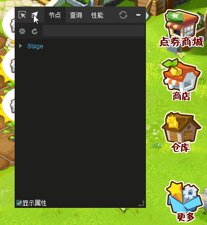
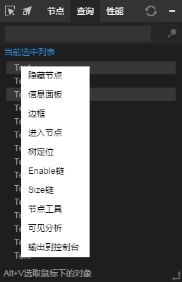

# LayaAir DebugTool调试工具

###1、DebugToolデバッグパネルを有効にする

LayaAir Debug ToolデバッグパネルはDivに基づくデバッグウィンドウであり、プラグインをダウンロードする必要がなく、デバッグライブラリを導入して直接プロジェクト中に実行できます。デバッグパネルを起動する`DebugTool.init()`メソッドは`laya.debugtool.js`ファイルには、index.htmlにこのjsファイルを導入して初期化することができます。`Laya.init()`後の任意のコードに使用を追加し、index.でjsファイルコードを導入すると以下のようになります。


```javascript

<script type="text/javascript" src="libs/laya.debugtool.js"></script>
```


使用方法は、例えば以下のコードで示します。

入口類Main.as


```java

// 程序入口
class GameMain{
    constructor()
    {
        //初始化舞台
        Laya.init(1334,750);
        //调用DebugTool调试面板
        Laya.DebugTool.init();
        //设置舞台背景色
        Laya.stage.bgColor = "#ffffff";
        var Img:Laya.Sprite = new Laya.Sprite();
        //添加到舞台
        Laya.stage.addChild(Img);
        Img.loadImage("res/img/monkey1.png",200);
    }
}
new GameMain();
```


デバッグパネルの有効化に成功したら、図1に示します。

  


（図1）


###2、ノード選択機能

まずデバッグパネルの一番上をクリックしてください。`选取`ボタンのアイコンをクリックします。

ゲームページのノードをスライドさせて、ノードの枠を表示します。

マウスをクリックしてノードを選択します。同時に、デバッグパネルのノード分類には、ノードの属性値情報が表示されます。効果は図2に示すようになります。

 


（図2）


###3、表示属性の設定

デバッグパネルの第二列のギアアイコンをクリックして、設定できます。`要显示的属性`。

新しくイジェクトされた表示属性設定パネルでは、ノードに表示する属性情報を追加して削除することができます。関連動作は図3に示すようになっています。

  


（図3）


###4、ドラッグ選択

左クリックでトップの2番目をクリックします。`拖动选取`ボタンのアイコンを押したまま表示対象ノードにドラッグすると、図4に示すようにデバッグパネルからノードの属性情報が表示されます。


  


（図4）


###5、快速検索機能

####5.1ショートカットキーでページ内のノードオブジェクトを取得する

ショートカットを長押しする`Alt+V`を選択し、同時にマウスでページノードオブジェクトを選択する方法です。図5-1に示すように、ページ中のノードオブジェクトを取得し、右キーで操作するか、またはオブジェクトの属性を素早く調べることができます。

  


（図5-1）

####5.2キーワード検索により、ページ内のノードオブジェクトリストを取得する

ショートカットキーの正確な位置決め取得方式に対しては、`对象查询`ボタン(*ルーペのアイコン*)を押して、オブジェクトリストを取得します。

ルーペのアイコンをクリックすると、新しいオブジェクトの検索パネルが表示されます。nameやクラスにキーワードが含まれているオブジェクトが検索できます。図5-2に示すように。

 


（図5-2）

####5.3属性の内容をオブジェクトで素早く検索する

ショートカットキーでもキーワードでも、属性照会機能により、属性値を素早く検索することができます。

操作方法は：`属性查询输入框`にある**入力**一つ以上`属性名称`（複数の属性は英語のコンマで区切られます）そして`按回车键`属性の内容を取得できます。操作方法は図5-3に示すようになっています。

  


（図5-3）


###6、性能統計

####6.1オブジェクト作成統計

クリック`对象`ボタンを押すと、オブジェクトが作成した統計情報が得られます。情報の内容はそれぞれ`对象名、当前运行创建的对象数量、当前运行距上次运行增加的对象数量`。統計情報は図6-1に示す。

   


（図6-1）

####6.2オブジェクト作成統計の詳細と増分の詳細

オブジェクトが作成した統計情報リストでは、マウスの右ボタンをクリックしてクエリー統計の詳細と増分作成の詳細を図6-2に示します。

   


（図6-2）

####6.3レンダリング時の統計

レンダリング時の統計は、現在のゲームのレンダリングに使用されている時間を調べるために使用されます。単位はミリ秒（ms）です。クリック`渲染`ボタンをクリックして、現在のゲームのレンダリング用の統計データを図6-3に示します。

   


（図6-3）


####6.4 cache再描画統計

クリック`重绘`ボタンを押すと、cacheの描き直しのデータランキングが調べられ、描き直しの多いオブジェクトが上位になります。効果は図6-4に示すとおりです。

   


（図6-4）


####6.5リソースキャッシュ統計

クリック`资源`ボタンをクリックします。**リソースキャッシュのリスト**を選択します。

   


（図6-5）


###7、右クリック機能メニュー

デバッグパネルでは、右クリックで対応する機能メニューが表示されます。特にノード、照会及びレンダリング性能統計の右ボタン機能メニューは熟練した理解と把握が必要です。

 


（図7）


右ボタンの機能が分かりやすいです。開発者は一つ一つ体験できます。ここで注目してもいいです。**ノードツール**このツールは、選択されたノードの表示／非表示動作、現在のノードのmouse Enbale関係チェーン、選択されたノードのSize関係チェーンなどを表示することができます。実用的で常用的です。

ノードツールの動作は図8に示すようになっています。

  


(図8)


