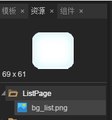

# List示例：显示、增加、删除

List（リスト）は比較的一般的な機能です。本編ではLayaAirエンジンとIDEを結合して、Listの表示、追加、削除などの操作について説明していきます。開発者がエンジンとIDEの実戦参照を学ぶために。（プロジェクト作成などの基本的な操作は、他のドキュメントを確認してください。本編はスキップします。）

###一、LayaAirIDEでUIを作る

#####1.1 ViewタイプのUIページを作成する

​
（図1）ListPageというViewタイプのUIページを作成します。

まず、LayaAirIDEのプロジェクトマネージャにおいて、ViewタイプのUIページを作成します。幅は640＊1136です。ページの名前はListPageです。

#####1.2 UIリソースの導入

美術で作成されたUIページリソースをリソースマネージャに導入する。（具体的な導入方法はLayaAirIDEリソース導入のドキュメントを参照してください。）

​
（図2）

#####1.3九宮格でList背景を作る

**1.3.1 Listの背景をステージにドラッグする**


​      
（図3）写真の背景bgulist.pngをステージにドラッグします。

​**1.3.2 Image属性では、sizGrid属性で九宮格を設定します。**


​      
（図4）サイゼグGridプロパティ右ボタンをクリックして、九宮格設定パネルを開く

​**1.1.3プロパティにwidthを640に設定する（フルスクリーン幅）**

​
（図5）


 #####1.4 List容器を作る

**1.4.1 checkbox.pngをステージにドラッグし、属性nameをcheckに設定します。**


​    
（図6）

​**1.4.2 label.pngをステージにドラッグし、属性nameをlistNumberとし、その他の属性は図7を参照してください。**

​
（図7）シーケンス番号用のlabelコンポーネント

​**1.4.3もう一つのlabel.pngをステージにドラッグして、テキストの内容を変更すると「Listサンプルテキスト」となり、属性設定は図8を参照してください。**

​
（図8）Listテキスト用のlabelコンポーネント

​**1.4.4 list背景図、番号label、テキストlabel、checkboxを選択し、Ctrl+BショートカットでBox容器を作成します。Boxコンテナを選択して、Box属性のrendertypeをrenderに設定します。図9のように、図10は。**

​
（図9）

​
（図10）

​**1.4.5 box容器をクリックして再びCtrl+Bを通してList容器を作成します。図11のように。なお、すべてのList容器は、Box容器に基づいている必要があります。次の図12の階層関係を見ると、より明確になります。listはboxサイクルに基づいて発生します。**

​
（図11）

​
（図12）

#####1.5 List属性の設定

List容器を選択し、Lis属性varを_listとして設定し、必要に応じて他の属性を設定し、repeatXはX軸のリスト数であり、spaceXはX軸リスト間隔であり、spaceXはY軸リスト間隔であり、spaceYはY軸リスト間隔である。図13に示すように、

​
（図13）

#####1.6操作ボタンを追加する

ここで、私達は直接テンプレートのButonTabを使って、ステージの中にドラッグして、サブノードに入ることをクリックして、var、label属性と九宮格などを設置します。図14のように、図15：

​
（図14）

​
（図15）

UI位置の詳細は図16のように調整される。F 12 UIをリリースすれば、コード段階に入ることができます。

​
（図16）

###二、Type Script言語でListコードロジックを実現する

#####2.1作成されたUIページを表示する

2.1.1 ListDemo.tsプログラムファイルを作成し、対応するjsをindex.html入り口に起動クラスとして設定します。

​
（図17）

2.1.2コードを編集し、UIを表示する。

まず、ローディングおよびUIクラスを導入し、その後、UIを表示するための図セットリソースをローディングし、最後の例のUIインターフェースをステージに追加します。この3つのリンクは以下のコードにより実現される。


```typescript

module demo{        
        import WebGL = Laya.WebGL;
        import Loader = laya.net.Loader;
        import Handler = laya.utils.Handler;  
 
        //引入制作的List UI页面类，此处要结合自己项目，注意引入名称是否正确     
        import listPageUI = ui.test.ListPageUI;
                 
        export class list
        {                  
              private  listP:listPageUI;
              constructor()
           {
                //初始化舞台宽高
                Laya.init(640, 1136,WebGL);
                Laya.stage.bgColor = "#ffffff";
 
                //预加载资源文件后执行回调
                Laya.loader.load(["./res/atlas/ListPage.atlas","res/atlas/template/ButtonTab.atlas"], Handler.create(this, this.onLoaded));
              }
                 
              private  onLoaded():void 
            {
                    //实例UI界面
                    this.listP = new listPageUI();
                    //添加UI界面到舞台
                    Laya.stage.addChild(this.listP);
       
              }
        }
}
new demo.list();
```


​*Tips：コードの中の図集のパスは自分のプロジェクトの実際の状況によって柔軟に調整します。*

2.1.3符号化が完了したら、F 5で運転し、図18に示すように、ページ表示とIDE作成の効果が一致したら、論理コードの編集を開始します。

​
（図18）

#####2.2コードロジックの作成

​**2.2.1 Listシーケンス番号論理を実現する**

Listシーケンス番号のデータ追加を実現するには、「laya.ui.List」APIにおいてlistデータソース割当値array、セルレンダリングプロセッサrender Handler、および「laya.display.Node」APIを用いてサブノード名でサブノードオブジェクトを取得する方法getChildByNameが必要である。まずAPIの説明を見ます。図19、図20、図21のようです。


​        
（図19）

​
（図20）

​
（図21）


 **Listシーケンス番号の追加コードは以下の通りです。**


```typescript

module demo{        
        import WebGL = Laya.WebGL;
        import Loader = laya.net.Loader;
        import Handler = laya.utils.Handler;  
        import Box = laya.ui.Box;
        import Label = laya.ui.Label;
 
        //引入制作的List UI页面类，此处要结合自己项目，注意引入名称是否正确     
        import listPageUI = ui.test.ListPageUI;
                 
        export class list{                  
                private listP:listPageUI;
                private arr:Array;
                constructor()
                {
                        //初始化舞台宽高
                        Laya.init(640, 1136,WebGL);
                        Laya.stage.bgColor = "#ffffff";

                        //预加载资源文件后执行回调
                       Laya.loader.load(["./res/atlas/ListPage.atlas","res/atlas/template/ButtonTab.atlas"], Handler.create(this, this.onLoaded));
                  
                }
                 
                //资源加载后回调
                private  onLoaded():void 
                {
                        //实例UI界面
                        this.listP = new listPageUI();
                        //添加UI界面到舞台
                        Laya.stage.addChild(this.listP);
 
                        //获得List模拟数据，并渲染
                        this.getListData();                
                }
 
                //List数据模拟，渲染
                private  getListData():void
                {
                  //添加list数据
                  this.arr = [];
                  for (var i:number = 1; i <= 30; i++) {
                      this.arr.push({listNumber:{text:i}});
                  }
 
                  //将this.arr数据赋值到列表数据源。
                  this.listP._list.array = this.arr;
                  //list渲染:单元格渲染处理器(默认返回参数cell:Box,index:int)。
                  this.listP._list.renderHandler=new Handler(this,this.onRender);
                }
 
                /**
                 *渲染List 
                 * @param cell
                 * @param index
                 * 
                 */                
                private  onRender(cell:Box,index:number):void
                {
                    //如果索引不再可索引范围，则终止该函数
                    if(index > this.arr.length)return;
                    //获取当前渲染条目的数据
                    var data:any=this.arr[index];
                    //根据子节点的名字listNumber，获取子节点对象。         
                    var listNumber:Label=cell.getChildByName("listNumber");
                    //label渲染列表文本（序号）
                    listNumber.text=data.listNumber.text;
                }
        }
}
new demo.list();
```


コード実行結果は図22に示すように、シリアルデータの持ち込みに成功しました。具体的な実装ロジックとコードの説明は、コードとコメントを直接参照してください。


​        
（図22）

2.2.2 Listシーケンススクロールの実現
30個のアナログデータは上の例の運転後、16個しか見られません。だから私たちはスクロール効果を増やす必要があります。laya.ui.ListのAPIにおいて、vScrrollBarSkinは私たちの需要を満たすことができます。APIは図23のように説明しています。


​        
（図23）
この機能を追加するには、1行のコードだけで、すべてのコードが接着されなくなります。以下のコードを割り当てリストのデータソースの前に置いてください。


```typescript

//添加list滚动条功能
this.listView._list.vScrollBarSkin='';
```


再運転効果は図24に示す通りです。

​
（図24）

2.2.3 List追加機能の実現

Listの増加を実現するには、LayaAirエンジンlaya.display.Spriteにおけるイベントリスニングon（）方法を用いて、マウスクリックイベントCLICKをリスニングし、laya.ui.List APIにセルデータソースを追加する方法addItem（）が必要である。

​
（図25）

​
（図26）


 
```typescript

module demo{        
        import WebGL = Laya.WebGL;
        import Loader = laya.net.Loader;
        import Handler = laya.utils.Handler;  
        import Box = laya.ui.Box;
        import Label = laya.ui.Label;
        import Event = laya.events.Event;
 
        //引入制作的List UI页面类，此处要结合自己项目，注意引入名称是否正确     
        import listPageUI = ui.test.ListPageUI;
                 
        export class list{                  
                private listP:listPageUI;
                private arr:Array;
                constructor()
                {
                        //初始化舞台宽高
                        Laya.init(640, 1136,WebGL);
                        Laya.stage.bgColor = "#ffffff";
 
                        
                        //预加载资源文件后执行回调
                        Laya.loader.load(["res/atlas/ListPage.atlas","res/atlas/template/ButtonTab.atlas"], Handler.create(this, this.onLoaded));
                }
                 
                //资源加载后回调
                private  onLoaded():void 
                {
                        //实例UI界面
                        this.listP = new listPageUI();
                        //添加UI界面到舞台
                        Laya.stage.addChild(this.listP);
 
                        //获得List模拟数据，并渲染
                        this.getListData();                
                        //侦听增加按钮点击事件
                        this.listP.add.on(Event.CLICK,this,this.onAddClick);
                }
 
                //模拟List数据
                private  getListData():void
                {
                        //添加list数据
                        this.arr = [];
                        for (var i:number = 1; i <= 30; i++) {
                                        this.arr.push({listNumber:{text:i}});
                        }
                         
                        //添加list滚动条功能
                        this.listP._list.vScrollBarSkin='';
                        //将this.arr数据赋值到列表数据源。
                        this.listP._list.array = this.arr;
                        //list渲染:单元格渲染处理器(默认返回参数cell:Box,index:int)。
                        this.listP._list.renderHandler=new Handler(this,this.onRender);
                }
 
                /**
                 *渲染List 
                 * @param cell
                 * @param index
                 * 
                 */                
                private  onRender(cell:Box,index:number):void
                {
                        //如果索引不再可索引范围，则终止该函数
                        if(index > this.arr.length)return;
                        //获取当前渲染条目的数据
                        var data:any=this.arr[index];
                        //根据子节点的名字listNumber，获取子节点对象。         
                        var listNumber:Label=cell.getChildByName("listNumber");
                        //label渲染列表文本（序号）
                        listNumber.text=data.listNumber.text;
                }
 
                //添加新的List条目                 
                private  onAddClick():void
                {                
                        //添加单元格数据源
                        this.listP._list.addItem({listNumber: {text:this.arr.length+1}});
                }
        }
}
new demo.list();
 ```


詳細はコードとコメントを直接参照してください。


コード実行効果は図27に示す通りです。


​       
（図27）リストアップ効果を実現する

2.2.3 List追加機能削除機能の実現

List削除機能を実現するには、多選択ボックスcheckbox機能、削除ボタンのマウスリスニングを実現し、操作後のデータを削除して再レンダリングする必要があります。詳細はコードとコメントを直接参照してください。


 
```typescript

module demo{        
    import WebGL = Laya.WebGL;
    import Loader = laya.net.Loader;
    import Handler = laya.utils.Handler;  
    import Box = laya.ui.Box;
    import Label = laya.ui.Label;
    import Event = laya.events.Event;
    import CheckBox = laya.ui.CheckBox;
    //引入制作的List UI页面类，此处要结合自己项目，注意引入名称是否正确     
    import listPageUI = ui.test.ListPageUI;
         
    export class list{                  
        private listP:listPageUI;
        private arr:Array;
        constructor()
        {
            //初始化舞台宽高
            Laya.init(640, 1136,WebGL);
            Laya.stage.bgColor = "#ffffff";
 
 
            //预加载资源文件后执行回调
            Laya.loader.load(["res/atlas/ListPage.atlas","res/atlas/template/ButtonTab.atlas"], Handler.create(this, this.onLoaded));
        }
         
        //资源加载后回调
        private  onLoaded():void 
        {
            //实例UI界面
            this.listP = new listPageUI();
            //添加UI界面到舞台
            Laya.stage.addChild(this.listP);
 
            //获得List模拟数据，并渲染
            this.getListData();    
            //侦听增加按钮点击事件
            this.listP.add.on(Event.CLICK,this,this.onAddClick);
            //侦听删除按钮点击事件
            this.listP.del.on(Event.CLICK,this,this.onRemoveClick);
        }
 
        //模拟List数据
        private  getListData():void
        {
            //添加list数据
            this.arr = [];
            for (var i:number = 1; i <= 30; i++) {
                    this.arr.push({listNumber:{text:i,isCheck:false}});
            }
             
            //添加list滚动条功能
            this.listP._list.vScrollBarSkin='';
            //将this.arr数据赋值到列表数据源。
            this.listP._list.array = this.arr;
            //renderHandler:单元格渲染处理器(默认返回参数cell:Box,index:int)。
            this.listP._list.renderHandler=new Handler(this,this.onRender);
            //mouseHandler: list单元格鼠标事件处理器
             this.listP._list.mouseHandler = new Handler(this,this.onMouse);
        }
 
        /**
         *渲染List 
         * @param cell
         * @param index
         * 
         */                
        private  onRender(cell:Box,index:number):void
        {
            //如果索引不再可索引范围，则终止该函数
            if(index > this.arr.length)return;
            //获取当前渲染条目的数据
            var data:any=this.arr[index];
            //根据子节点的名字listNumber，获取子节点对象。         
            var listNumber:Label=cell.getChildByName("listNumber");
            //label渲染列表文本（序号）
            listNumber.text=data.listNumber.text;
 
            //获取当前渲染条目的check组件
            var check:CheckBox=cell.getChildByName("check");
            //根据isCheck的值，确定当前check组件是否为勾选状态（可以避免出现其他多余的选中状态）
            if(data.isCheck)
            {
                    check.selected=true;
            }
            else
            {
                    check.selected=false;
            }
        }
 
        //添加新的List条目                 
        private  onAddClick():void
        {      
            //添加单元格数据源
            this.listP._list.addItem({listNumber: {text:this.arr.length+1},isCheck:false});
        }
 
        /**
         *鼠标事件添加 
         * @param e
         * @param index
         * 
         */                
        private  onMouse(e:Event,index:number):void
        {
            //鼠标单击事件触发
            if(e.type == Event.CLICK)
            {
                //判断点击事件类型,如果点中的是checkBox组件执行
                if((e.target) instanceof CheckBox)
                {
                    //记录当前条目所包含组件的数据信息(避免后续删除条目后数据结构显示错误)
                    var tempObj:any = this.arr[index];
                     
                    //根据check的选中状态，设置条目的数据信息
                    if(((e.target) as CheckBox).selected)
                    {
                        this.listP._list.setItem(index,{listNumber:{text:tempObj.listNumber.text} ,isCheck:true});
                    }
                    else
                    {
                        this.listP._list.setItem(index,{listNumber:{text:tempObj.listNumber.text},isCheck:false});
                    }
                }
            }
        }
 
 
        //移除选中的条目                 
        private  onRemoveClick():void
        {
            //创建一个新的数组，存放移除条目后的数据
            var temp:any = [];
            for(var i:number=0;i<this.arr.length;i++)
            {
                //将非选中状态的条目数据存储起来
                if(!this.arr[i].isCheck)
                {
                    temp.push(this.arr[i]);
                }
            }
            // this.arr = null;
            this.arr = temp;
            //将新的数组赋值给list
            this.listP._list.array = this.arr;
        }
 
 
    }
}
new demo.list();
 ```


運転効果は図28に示す通りです。

​
（図28）2、3、4条を削除した後の効果
​

これで、リストのUI作成が完了しました。また、コードロジックの追加、削除が表示されます。疑問があれば、コミュニティに提出してください。ask.layabox.com。


