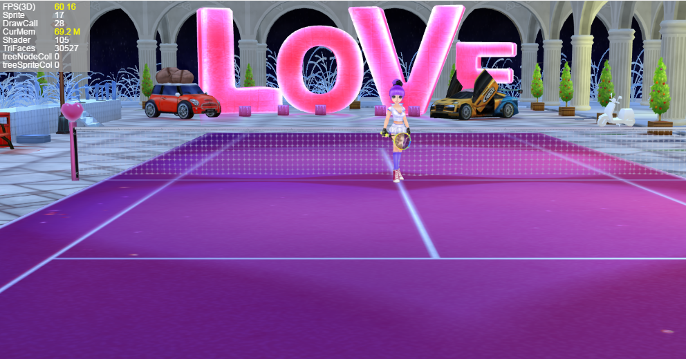

#LayaAir 3 Dの資源放出

###なぜ資源を釈放しますか？

LayaAir 3 Dゲームの開発において、資源の放出は非常に重要です。3 Dリソースには、モデル、スタンプ、材質、動画などが含まれており、良い画面効果を達成するためには、ファイルは2 Dよりも大きくなります。3 Dエンジンは基本的にすべてのリソースをGPUに入れて計算してレンダリングするので、多くの表示を占めています。ゲームのレベルがどんどん読み込まれて、ゲームがどんどん深くなって、現存中の資源がだんだん多くなります。資源を解放しないと、ゲームは最終的に崩壊します。

現存はメモリと違って、メモリはゴミ回収の仕組みがあります。現存は違っています。手動で釈放しなければならないので、現存する資源の放出は重視されなければなりません。

図1、図2の統計ツールにおける現存サイズを観察する。

図1はゲーム起動後にロードされる最初のシーンで、表示回数は30527で、69.2 Mを占有している。

(图1)</br>


図2はゲームにロードされた第2のシーンで、面数は7455しかないが、ロード後の現存リソースは118.91 Mである。これはどういう理由ですか？顔なじみが少なく、シーンが小さく、スタンプも図1のシーンより少ないです。写真のスタンプも小さいですが、現存資源がもっと大きいです。

これは第一段階のシーンの資源が解放されていないためで、その資源はまだ現存中で、だから現存占有が大きくなりました。手動でクリアしないと、ゲームは他のシーンに切り替わり続けます。一定量に達すると、携帯のディスプレイは消耗されます。ゲームカードの死、フラッシュバック、発熱などの現象が頻繁に現れます。

（図2）<br/>


###資源をロードする時の処理原則

上の図の例を通して、LayaAir 3 Dエンジンの処理資源と現存の関係を見ることができます。ゲームの性能最適化の目的を達成するために、資源をロードする時も原則を注意しなければなりません。

1、資源をロードする時は、必要な資源だけを一度に全部ロードしないでください。3 Dリソースのロードが完了すると、リソースの拡張子の名前に基づいて直接3 D表示オブジェクトを作成します。例えば.lsはScheneを作成します。lhはSprite 3 Dオブジェクトを作成します。作成した対象リソースはステージに置いていなくても直接に現存に入れるので、資源が多すぎると大量に現存します。

2、合理的に現存を管理し、頻繁に繰り返し使用する資源は現存において釈放する必要がなく、繰り返し使用する資源は使用完了後直ちに釈放して、性能オーバーヘッドを節約する。例えば主役の資源、3 Dの道具の資源、プレーヤーはいつも使って、ずっと現存の中で保管することができて、スピードを抽出するのは速いです。


###現存資源の放出方法

現存リソースを解放する方法は二つあります。一つはオブジェクトを通じて現存リソースを解放することです。ただし、リソースオブジェクトを遍歴するのは面倒です。ここでは紹介しません。もう一つは、リソースアドレスを通じて現存リソースを解放することであり、リソース管理の観点から、リソースアドレス方法を通じてより柔軟に、JSONデータテーブルを構成して管理することができる。

####切り替えシーンとリリースリソースの遷移画面

リソースをロードしてシーンを切り替えるとき、図3に示すように、遷移のための進捗表示画面をIDEで作成します。

（図3）<br/>

IDEリリース後、制御クラスを作成し、論理コードは下記を参照してください。


```typescript

class AssetLoadView extends ui.ProgressBarUI{
    /*资源加载进度*/
    private progress:number = 0;
    constructor() {
        super();
    }
    /*初始化，进度计时*/
    public init():void{
        this.progress = 0;
        //进度增加的帧循环
        Laya.timer.loop(20,this,this.onLoop);
    }
    /*资源加载进度模拟（假进度）*/
    private onLoop():void{
        //进度增加
        this.progress++;
        //最高100%进度
        if(this.progress > 100){
            this.progress = 100;
            this.tips.text = "游戏加载完毕，即将进入游戏...";
            Laya.timer.clearAll(this);
            this.removeSelf();
        }
        else{
            this.pro.value = this.progress/100;
            this.tips.text = "游戏正在加载中，当前进度为："+this.progress+"%!";
        }
    }
}
```


####リソースアドレステーブルを通じて現存リソースを解放する。

メインクラスでは、マウスで舞台をダブルクリックして場面を切り替え、リソースアドレスを使って現存リソースを解放する方法を使って、新しいシーンをロードします。

リソースパスのリスト方法が柔軟で、テーブルを構成することによって、テーブル内の削除リソースを増やすことができます。例えば美術はシーンをエクスポートする時、JSON表を新たに作って、このシーンの中で切り替えた後に必要でない資源のルートをすべてJ表の中に置いて、役に立つ資源は表に入れないで、資源は釈放しないで、たとえばいくつかの公共のNPC、道具、特効などのゲームの元素の資源。

Tips：リソースは、シーン光のスタンプlightmap、材質、lmat、モデル、lm、様々なタイプのスタンプ、pngまたは.jpg、動画、lani、骨格、lavなどの資源を含みます。

ここでは、リソース表の方法を紹介します。まず、エクスポートされたリソースファイルディレクトリにjsonファイルを作成し、リリースするパスリソースを編集し、Json配列を形成します。名前はlsファイルと一致しています。図5、6のように。

（図5）<br/>

（図6）<br/>

Json編集が完了したら、チェックツールでフォーマットが正しいかどうかを確認できます。次にメインクラスのコードを作成します。


```typescript

class LayaAir3D_AssetsDespose {
    /*3D场景*/
    private scene:Laya.Scene;
    /*3D摄像机*/
    private camera:Laya.Camera;
    /*3D角色*/
    private role:Laya.Sprite3D;
    /*2D加载进度界面（假）*/
    private progress:AssetLoadView;
    constructor() {
        //初始化引擎
        Laya3D.init(1334,750,true);
        //画布垂直居中对齐
        Laya.stage.alignV = Laya.Stage.ALIGN_MIDDLE;
        //画布水平居中对齐
        Laya.stage.alignH = Laya.Stage.ALIGN_CENTER;
        //等比缩放
        Laya.stage.scaleMode = Laya.Stage.SCALE_FIXED_AUTO;
        //自动横屏，游戏的水平方向始终与浏览器屏幕较短边保持垂直
        Laya.stage.screenMode = "horizontal";
        //开启统计信息
        Laya.Stat.show();

        //加载2D资源
        Laya.loader.load("res/atlas/comp.atlas",Laya.Handler.create(this,this.on2DComplete));
    }
    /*加载2D资源完成回调*/
    private on2DComplete():void{
        //实例化加载进度页面
        this.progress = new AssetLoadView();
        this.progress.init();
        this.progress.loadTitle.text = "资源加载与释放示例";
        //加载第一关场景角色3D资源（不能全部加载，否则太占显存）
        Laya.loader.create([{url:"LayaScene_loveScene/loveScene.ls"},
                                {url:"LayaScene_girl/girl.lh"}],Laya.Handler.create(this,this.on3DComplete));
    }
    /*加载3D资源完成回调*/
    private on3DComplete():void{
        //实例化场景
        this.scene = Laya.loader.getRes("LayaScene_loveScene/loveScene.ls");
        Laya.stage.addChild(this.scene);
        Laya.stage.setChildIndex(this.scene,0);

        //实例化摄像机
        this.camera = new Laya.Camera();
        //移动摄像机位置
        this.camera.transform.translate(new Laya.Vector3(-1,2,15));
        //设置摄像机视野范围（角度）
        this.camera.fieldOfView = 25;
        this.camera.transform.lookAt(new Laya.Vector3(-1,0,0),new Laya.Vector3(0,0,0));
        this.scene.addChild(this.camera);

        //实例化角色添加到场景
        this.role = Laya.loader.getRes("LayaScene_girl/girl.lh");
        this.scene.addChild(this.role);
        
        //双击游戏画面切换场景
        Laya.stage.on(Laya.Event.DOUBLE_CLICK,this,this.onChangeScene);
    }
    /*加载第二关场景资源，切换场景*/
    private onChangeScene():void{
        //去除双击事件监听
        Laya.stage.off(Laya.Event.DOUBLE_CLICK,this,this.onChangeScene);
        //切换场景加载界面
        this.progress.init();
        this.progress.loadTitle.text = "正在切换场景，请稍后";
        Laya.stage.addChild(this.progress);

        //移除摄像机与角色
        this.scene.removeChild(this.camera);
        this.scene.removeChild(this.role);

        //列表释放显存资源方法（释放的资源配置表）
        this.assetsDispose("LayaScene_loveScene/loveScene.json");

        //销毁之前场景
        this.scene.destroy();
        
        //加载第二关场景资源到游戏中
        this.scene = Laya.Scene.load("LayaScene_scene02/scene02.ls");
        Laya.stage.addChild(this.scene);

        //摄像机的位置与对准目标
        this.camera.transform.position = new Laya.Vector3(-1,1,8);
        this.camera.transform.lookAt(new Laya.Vector3(-1.5,0.5,0),new Laya.Vector3(0,0,0));

        //添加摄像机与角色到新场景
        this.scene.addChild(this.camera);
        this.scene.addChild(this.role);
        this.role.transform.position = new Laya.Vector3(-1,0,-3.5);

        //设置场景层级在最下层
        Laya.stage.setChildIndex(this.scene,0);

        //现有显存中的资源
        console.log("现有显存中的资源：",Laya.Loader.loadedMap);
    }
     /**
     * 列表释放显存资源方法(利用资源表方式，每个场景配置资源路径表)
     * target3D 需要释放资源的对象资源表assetsUrl:String
     */ 
    private assetsDispose (assetsUrl:string):void{
        //加载盘释放的资源配置表
        Laya.loader.load([{url:assetsUrl,type:Laya.Loader.JSON}],
                             Laya.Handler.create(this,this.onAssetsOK,[assetsUrl]));
    }
    /*加载资源释放表完成后*/
    private onAssetsOK(assetsUrl:string):void{
        //获取加载的数据（Json数组转化成数组）
        var arr:any = Laya.loader.getRes(assetsUrl);
        for(var i:number = arr.length - 1;i>-1;i--){
            //根据资源路径获取资源（Resource为材质、贴图、网格等的基类）
            var resource:Laya.Resource = Laya.loader.getRes(arr[i].url);
            //资源释放
            resource.dispose();
        }
    }
}
new LayaAir3D_AssetsDespose;
```


上述のコードassites Displaseを観察して、配置表をロードした後、Laya.loader.getsRes（arr[i].url）方法で直接に資源発生の対象を取得します。（作成時はurlの拡張子によって異なるタイプのオブジェクトが発生します。getsRes方法は直接に読みます。）これらはすべてResourceのオブジェクトです。ソース

リソースをリリースした後、Loader.loadeMap属性によってキャッシュ中のリソースを確認することもできます。

上記のコードをコンパイルして実行すると、図4の効果が見られます。リリースが完了し、新しいフィールドシーンをロードすると、グラフィック占有率は前よりずっと小さくなります。これまでリリースされていなかったリソースは118.91 mで、リリース後の現存は59.68 Mのみを占めています。

