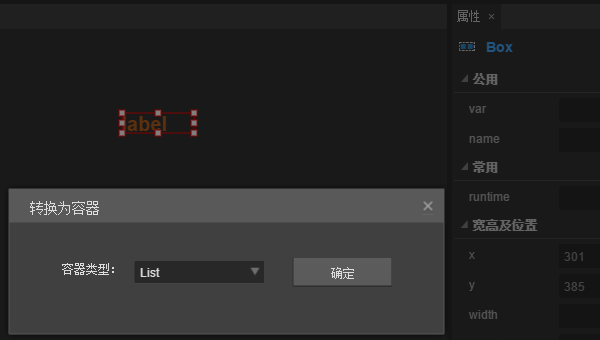

#Listコンポーネント参照


##一、LayaAirIDEでListコンポーネントを作成する

Listコンポーネントはプロジェクトリストを表示することができます。デフォルトは垂直方向のリストです。UIエディタでリストをカスタマイズできます。Listリストの各リストは通常同じですが、エディタを使って異なるスタイルのリストの内容項目をカスタマイズすることもできます。
Listは通常2つの部分から構成される。リストレンダリング項目（セル）、スクロールバー。
Listコンポーネントのスクリプトインターフェースを参照してください。[List API](http://layaair.ldc.layabox.com/api/index.html?category=Core&class=laya.ui.List)。


 


###1.1 Listコンポーネントの作成

####1.リスト項目を編集します。

リスト項目は、BoxオブジェクトまたはView(ページ)または他のカスタムページオブジェクトとすることができます。ここではBoxオブジェクトを例にします。
​**a.**資源パネルからLabelコンポーネントを選択して、編集エリアのインターフェースにLabel属性nameを設定します。またLabelの表示に関する属性を設定してもっと綺麗にしてください。
​**b.**Labelオブジェクトを選択し、ショートカットキーCtrl+Bまたは選択を使用します。**メニューバー->編集->コンテナに変換**を選択して、容器設定パネルに変換し、容器の種類をBoxにし、決定ボタンをクリックしてBox容器の追加を完了します。


​        <br/>
（図1）


 ####2.List容器に変換します。

リストレンダリング項目のオブジェクトを選択し、ショートカットキーCtrl+Bまたは選択を使用します。**メニューバー->編集->コンテナに変換**を選択して、容器設置パネルに変換し、容器の種類をListに選択し、決定ボタンをクリックして容器Listの追加を完了します。
​<br/>
（図2）
####3.Listのリストレンダリング項目を指定します。
方法1：ListオブジェクトをダブルクリックしてList内部に入り、Listリストレンダリング項目の属性nameの値をレンダーとして設定します。**ここでレンダリング項目の属性nameの値はレンダーでなければなりません。**

方法2：ListオブジェクトをダブルクリックしてList内部に入り、Listリストレンダリング項目の属性レンダリングタイプの値をレンダーとします。


​           <br/>
（図3）

####4.Listにスクロールバーのコンポーネントを追加します。
方法1：資源パネルからVcrollBarのコンポーネントを選んで、Listコンポーネントの内部にドラッグして、VcrollBarコンポーネントのオブジェクトの属性nameの値をscrollBarとします。***注意：ここのスクロールバーの属性nameの値はscrollBarでなければなりません。***

方法2：listコンポーネントを選択して、右側の属性パネルはよく使う中でvScrrollBarrSkinが現れて、資源パネルの中からVcrollBarrコンポーネントを選んでドラッグしてこのskin属性の中に来て、すぐにスクロールバーを生成します。

​<br/>
（図4）

####5.ドラッグ設定Listの幅の高さ
属性repeat Xの値を1に設定し、repeat Yの値を6に設定します。Listオブジェクトのグローバル参照名、すなわち属性varを設定する値はmulistである。
​<br/>
（図5）

####6.コードにListオブジェクトに値を割り当てます。


```javascript

  var data: Array<string> = [];

   for(var m:number =0;m<20;m++){

        data.push({m_label:"No."+m});
}
m_list.array = data;
```


####7.プログラム内で実行して効果を確認します。

   ​        <br/>
（図6）

####8.コードにスクリプトを追加し、スクロールバーを隠し、ドラッグの輪ゴム効果を設定します。

```javascript

 m_list.scrollBar.hide = true;//隐藏列表的滚动条。
 m_list.scrollBar.elasticBackTime = 200;//设置橡皮筋回弹时间。单位为毫秒。
 m_list.scrollBar.elasticDistance = 50;//设置橡皮筋极限距离。
```


####9.プログラム内で実行して効果を確認します。
​<br/>
（図7）


###1.2 Listコンポーネントの一般的な属性

​<br/>
（図8）

𞓜**属性**𞓜**機能説明**𞓜
|------------------------------------|
|repeatX 124;水平方向に表示されるセルの数。𞓜
|repeatY 124;垂直方向に表示されるセルの数。𞓜
|spaceX|水平方向に表示されるセル間の間隔（ピクセル単位）。𞓜
|spaceY|垂直方向に表示されるセル間の間隔（ピクセル単位）。𞓜
|vScrrollBarSkin|は垂直方向に皮膚を転がします。𞓜
|h ScrrollBarSkin|水平方向に皮膚を転がす。𞓜


  


###1.3 Tips:

1.Listにスクロールバーを追加するには、2つの方法があります。1つは直接List内部にスクロールバーをドラッグ＆ドロップし、スクロールバーの名前をscrollBarとして設定し、もう1つはListの属性vScrlBarSkin、hScrrollBarSkinの値をスクロールバーのリソースアドレスとして設定します。

2.Listのリストレンダリング項目は、Boxオブジェクトであっても良いし、ページオブジェクトであっても良い。

​


##二、コードによるListコンポーネントの作成

コードを書くときは、コード制御UIを通じてUUUUUUUUnitクラスを作成し、コードを通してList関連の属性を設定します。

**実行例の効果:**
​<br/>

（図9）コードによるListの作成

Listの他の属性もコードで設定できます。コードによって異なる肌（スタイル）を作成するListがどのように実演されますか？興味のある読者は自分でコードを通してListを設定して、自分のニーズに合ったリストを作成できます。

**サンプルコード:**


```javascript

module laya {
    import Stage = Laya.Stage;
    import List = Laya.List;
    import Handler = Laya.Handler;
    import WebGL = Laya.WebGL;

    export class UI_List {
        constructor() {
            // 不支持WebGL时自动切换至Canvas
            Laya.init(800, 600, WebGL);

            Laya.stage.alignV = Stage.ALIGN_MIDDLE;
            Laya.stage.alignH = Stage.ALIGN_CENTER;

            Laya.stage.scaleMode = Stage.SCALE_SHOWALL;
            Laya.stage.bgColor = "#232628";

            this.setup();
        }

        private setup(): void {
            var list: List = new List();

            list.itemRender = Item;

            list.repeatX = 1;
            list.repeatY = 4;

            list.x = (Laya.stage.width - Item.WID) / 2;
            list.y = (Laya.stage.height - Item.HEI * list.repeatY) / 2;

            // 使用但隐藏滚动条
            list.vScrollBarSkin = "";

            list.selectEnable = true;
            list.selectHandler = new Handler(this, this.onSelect);

            list.renderHandler = new Handler(this, this.updateItem);
            Laya.stage.addChild(list);

            // 设置数据项为对应图片的路径
            var data: Array<string> = [];
            for (var i: number = 0; i < 10; ++i) {
                data.push("res/ui/listskins/1.jpg");
                data.push("res/ui/listskins/2.jpg");
                data.push("res/ui/listskins/3.jpg");
                data.push("res/ui/listskins/4.jpg");
                data.push("res/ui/listskins/5.jpg");
            }
            list.array = data;
        }

        private updateItem(cell: Item, index: number): void {
            cell.setImg(cell.dataSource);
        }

        private onSelect(index: number): void {
            console.log("当前选择的索引：" + index);
        }
    }

    import Box = Laya.Box;
    import Image = Laya.Image;
    class Item extends Box {
        public static WID: number = 373;
        public static HEI: number = 85;

        private img: Image;

        constructor(){
            super();
            this.size(Item.WID, Item.HEI);
            this.img = new Image();
            this.addChild(this.img);
        }

        public setImg(src: string): void {
            this.img.skin = src;
        }
    }
}
new laya.UI_List();
```


