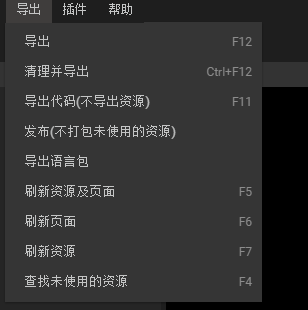

#メニューバーの紹介

メニューバーは画面の一番上にあります。IDE全体の制御情報が含まれています。画面に慣れていない友達はメニューバーに素早く操作する機能を見つけられます。メニューバーの詳細を紹介します。

​ 
（図1）

 

###一、ファイル

​ 
（図2）

-新規項目：新規プロジェクトオプションウィンドウを介して新規プロジェクトを作成します。

-新規ファイル:新規ページウィンドウを介して新しい編集ページを作成します。ショートカットキーCtrl+N。

-新規ディレクトリ:プロジェクト内に新しいページフォルダを作成します。ショートカットキーCtrl+D。

-プロジェクトを開く:リソースマネージャを介してアイテムをブラウズして開きます。ショートカットキーCtrl+D。

−変換項目：変換項目ウィンドウで、MornUI項目を選択し、LayaAir項目に変換することができます。

-設定項目：設定項目の設定ファイル、ショートカットキーF 9。

-ページの設定:ページのデフォルト属性、ショートカットキーCtrl+Pを設定します。

-エディタの更新:エディタの状態を更新できます。エディタのリセットや再起動に相当します。

​

###二、編集

​ 
（図3）

-元に戻す:現在の操作をキャンセルして、前のステップに戻ります。ショートカットキーCtrl+Z。

-やり直し：取消しが多すぎると取消し操作が再開されます。ショートカットキーCtrl+Y。

-削除:選択したリソースまたはコントロールを削除します。ショートカットキーDelete。

-コピー:現在選択されているリソースまたはコントロールをコピーします。ショートカットキーCtrl+C。

-貼り付け:コピーされたリソースまたはコントロールを貼り付けます。ショートカットキーCtrl+V。

-元の位置にコピーして選択したコントロールを貼り付けます。ショートカットキーCtrl+Shift+V。

-切り取り:選択したコントロールまたはリソースを切り取り、ショートカットキーCtrl+X。

-すべて選択:すべてのコントロールを選択し、ショートカットキーCtrl+Aを選択します。

-クイック移動:選択したコントロールを矢印キーの位置に10ピクセル移動し、ショートカットキーShift+矢印キーを押します。

-コンテナに変換:選択したコントロールをコンテナに変換し、変換ボックスで具体的に回転するコンテナの種類を選択します。ショートカットキーCtrl+B。

-コンテナの削除：選択した容器を削除するコンテナのタイプを通常のコントロールに変え、ショートカットキーCtrl+Uを押します。

-繰り返しコピー:複数回コピーする行の数列と間隔を設定します。ショートカットキーCtrl+R。

-リソースの位置を指定します。リソースマネージャの位置をすばやく指定します。ショートカットキーCtrl+K。

-検索置換:ポップアップ置換ウィンドウで、検索された位置を別の内容に置き換えることができます。ショートカットキーCtrl+F。

-ファイルの保存:ファイルの変更、ショートカットキーCtrl+Sを保存します。

-すべてのファイルを保存します。すべてのファイルの変更、ショートカットキーCtrl+Shift+Sを保存します。

​

###三、ビュー

​ 
##（図4）拡大表示：シーンエディタ、ショートカットキーCtrl++を拡大します。

-縮小表示：シーンエディタを縮小し、ショートカットキーCtrl+-。

-ビューの復元:シーンエディタを元のサイズに戻し、ショートカットキーCtrl+0(またはCtrl+|)を押します。

→ドラッグ表示：マウスの右ボタン（またはマウスホイール）を押して表示位置をドラッグします。

-参照ビューの表示/非表示を切り替えます。ショートカットキーF 8は、シーンエディタに表示/非表示を設定します。

-ルーラーの表示/非表示を切り替えます。シーンエディタにルーラーの表示/非表示を設定します。ショートカットキーCtrl+Shift+R。

-ノードの上向き:選択したコントロールをコントロールしてレベルマネージャの階層位置を上に移動し、ショートカットキーCtrl+↑をクリックします。

-下のノード:選択したコントロールをコントロールして、階層マネージャの階層位置から下のビットに移動します。ショートカットキーCtrl+↓。

​

###四、工具

​ 
（図5）

−SWF変換：SWFリソース変換ツールウィンドウを開き、ユーザによるSWF変換操作を行う。

-JS圧縮：JS圧縮ツールウィンドウを開き、ユーザがJSファイルを圧縮して混淆するために使用します。

-竜骨アニメーション変換：竜骨アニメーション変換ウィンドウを開き、ドラゴンズ骨格アニメーションをLayaAir認識のフォーマットに変換する。

-Spineアニメーション変換：Spineアニメーション変換ウィンドウを開き、ユーザーがSpine骨格アニメーションをLayaAir認識のフォーマットに変換する。

-図セットの包装：図セットのパッキングウィンドウを開けて、ユーザーに図セットのパッキング操作を行うようにします。

-ランチャーダウンロード：ランチャーがダウンロードした二次元コードウィンドウを開いて、LayaNativeのランチャーをユーザがスキャンコードでダウンロードするために使用します。

-パッケージAPP：APPパッケージの環境配置と操作ウィンドウは、LayaAirプロジェクトをAndroidとしてパッケージ化するためのAPP（appkファイル）

-チャネルパッキングツール：ルートパッキングウィンドウを開けて、LayaAirエンジンプロジェクトを直接にパッケージ化するために、複数のAndroid主流チャネルに接続されているappkパッケージです。

-APP構築：LayaAirエンジンプロジェクトをAndroid d-eclipse、Android d-studio、XCode(IOS)の3つのモバイル端末のAPPプロジェクトプロジェクトとして構築するための構築機能ウィンドウを開く。

-3 D変換ツール：3 D変換ツールのURLリンクを開き、圧縮パッケージ内に3 DMAxとユニティ3 Dエディタのリソース変換ツールを提供し、3 DMAxとユニティ3 DのリソースをLayaAirエンジンのサポートリソースにする。

​

###五、窓口

​ 
（図6）

-アニメーションパネル：アニメーションマネージャパネルが閉じられている場合は、ここで設定して再度表示することができます。

-フレーム属性パネル：フレーム属性パネルが閉じられている場合は、ここで設定して再度表示することができます。

-プロジェクトパネル：プロジェクトマネージャパネルが閉じられている場合、ここで設定して再度表示することができます。

-リソースパネル：リソースマネージャパネルが閉じられている場合は、ここで設定して再度表示することができます。

-プロパティパネル：プロパティ設定器パネルが閉じられている場合は、ここで設定して再度表示することができます。

-階層パネル：階層マネージャパネルが閉じられている場合、ここで設定して再度表示することができます。

-テンプレートパネル：テンプレートマネージャパネルが閉じられている場合は、ここで設定して再度表示することができます。

-コンポーネントパネル：コンポーネントパネルが閉じられている場合は、ここで設定して再度表示することができます。

-パネルの設定を復元します。すべてのマネージャパネルの位置と表示サイズ、ショートカットキーF 3を復元します。

​

###六、設定

   
（図8）

##-エディタ設定：UIリリース後のモード設定とルーラー表示設定。クラス管理：現在のプロジェクトで使用されているクラスのバージョンを設定します。

###エクスポート

​ 
（図7）

-エクスポート：作成したインターフェースをパッケージ化してエクスポートします。リソースフォルダが変化していない場合は、フォルダをスキップして変化したフォルダだけをパッケージ化してエクスポートします。ショートカットキーF 12。

-整理してエクスポートします。強制的に整理する前にすでに包装されていたリソースファイルをすべて再パッケージしてエクスポートします。ショートカットキーCtrl+F 12。

−出力コード（リソースをエクスポートしない）：リソースが変化していない場合、UIの位置や属性などが変化しているだけで、この機能を利用してUIコードを再導出するだけで、リソースを再導出することができず、UI項目の出力効率が速くなります。

-リリース（未使用の資源を梱包しない）：F 12の機能に近いですが、使用済みのリソースだけを梱包してエクスポートします。未使用のリソースは操作しません。この機能は全てのリソースの使用状態を巡回する必要があるため、UIプロジェクトの出力速度が遅くなります。

-言語パッケージをエクスポートします。この機能は、現在のLayaAirIDEのすべてのUIテキストコンテンツを抽出して、lang.langファイルを生成して、多言語バージョンを設定します。

-リソースおよびページの更新：リソースおよびページを更新して再表示します。通常はリソース変動が発生した場合は、すべてを更新するために使用されます。ショートカットキーF 5。

-ページの更新：ページを更新し、ページを再表示します。ショートカットキーF 6。

−リソースの更新：リソースマネージャを更新し、リソースへの参照を再表示します。ショートカットキーF 7。

-使用されていないリソースを検索します。検索項目で使われていないリソースをリストにまとめ、不要なリソースを素早く削除しやすくします。ショートカットキーF 4。

​

###八、プラグイン

開発プラグインを自主的に編集したり、開発者のために共有プラグインをIDEにインストールしたりすることができます。

###九、助けます

​ 
（図9）

##-開発者ツール：エディタのデバッグページを開くために使用します。Layabox公式サイトのリンクを開きます。
##-公式サイトの例：公式サイトのLayaAirエンジンのリンク例を開きます。開発者センター：Layabox開発者センターのリンクを開きます。
##-エディタローカルキャッシュを開きます。エディタのローカルキャッシュファイルの場所ディレクトリを開きます。更新を確認します。LayaAirIDEのバージョンを開いて、リストリンクをダウンロードします。
##-更新ログ：gitHubのエンジンとIDEバージョンの更新ログのリンクを開きます。現在のバージョン番号：LayaAirIDEの現在のバージョン番号が表示されます。

